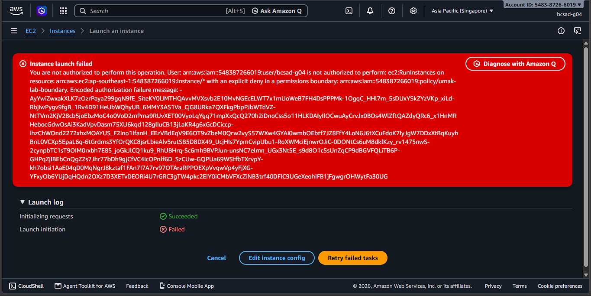
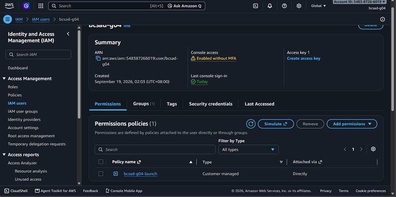
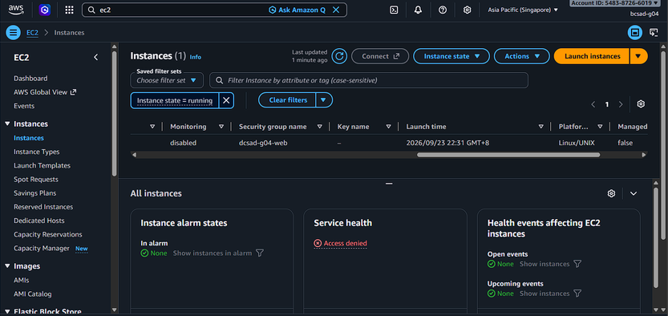
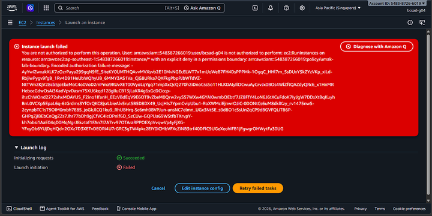
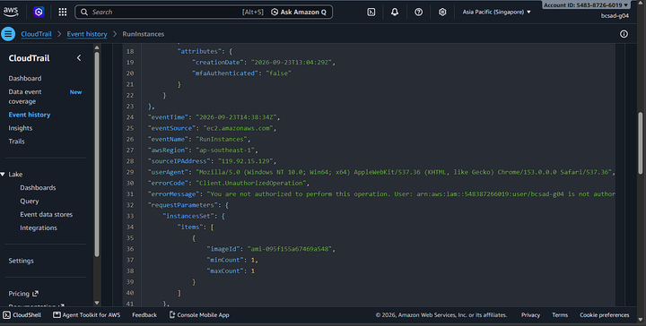

# Lab 1 Submission

## Part B
**Error Action Name:** You are not authorized to perform: **ec2:RunInstances** on resource: arn:aws:ec2:ap-southeast-1:548387266019:instance/* with an explicit deny in a permissions boundary: arn:aws:iam::548387266019:policy/umak-lab-boundary.

**Screenshot (Part B launch denial with username visible):**

## Part C
**Policy Statement Blanks:**
- `"Action"`: `ec2:RunInstances`
- `"Resource"`: `arn:aws:ec2:ap-southeast-1:548387266019:instance/*`
- `"ec2:InstanceType"`: `t3.micro`

## Part D
**Security Group Error Text:** You are not authorized to perform this operation. User: arn:aws:iam::548387266019:user/bcsad-g04 is not authorized to perform: ec2:CreateSecurityGroup on resource: arn:aws:ec2:ap-southeast-1:548387266019:security-group/* because no identity-based policy allows the ec2:CreateSecurityGroup action.

**Running Instance Time:** 2026/09/23 22:31 GMT+8

**Screenshot 1 (Permissions tab listing <user>-launch):**

**Screenshot 2 (Instance in Running state):**

## Part E
**t3.small / Tokyo Denial Error:** You are not authorized to perform this operation. User: arn:aws:iam::548387266019:user/bcsad-g04 is not authorized to perform: ec2:RunInstances on resource: arn:aws:ec2:ap-southeast-1:548387266019:instance/* with an explicit deny in a permissions boundary: arn:aws:iam::548387266019:policy/umak-lab-boundary.

**Screenshot 1 (t3.small or Tokyo denial):**

**Screenshot 2 (CloudTrail event showing errorMessage):**

## Part F Questions
1. Which action did the Part B error name?
   `ec2:RunInstances`

2. In your policy, which condition limits `ec2:RunInstances`?
   The `ec2:InstanceType` condition key set to `"t3.micro"` inside the `StringEquals` block.

3. After you attached `ec2:*` on `*`, why was `t3.small` still denied? Name the boundary statement.
   It was denied because the permissions boundary (`umak-lab-boundary`) overrides identity-based policies with an explicit deny. The boundary statement responsible is `DenyAnyInstanceTypeButT3Micro`.

4. Why is `ec2:*` on `*` a poor policy even with a boundary?
   It violates the principle of least privilege by granting excessive permissions across all resources, allowing dangerous actions (like deleting security groups or terminating instances) that the boundary does not explicitly restrict.

5. In two sentences: what does the boundary control that your policy cannot?
   A permissions boundary sets the maximum allowable permissions that an identity-based policy can grant to an IAM user or role. It ensures that even if an identity policy grants full administrator rights (`ec2:*`), actions outside the boundary's allowed scope (such as non-t3.micro sizes or unauthorized regions) remain strictly denied.