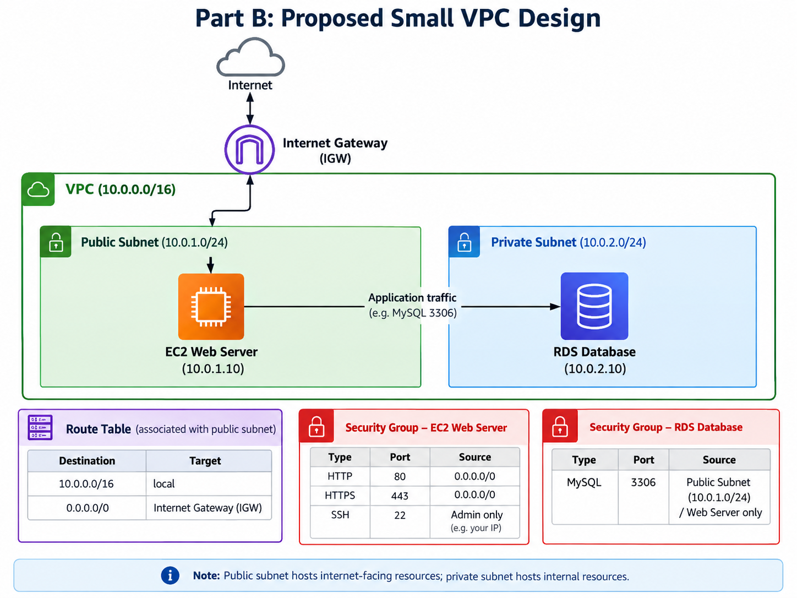

# Assignment #2: Explore a VPC

## About me

- GitHub username: marionnn10
- IAM user name that I signed in with: Lab group IAM user
- AWS Region: Singapore (ap-southeast-1)

---

# Part A. Explore

## A1. The VPC

Default VPC IPv4 CIDR:

`172.31.0.0/16`

Number of addresses in that CIDR:

65,536

VPC ID:

`vpc-02b29f02cd658307`

State:

Available

Tenancy:

Default

Owner ID:

`548387266019`

---

## A2. The Subnets

The default VPC contains three default subnets.

| Availability Zone | IPv4 CIDR |
|---|---|
| `ap-southeast-1a` | `172.31.32.0/20` |
| `ap-southeast-1b` | `172.31.16.0/20` |
| `ap-southeast-1c` | `172.31.0.0/20` |

Subnet IDs:

| Subnet ID | Availability Zone |
|---|---|
| `subnet-00a19af925fdd4d` | ap-southeast-1a |
| `subnet-03a5209dd3590f3f5` | ap-southeast-1b |
| `subnet-09c3dc46f64c311d1` | ap-southeast-1c |

---

## A3. Available IPv4 Addresses

A `/20` subnet contains 4,096 IPv4 addresses.

AWS reserves 5 IP addresses in every subnet.

Therefore:

4,096 - 5 = 4,091 available IPv4 addresses.

The number can become lower when AWS resources use addresses inside the subnet.

---

## A4. The Route Table

Route Table ID:

`rtb-037b142ea7ed8c1c9`

VPC:

`vpc-02b29f02cd658307`

Routes:

| Destination | Target |
|---|---|
| `172.31.0.0/16` | `local` |
| `0.0.0.0/0` | `igw-0943e7e688293168` |

The local route allows communication between resources inside the VPC.

The `0.0.0.0/0` route sends Internet traffic to the Internet Gateway.

---

## A5. Public or Private Subnets

Are the default subnets public or private?

The default subnets are public.

Which route proves it?

The route:

```
0.0.0.0/0 → igw-0943e7e688293168
```

proves that the subnets have a route to the Internet Gateway.

---

## A6. The Internet Gateway

Internet Gateway ID:

`igw-0943e7e688293168`

State:

Attached

Attached VPC:

`vpc-02b29f02cd658307`

What happens if the Internet Gateway is detached?

The default subnets lose their route to the Internet.

However, resources can still communicate inside the VPC because the local route remains available.

---

## A7. NAT Gateways

Number of NAT gateways:

0

Can a server in a new private subnet download updates? Why?

No.

A private subnet cannot access the Internet without a NAT Gateway.

The private subnet needs a route:

```
0.0.0.0/0 → NAT Gateway
```

to allow outbound Internet access while preventing direct inbound Internet access.

---

## A8. The Network ACL

Network ACL ID:

`acl-05e0f593c4c567477`

Associated VPC:

`vpc-02b29f02cd658307`

Default:

Yes

Inbound Rules:

| Rule Number | Type | Source | Allow/Deny |
|---|---|---|---|
| 100 | All traffic | `0.0.0.0/0` | Allow |
| * | All traffic | `0.0.0.0/0` | Deny |

How is a Network ACL different from a Security Group?

A Network ACL protects a whole subnet, while a Security Group protects individual resources such as EC2 instances.

A Network ACL is stateless, meaning inbound and outbound rules are evaluated separately.

A Security Group is stateful, meaning return traffic is automatically allowed.

A Network ACL can deny traffic, while Security Groups only allow traffic.

---

## A9. The Default Security Group

Security Group:

`default`

VPC:

`vpc-02b29f02cd658307`

Inbound rule:

All traffic from the same security group.

Which resources can send traffic to an instance that uses it?

Only resources that also use the same default security group can send inbound traffic.

---

# Part B. Prepare

## B1. Plan Two Subnets

VPC CIDR:

`10.0.0.0/16`

Public subnet CIDR:

`10.0.1.0/24`

Private subnet CIDR:

`10.0.2.0/24`

---

## B2. Route Tables

Public subnet route table:

| Destination | Target |
|---|---|
| `10.0.0.0/16` | `local` |
| `0.0.0.0/0` | Internet Gateway |

Private subnet route table:

| Destination | Target |
|---|---|
| `10.0.0.0/16` | `local` |

---

## B3. My VPC Diagram

Tool used:

Excalidraw



---

## B4. Predict a Change

Can you still open the web page from your laptop? Why?

Yes.

The public subnet has a route:

```
0.0.0.0/0 → Internet Gateway
```

which allows Internet communication.

Can the instance still reach another instance in the VPC? Why?

Yes.

The local route allows communication between resources inside the VPC.

---

## B5. Place a Database

Which subnet gets the database? Why?

The database should be placed in the private subnet:

`10.0.2.0/24`

The private subnet does not have a route to the Internet Gateway, preventing direct Internet access.

---

## B6. My Question About VPCs

What is your question, and what made you think of it?

Can two VPCs in the same AWS account communicate with each other securely?

I thought of this because multiple VPCs can exist inside one AWS account, and some applications may require communication between separate networks.