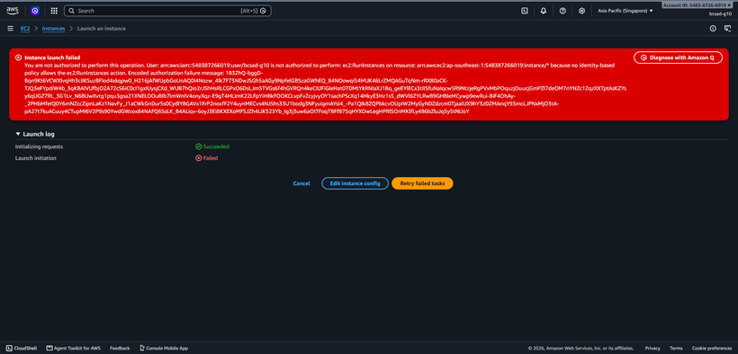
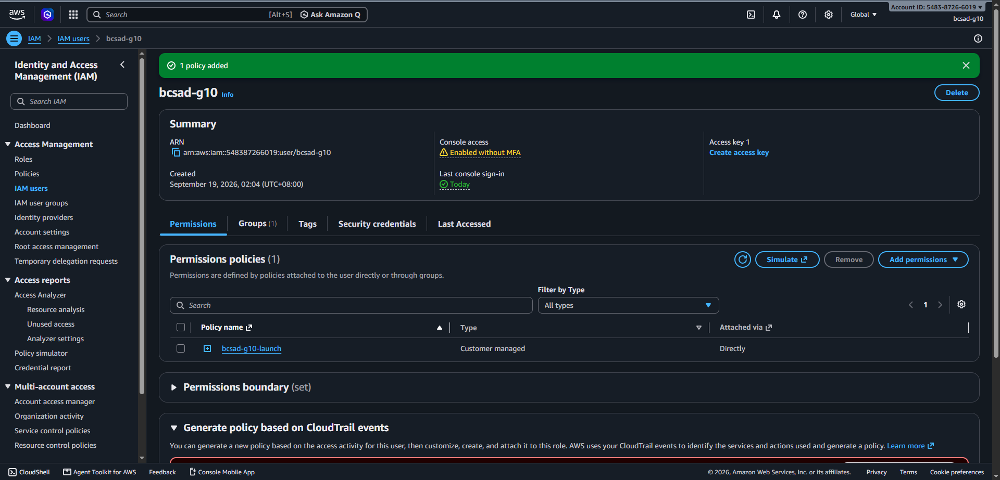
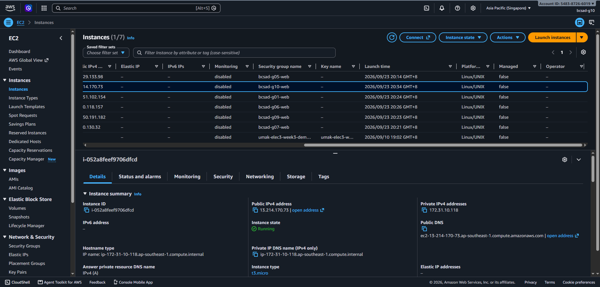
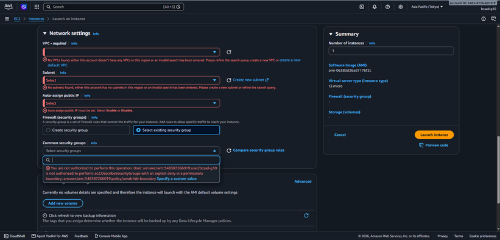
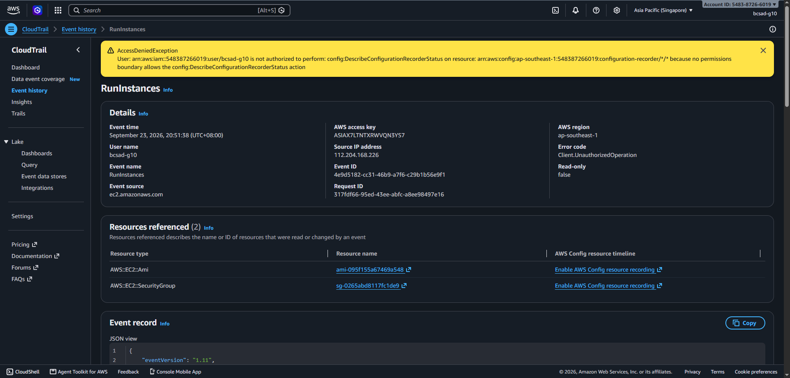

# Lab 1 Submission

## Part B
**Error Action Name:** Instance launch failed
You are not authorized to perform this operation. User: arn:aws:iam::548387266019:user/bcsad-g10 is not authorized to perform: **ec2:RunInstances** on resource: arn:aws:ec2:ap-southeast-1:548387266019:instance/* because no identity-based policy allows the ec2:RunInstances action. Encoded authorization failure message: 1B3ZhQ-bggD-Bqn9Kt6VCWXlvqHh3ciIKSuzBFIod4xkqpw0_H216jAfWUpbGoUnAQ0I4Nozw_4Ik7F73NDwJSGh5aAGy9NpfelGBSzaGWhEQ_84NOowqi54MUK46LrZMQAGuTqNm-rRX80aCK-TJQ3eFYpdiW4b_3qKBAlVUfbjO2A72cS6iC0cI1gxIUysjCXd_WUB7hQio2rJShHsRLCGPxO6DsLJm5TVGs6f4hGVRQn4keCIUFiGleHat07DMtYkRNIaXJ1Bq_geEYlECx3tII5fuNaIqcw5R9NtzjeRgPVvMbPOquzjOuucjGmPZl7deOM7nYNZc1ZqzXXTptAsKZYsy6qUGZ7RL_3G1Lv_N6BUwXvtg1pqu3gsa21XNELOOuBIb7lmWnIV4onyXqz-E9gT4HLImK22LFpYiHBkFOOKCLvpFvZcyjvyOY1sachPScXq14HkyE3Hz1s5_dWVl6ZYLRwB9GHBleMCywp9ewRui-BiF4OhAy-_2PHbMfeIQ0Y6mNZccZipnLaKz1NavFy_J1aCWkGnDurSs0CydlYBGAVx1FrP2noxfF2Y4uynMECvs4NJ5hs33U1bodg3NFyuigmAYsl4_-Pa1QIk8ZQPbkcvOUpiW2MyGyNDZdzcm0TjaalUX9hY3zDZMAnqY93mcLJPNxMjO3tA-pA27t7kuACuuy4CTupMI6V2P9s90YwdGWzox84NAFQ6SsLK_B4ALiqv-6oyJ3Ei8KXEXoMFSJZh4LlK523Yb_Ig3j3uw6aOI7FoqTBFf875qHYXOwLegHPRlSOnMKlfLy4B6bZluJq5y5tNUoY

**Screenshot (Part B launch denial with username visible):**

## Part C
**Policy Statement Blanks:**
- `"Action"`: ec2:RunInstances
- `"Resource"`: instance
- `"ec2:InstanceType"`: t3.micro

## Part D
**Security Group Error Text:** You are not authorized to perform this operation. User: arn:aws:iam::548387266019:user/bcsad-g10 is not authorized to perform: ec2:CreateSecurityGroup on resource: arn:aws:ec2:ap-southeast-1:548387266019:security-group/* because no identity-based policy allows the ec2:CreateSecurityGroup action. Encoded authorization failure message: 9WVmQiWy0_LloIawMwIw5VUcmGRjfMX-eafxLUi4qHeBvo9vwQm9pmQQp-iowOExCpsv_fFGClBqZ7nZ03tGpK4bBNwfBeU30wyQDomdiUTOIRiMhJhZzgjK1vjqLiysRs0_4QZU-WnsyC2siwmr_qUuSAE4vs9EB8mU4Y2ojYbeba0Aj3eJB1YLxGp-uyB3ae00-0LsYVXkyTuL4pFkSOsumB_n5s6ZSYaubWlEeg7ew9q7R5w1j2W2uqDaNaW4llpEB3g3JFGtnlXG1yWb1Fqa89jHW4ap8xiCTaM-9Les-Jw3rjdk1hbJUR4iYJfMn7fmBeWJXKSC7sDX6ls8M83GFc_hMk7WO6Yjg-_twJvzBDIpP5Itous2iXUzSpctcm1HQwL2_ge-iJ_yBDP9E_Y_N6n8tV3IH5P4PuF35A3Iw_ZfjwseQ4UIosWO92CvEgBPs3RbEm_dmGS3twOR3O5SeSqZWE4UyozAOCYPYFKmEVA-Ybbukd4CxvdXaWSsTN-x5n1Su6bLSmmwz0h9qxckcX5CBa8qGJawDFtX30b7

**Running Instance Time:** 20:34 GMT+8

**Screenshot 1 (Permissions tab listing <user>-launch):**

**Screenshot 2 (Instance in Running state):**

## Part E
**t3.small / Tokyo Denial Error:** Instance launch failed
You are not authorized to perform this operation. User: arn:aws:iam::548387266019:user/bcsad-g10 is not authorized to perform: ec2:RunInstances on resource: arn:aws:ec2:ap-southeast-1:548387266019:instance/* with an explicit deny in a permissions boundary: arn:aws:iam::548387266019:policy/umak-lab-boundary. Encoded authorization failure message: GdIWPnptu6qCnCJBOYJEwLauIfxZe5uybGhils5NE-M7v4rxL04219OtXk3HPorwL5zsQ3xsB1FrOg1K-FES-DqBYN_SaFnncxbn6mKO_JOq22orCh-04mPBb1ZV5wtmYesn8cITFsDUvsxJcdm03s-GDUXqnsxxorWb0iAhjTg7X7ED1gEv3opjIC1iz6z-515JkESIwXdk_pyyrOIBof02UE4ukNKnWZQ1xeymLw1VUnmqsTLmBHvDNKaSBicV3Q-Yi_vXo1t6hFhYfCGQVZKlgNotBZbI2sXE2pgVBIYN1n77-oSwLNAZ324O1G4hy5Hb5avuEd8dMQxmMVuYsdlLYVWYZbIBSLS76O4tR5uOehZZSJJ6KjuHtEIClS-ZSlqQDuTNYImnYLs7jw1df4AeLbrxc0mz6vmYkzmU3Ob5Ohael25IL8jBVSGZFsJQrU87yN9yHbkS83QwutZNiyazK9ylhmoyylmsm5I6d6gPxp2UEzMoCBWsWQypgnfQylMo6pu81ccg14R38S12bSM3lfJiNSUiwze34tSAG9qDD_rRF9yEZAsFdY0w0vthGD_KKLomar6NBCYiPYStiOl5hRIqJI-dh5SXfFJIEEiE27zmJEzzPVJlB7UaEi86CWF9FsXeDEWV38Sy-E032YMb-XlFkWiENMwsRjGLCziWGKhxANqUs9KzIWG6Zhl3Mk5FXQ_4toxlFeK-2nr5KSbYs9ucKc1_EoMSpOMptyMcsG9s-z5z_8BovPLPbEi6sR1na1x3Ag2efJslV7mXtzY4CIsVNjv7to6c_FORv9rRAt8m2aRjUllf6sMktAFtFwmOGce8xJN9ZVw6bN9phSFk0SzV54c-PJqquEXdYpKGfr63Ft5QwGI3xNABcUWdb8z2x3Sb6sZ8PJD4ZCXMJ0ZuB_VPzHX5WvlHRbhBoyCe8UtGZ7N1b09ap8DzAWSa

**Screenshot 1 (t3.small or Tokyo denial):**

**Screenshot 2 (CloudTrail event showing errorMessage):**

## Part F Questions
1. Which action did the Part B error name?
   The Part B error named the ec2:RunInstances action. This is the action required to launch an EC2 instance.
2. In your policy, which condition limits `ec2:RunInstances`?
   The ec2:InstanceType condition limits ec2:RunInstances to the t3.micro instance type. This prevents the policy from allowing the launch of other instance types.
3. After you attached `ec2:*` on `*`, why was `t3.small` still denied? Name the boundary statement.
   The t3.small instance was still denied because the permissions boundary contains an explicit deny that prevents instance types other than t3.micro. The boundary statement responsible for this is DenyAnyInstanceTypeButT3Micro.
4. Why is `ec2:*` on `*` a poor policy even with a boundary?
   ec2:* on * gives very broad permissions to perform EC2 actions on all resources. It violates the principle of least privilege because the user receives permissions beyond what is actually needed, even though the permissions boundary can still restrict some of those actions.
5. In two sentences: what does the boundary control that your policy cannot?
   A permissions boundary sets the maximum permissions that the IAM user can have, regardless of what an identity-based policy allows. It can therefore prevent actions or resource types that a broad identity-based policy such as ec2:* would otherwise allow.