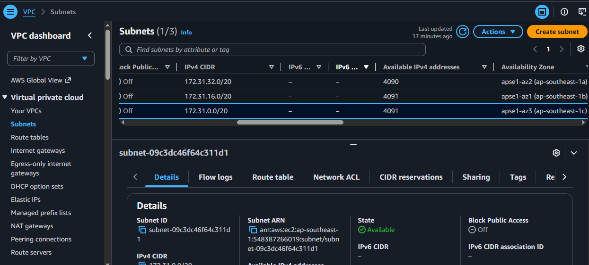
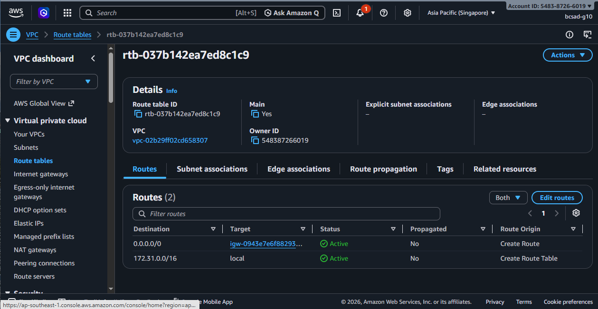
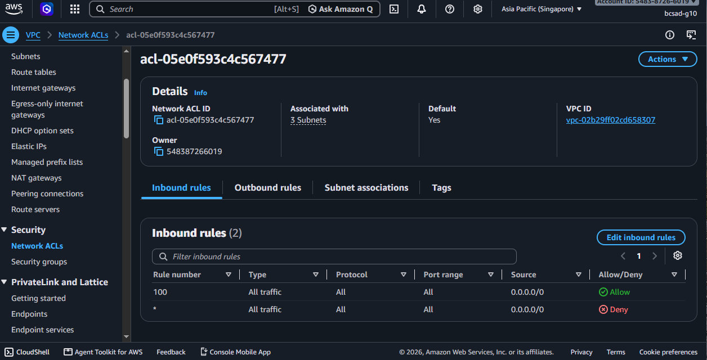
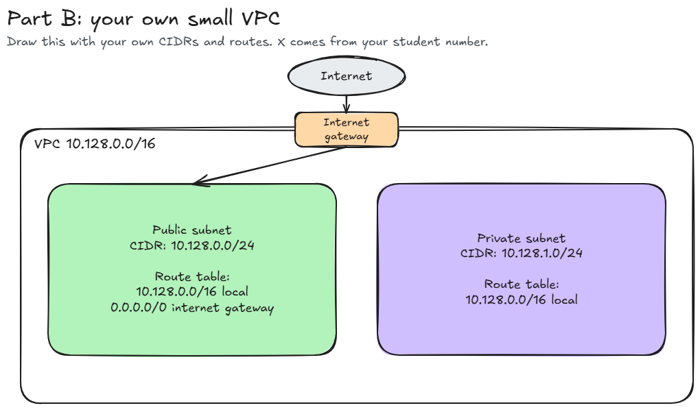

# Assignment 2 Submission

<!--
How to use this template:

1. Copy this file to submissions/assignment-2/<your-github-username>/submission.md
2. Replace every answer placeholder with your own answer. Delete the angle brackets too.
3. Save your four images in the same folder, with the exact file names below.
4. Do not write your full name or your student number in this file.
-->

## About me

- GitHub username: CANLASpogi
- Section: IV-BCSAD
- IAM user name that I signed in with: bcsad-g10
- X: 128

---

## Part A. Explore

### A1. The VPC

Default VPC IPv4 CIDR:

172.31.0.0/16

Number of addresses in that CIDR:

65,536

### A2. The subnets

| Availability Zone | IPv4 CIDR |
| --- | --- |
| apse1-az2 (ap-southeast-1a) | 172.31.32.0/20 |
| apse1-az1 (ap-southeast-1b) | 172.31.16.0/20 |
| apse1-az3 (ap-southeast-1c) | 172.31.0.0/20  |

Screenshot 1. Save it as `screenshot-1-subnets.png` in your folder. The image line below shows it.

### A3. Available addresses

Available IPv4 addresses in each subnet:

ap-southeast-1a 4,090, ap-southeast-1b 4,091, ap-southeast-1c 4,091

Why is the number lower than 4,096?

The number is lower than 4,096 because not all addresses in the block are available for use. In every subnet, AWS reserves 5 addresses: the first address is the network address, the second, third, and fourth are reserved by AWS for the VPC router, DNS mapping, and future use, and the last address is the network broadcast.

What uses the missing address in the subnet with the lowest number?

Something is already occupying that address, which means an active resource—such as a running or stopped EC2 instance's network interface is using it.

### A4. The route table

| Destination | Target |
| --- | --- |
| 0.0.0.0/0 | igw-0943e7e6f88293168 |
| 172.31.0.0/16 | local |

Screenshot 2. Save it as `screenshot-2-routes.png` in your folder. The image line below shows it.

### A5. Public or private

Are the default subnets public or private? Which route proves it?

It is public because the subnet contains the route 0.0.0.0/0, which routes traffic directly to the internet gateway.

### A6. The internet gateway

State of the internet gateway:

Attached

What happens to the default subnets if the gateway is detached?

It will not route traffic to the internet, so the subnets will lose their connection to the internet. Instances will no longer be able to send or receive internet traffic, but they can still communicate locally inside the VPC.

### A7. NAT gateways

Number of NAT gateways:

0

Can a server in a new private subnet download updates? Why?

No, the server cannot download updates because there are no NAT gateways to route outbound traffic to the internet.

### A8. The network ACL

| Rule number | Source | Allow or Deny |
| --- | --- | --- |
| 100 | 0.0.0.0/0 | Allow |
| * | 0.0.0.0/0 | Deny |

How is a network ACL different from a security group?

A network ACL covers the entire subnet, while a security group is for an individual instance only.

Screenshot 3. Save it as `screenshot-3-network-acl.png` in your folder. The image line below shows it.

### A9. The default security group

Inbound rule (type and source):

All traffic, sg-0c5b6d4081cf0a534 / default

Which resources can send traffic to an instance that uses it?

Only resources that are also assigned to the same default security group. Traffic from any other source is blocked because no other inbound rule exists.

---

## Part B. Prepare

### B1. Plan two subnets

- Public subnet CIDR: 10.128.0.0/24
-  Private subnet CIDR: 10.128.1.0/24

### B2. Route tables

Route table of the public subnet:

| Destination | Target |
| --- | --- |
| 10.128.0.0/16 | local |
| 0.0.0.0/0 | internet gateway |

Route table of the private subnet:

| Destination | Target |
| 10.128.0.0/16 | local |
| ---- | ---- |

### B3. My VPC diagram

Tool used (Excalidraw, draw.io, Lucidchart, or paper):

Excalidraw

Save your diagram as `vpc-diagram.png` in your folder. The image line below shows it.

### B4. Predict a change

Can you still open the web page from your laptop? Why?

No, as web browser on a laptop connects over the public internet, without the route 0.0.0.0/0 targeting the internet, traffic between the internet and the instance has no path to go. Having a public IP address alone is not enough without an active route.

Can the instance still reach another instance in the VPC? Why?

Yes, as the local route 10.128.0.0/16 is still present in the route table, which allows instances in different subnets of the same VPC to routet he traffic locally to each other.

### B5. Place a database

Which subnet gets the database? Why?

The private subnet 10.128.1.0/24 as its route table has no route to the internet gateway, which prevents direct inbound connections from the public internet which protects the database.

### B6. My question about VPCs

What is your question, and what made you think of it?

What happens if a subnet runs out of IP addresses as an application grows, can you expand the CIDR range, or do you have to delete and recreate the subnet

What made me think of it is seeing that AWS reserves 5 addresses, leaving only 251 usable IPs in a /24 subnet. That made me wonder what developers do if they end up needing more instances than they originally planned for.
