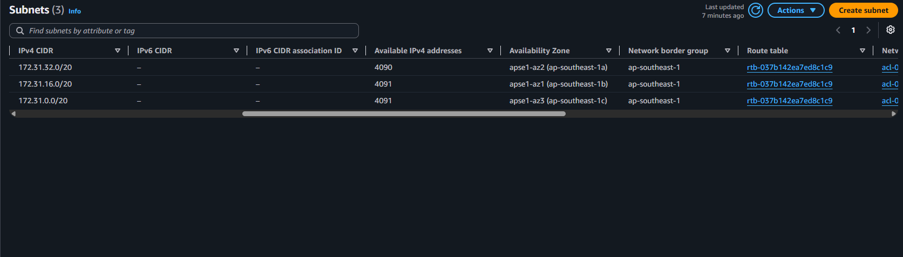
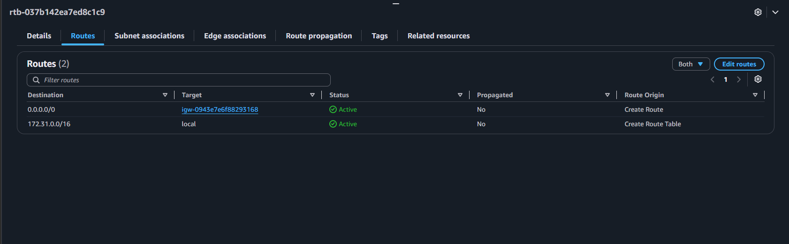
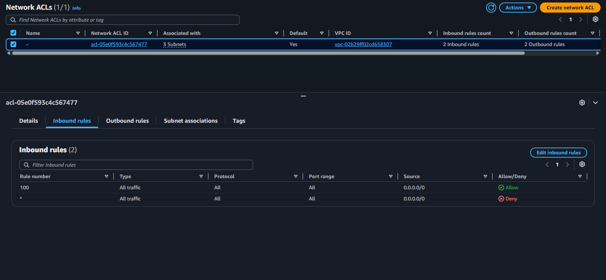
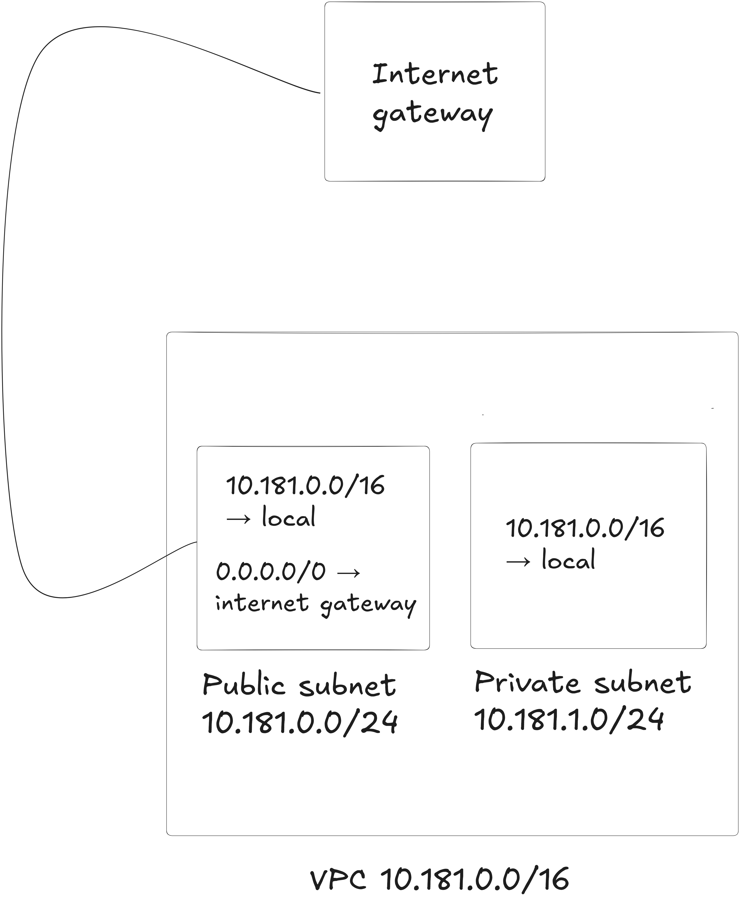

# Assignment 2 Submission

## About me

- GitHub username: Dan-Ike
- Section: IV - BCSAD
- IAM user name that I signed in with: bcsad-g07
- X: 181

---

## Part A. Explore

### A1. The VPC

Default VPC IPv4 CIDR:

172.31.0.0/16

Number of addresses in that CIDR:

65,536

### A2. The subnets

| Availability Zone | IPv4 CIDR |
| --- | --- |
| ap-southeast-1a | 172.31.32.0/20 |
| ap-southeast-1b | 172.31.16.0/20 |
| ap-southeast-1c | 172.31.0.0/20 |

Screenshot 1. Save it as `screenshot-1-subnets.png` in your folder. The image line below shows it.

### A3. Available addresses

Available IPv4 addresses in each subnet:

`ap-southeast-1a` 4,090, `ap-southeast-1b` 4,091, `ap-southeast-1c` 4,091.

Why is the number lower than 4,096?

A /20 has 4,096 addresses. AWS reserves 5 addresses in every subnet (the first four and the last one), and instances cannot use them. So an empty subnet has 4,096 − 5 = 4,091 available addresses.

What uses the missing address in the subnet with the lowest number?

`ap-southeast-1a` has 4,090, which is 1 fewer than the 4,091 in the other two subnets. One network interface in this subnet holds that address. It belongs to an EC2 instance and has the private address 172.31.37.42, which is inside 172.31.32.0/20.

### A4. The route table

| Destination | Target |
| --- | --- |
| `172.31.0.0/16` | `local` |
| `0.0.0.0/0` | `igw-...` |

Screenshot 2. Save it as `screenshot-2-routes.png` in your folder. The image line below shows it.

### A5. Public or private

Are the default subnets public or private? Which route proves it?

Public. The route table has the route `0.0.0.0/0` with the target `igw-...` (an internet gateway). A subnet is public when its route table sends `0.0.0.0/0` to an internet gateway.

### A6. The internet gateway

State of the internet gateway:

Attached

What happens to the default subnets if the gateway is detached?

The route `0.0.0.0/0` would no longer have a working target, so the default subnets would lose their path to the internet. Instances with public IP addresses could no longer be reached from the internet, and they could no longer reach it. Traffic inside the VPC would still work, because the local route (`172.31.0.0/16`) does not depend on the gateway.

### A7. NAT gateways

Number of NAT gateways:

0

Can a server in a new private subnet download updates? Why?

No. A new private subnet would use a route table with only the local route, so it has no path to the internet. For a private server to download updates, the private route table needs a route `0.0.0.0/0` to a NAT gateway, and the NAT gateway has to sit in a public subnet. This VPC has no NAT gateway, so that path doesn't exist.

### A8. The network ACL

| Rule number | Source | Allow or Deny |
| --- | --- | --- |
| 100 | `0.0.0.0/0` | Allow |
| `*` | `0.0.0.0/0` | Deny |

How is a network ACL different from a security group?

A network ACL protects a whole subnet, while a security group protects one resource such as an instance. A network ACL is stateless, so replies need their own rule, and it can have deny rules. A security group is stateful and has allow rules only.

Screenshot 3. Save it as `screenshot-3-network-acl.png` in your folder. The image line below shows it.

### A9. The default security group

Inbound rule (type and source):

All traffic, from `sg-...`. The source is the `default` security group itself.

Which resources can send traffic to an instance that uses it?

Only resources that also use the `default` security group. There is no other inbound rule, so traffic from any other source, including the internet, is blocked.

---

## Part B. Prepare

### B1. Plan two subnets

- Public subnet CIDR: `10.181.0.0/24`
- Private subnet CIDR: `10.181.1.0/24`

### B2. Route tables

Route table of the public subnet:

| Destination | Target |
| --- | --- |
| `10.181.0.0/16` | `local` |
| `0.0.0.0/0` | internet gateway |

Route table of the private subnet:

| Destination | Target |
| --- | --- |
| `10.181.0.0/16` | `local` |

### B3. My VPC diagram

Tool used (Excalidraw, draw.io, Lucidchart, or paper):

Excalidraw

Save your diagram as `vpc-diagram.png` in your folder. The image line below shows it.

### B4. Predict a change

Can you still open the web page from your laptop? Why?

No. My laptop is on the internet, and without the route `0.0.0.0/0` the instance has no path to internet addresses. A public IP address alone is not enough, because the route table decides where traffic goes.

Can the instance still reach another instance in the VPC? Why?

Yes. The local route (`172.31.0.0/16`) was not deleted, and it connects every subnet in the VPC.

### B5. Place a database

Which subnet gets the database? Why?

The private subnet, `10.181.1.0/24`. Its route table has no route to the internet gateway, so nobody on the internet can reach the database.

### B6. My question about VPCs

What is your question, and what made you think of it?

I saw 4,090 addresses in one subnet because of one network interface. What happens to that address if the instance is terminated, and whether it is released for reuse.
