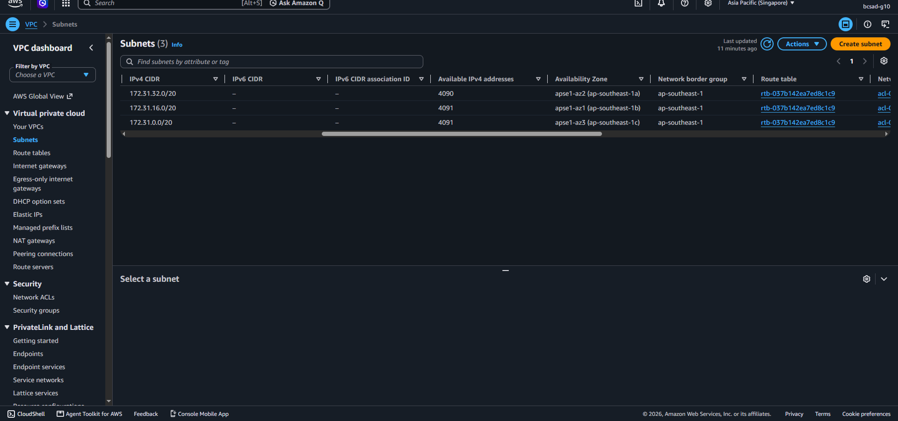
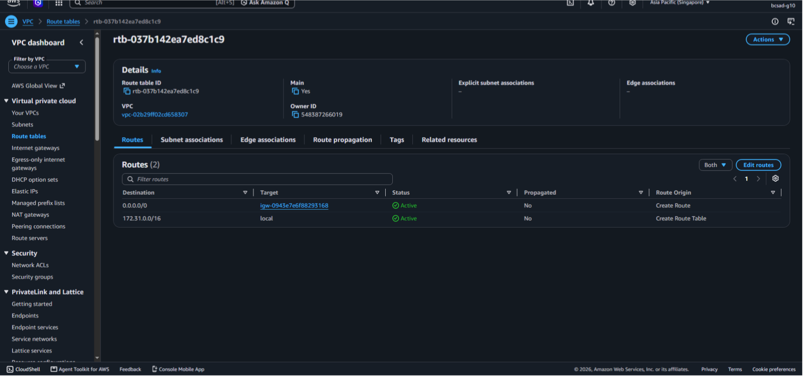
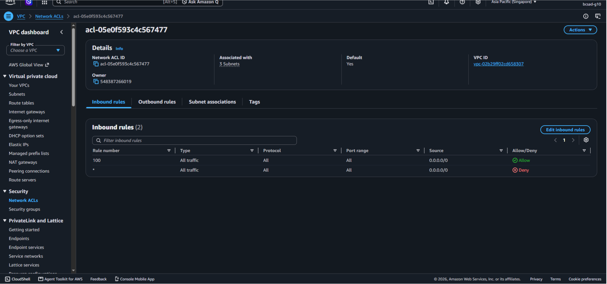
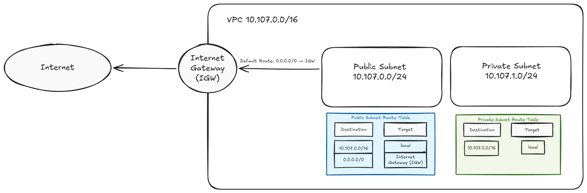

# Assignment 2 Submission

## About me

- GitHub username: DrMacky
- Section: IV-BCSAD
- IAM user name that I signed in with: bcsad-g10
- X: 107

---

## Part A. Explore

### A1. The VPC

Default VPC IPv4 CIDR:

172.31.0.0/16

Number of addresses in that CIDR:

65,536 IPv4 addresses.

### A2. The subnets

| Availability Zone | IPv4 CIDR |
| --- | --- |
| apse1-az2 (ap-southeast-1a) | 172.31.32.0/20 |
| apse1-az1 (ap-southeast-1b) | 172.31.16.0/20 |
| apse1-az3 (ap-southeast-1c) | 172.31.0.0/20 |

Screenshot 1. Save it as `screenshot-1-subnets.png` in your folder. The image line below shows it.

### A3. Available addresses

Available IPv4 addresses in each subnet:

- ap-southeast-1a: 4,090
- ap-southeast-1b: 4,091
- ap-southeast-1c: 4,091

Why is the number lower than 4,096?

Each subnet has 4,096 IP addresses, but AWS automatically reserves five of them for networking purposes. Because of this, only 4,091 addresses are normally available for use.

What uses the missing address in the subnet with the lowest number?

The subnet in ap-southeast-1a has one less available IP address than the others. This could mean that an additional address is being used by an AWS resource, such as a network interface.

### A4. The route table

| Destination | Target |
| --- | --- |
| 0.0.0.0/0 | igw-0943e7e6f88293168 |
| 172.31.0.0/16 | local |

Screenshot 2. Save it as `screenshot-2-routes.png` in your folder. The image line below shows it.

### A5. Public or private

Are the default subnets public or private? Which route proves it?

The default subnets are public because their route table has a route of 0.0.0.0/0 that points to an Internet Gateway (IGW). This allows traffic going outside the VPC to be routed toward the internet.

### A6. The internet gateway

State of the internet gateway:

Attached.

What happens to the default subnets if the gateway is detached?

If the Internet Gateway is detached, the instances in the default subnets would lose their direct access to the internet. However, they could still communicate with other resources within the same VPC through the local route, as long as their security rules allow it.

### A7. NAT gateways

Number of NAT gateways:

No NAT gateways found.

Can a server in a new private subnet download updates? Why?

No, not with the current setup. Since there is no NAT Gateway, a server in a private subnet would not have internet access through NAT to download updates. It would need a properly configured NAT Gateway or another way to access the required services.

### A8. The network ACL

| Rule number | Source | Allow or Deny |
| --- | --- | --- |
| 100 | 0.0.0.0/0 | Allow |
| * | 0.0.0.0/0 | Deny |

How is a network ACL different from a security group?

A Network ACL controls incoming and outgoing traffic for an entire subnet, while a Security Group controls traffic for specific resources, such as EC2 instances. Network ACLs can allow or deny traffic, while Security Groups only have allow rules. Also, Network ACLs are stateless, while Security Groups are stateful.

Screenshot 3. Save it as `screenshot-3-network-acl.png` in your folder. The image line below shows it.

### A9. The default security group

Inbound rule (type and source):

- Type: All traffic
- Source: sg-0c5b6d4081cf0a534 (default Security Group)

Which resources can send traffic to an instance that uses it?

Other resources that use the same default Security Group can send traffic to the instance. This is because the inbound rule allows traffic from resources belonging to that Security Group. However, traffic from other sources is not automatically allowed.

---

## Part B. Prepare

### B1. Plan two subnets

- Public subnet CIDR: 10.107.0.0/24
- Private subnet CIDR: 10.107.1.0/24

### B2. Route tables

Route table of the public subnet:

| Destination | Target |
| --- | --- |
| 10.107.0.0/16 | local |
| 0.0.0.0/0 | internet gateway |

Route table of the private subnet:

| Destination | Target |
| --- | --- |
| 10.107.0.0/16 | local |

### B3. My VPC diagram

Tool used (Excalidraw, draw.io, Lucidchart, or paper):

Excalidraw

Save your diagram as `vpc-diagram.png` in your folder. The image line below shows it.

### B4. Predict a change

Can you still open the web page from your laptop? Why?

No, I would no longer be able to access the instance's web page from my laptop because the default route to the Internet Gateway was removed. Even if the instance has a public IP address, it still needs that route for internet communication.

Can the instance still reach another instance in the VPC? Why?

Yes, the instance can still communicate with another instance in the same VPC because the local route remains available. This allows internal communication as long as their security rules permit it.

### B5. Place a database

Which subnet gets the database? Why?

I would place the database server in the private subnet (10.107.1.0/24) because it does not need to be directly accessible from the internet. This would help protect the database from unwanted public access while still allowing authorized resources within the VPC to communicate with it.

### B6. My question about VPCs

What is your question, and what made you think of it?

Question: If two VPCs are created in different AWS Regions, how can they communicate securely without using the public internet?

Reason: I thought of this question after learning that the local route allows resources to communicate within the same VPC. It made me curious about how communication works when resources are located in separate VPCs or Regions.
