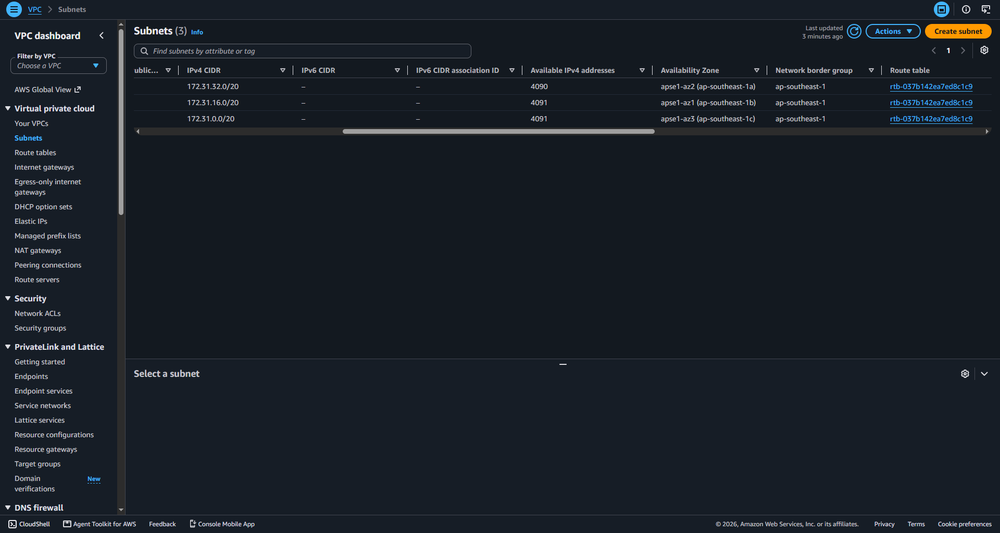
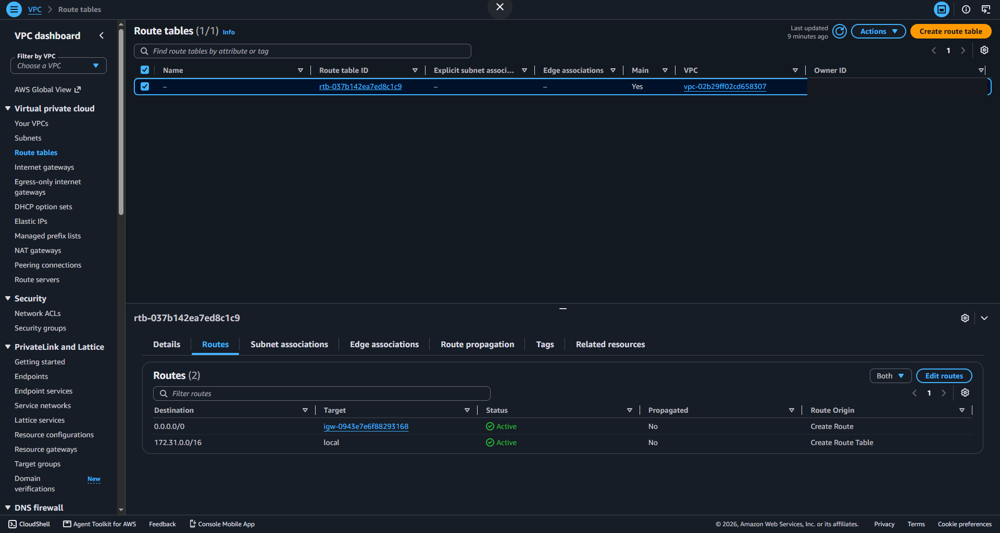
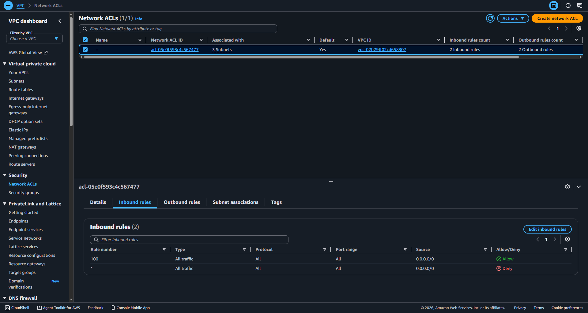
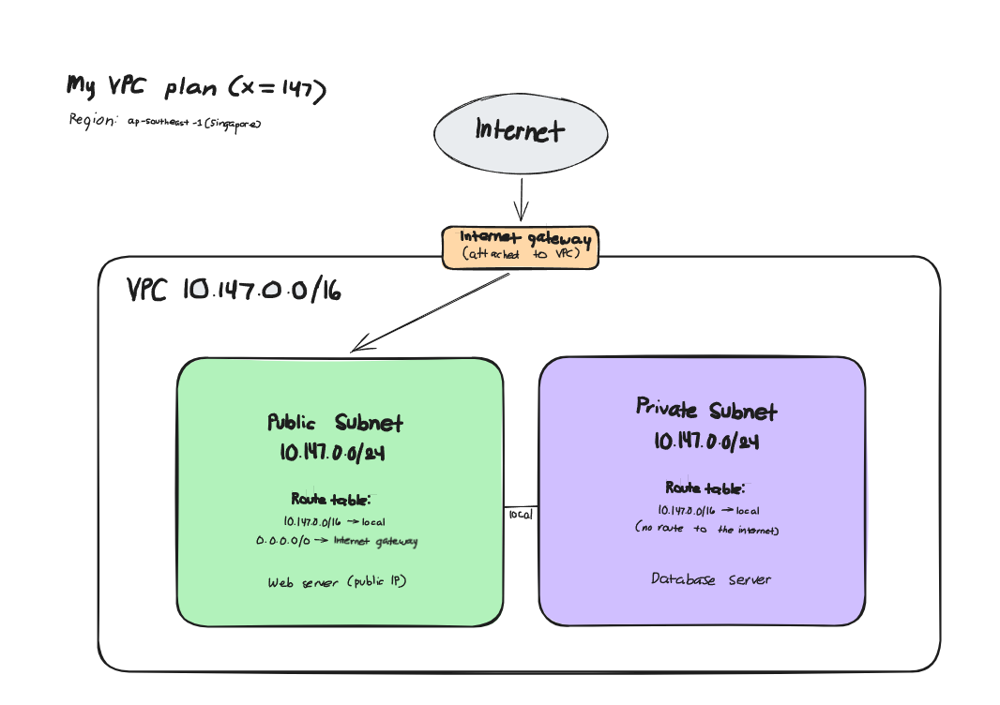

# Assignment 2 Submission

<!--
How to use this template:

1. Copy this file to submissions/assignment-2/<your-github-username>/submission.md
2. Replace every answer placeholder with your own answer. Delete the angle brackets too.
3. Save your four images in the same folder, with the exact file names below.
4. Do not write your full name or your student number in this file.
-->

## About me

- GitHub username: Dyeel
- Section: IV-BCSAD
- IAM user name that I signed in with: bcsad-g09
- X: 147

---

## Part A. Explore

### A1. The VPC

Default VPC IPv4 CIDR:

172.31.0.0/16

Number of addresses in that CIDR:

65,536

### A2. The subnets

| Availability Zone | IPv4 CIDR |
| --- | --- |
| ap-southeast-1a (apse1-az2) | 172.31.32.0/20 |
| ap-southeast-1b (apse1-az1) | 172.31.16.0/20 |
| ap-southeast-1c (apse1-az3) | 172.31.0.0/20 |

Screenshot 1. Save it as `screenshot-1-subnets.png` in your folder. The image line below shows it.

### A3. Available addresses

Available IPv4 addresses in each subnet:

- ap-southeast-1a (172.31.32.0/20): 4,090
- ap-southeast-1b (172.31.16.0/20): 4,091
- ap-southeast-1c (172.31.0.0/20): 4,091

Why is the number lower than 4,096?

Each subnet is a /20 with 4,096 addresses, but AWS reserves 5 addresses in every subnet (the first four and the last one) for its own use, such as the network address, the VPC router, and DNS. That leaves 4,091 addresses that instances can use.

What uses the missing address in the subnet with the lowest number?

The subnet in ap-southeast-1a shows 4,090, one fewer than the others, because the network interface of an EC2 instance (from Lab 2) is using one of its addresses. The network interface keeps its address even when the instance is stopped.

### A4. The route table

| Destination | Target |
| --- | --- |
| 0.0.0.0/0 | igw-... |
| 172.31.0.0/16 | local |

Screenshot 2. Save it as `screenshot-2-routes.png` in your folder. The image line below shows it.

### A5. Public or private

Are the default subnets public or private? Which route proves it?

The default subnets are public. The route 0.0.0.0/0 with the target igw-... proves it, because it sends all internet traffic to the internet gateway.

### A6. The internet gateway

State of the internet gateway:

Attached

What happens to the default subnets if the gateway is detached?

The default subnets lose their connection to the internet. The route 0.0.0.0/0 still points to the internet gateway, but the gateway is no longer connected to the VPC, so the route becomes a blackhole. Instances with public IP addresses can no longer reach the internet, and the internet cannot reach them. Traffic inside the VPC still works because of the local route.

### A7. NAT gateways

Number of NAT gateways:

0

Can a server in a new private subnet download updates? Why?

No. A private subnet has no route to the internet gateway, and the VPC has no NAT gateway that the private route table could send 0.0.0.0/0 to. So the server has no path to reach the internet to download updates.

### A8. The network ACL

| Rule number | Source | Allow or Deny |
| --- | --- | --- |
| 100 | 0.0.0.0/0 | Allow |
| * | 0.0.0.0/0 | Deny |

How is a network ACL different from a security group?

A network ACL is a firewall on a whole subnet, has both allow and deny rules, checks rules in number order, and is stateless, so each direction needs its own rule. A security group is a firewall on one resource, such as an instance, has allow rules only, and is stateful, so the reply to an allowed request goes back out automatically.

Screenshot 3. Save it as `screenshot-3-network-acl.png` in your folder. The image line below shows it.

### A9. The default security group

Inbound rule (type and source):

Type: All traffic. Source: sg-0c5b6d4081cf0a534, which is the default security group itself.

Which resources can send traffic to an instance that uses it?

Only resources that also use this same default security group. Because the source of the rule is the security group itself, traffic from anywhere else, including the internet, is blocked.

---

## Part B. Prepare

### B1. Plan two subnets

- Public subnet CIDR: 10.147.0.0/24
- Private subnet CIDR: 10.147.1.0/24

### B2. Route tables

Route table of the public subnet:

| Destination | Target |
| --- | --- |
| 10.147.0.0/16 | local |
| 0.0.0.0/0 | internet gateway |

Route table of the private subnet:

| Destination | Target |
| --- | --- |
| 10.147.0.0/16 | local |

### B3. My VPC diagram

Tool used (Excalidraw, draw.io, Lucidchart, or paper):

Digital tool (drawn with a Python script using the Pillow library)

Save your diagram as `vpc-diagram.png` in your folder. The image line below shows it.

### B4. Predict a change

Can you still open the web page from your laptop? Why?

No. My laptop reaches the instance through the internet, and the route 0.0.0.0/0 to the internet gateway was the only path for internet traffic. Without that route, the reply from the instance has no way back to the internet, so the public IP address alone does not help.

Can the instance still reach another instance in the VPC? Why?

Yes. The local route (172.31.0.0/16 to local) is still in the route table, so every subnet in the VPC can still reach every other subnet.

### B5. Place a database

Which subnet gets the database? Why?

The private subnet, 10.147.1.0/24. Its route table only has the local route and no route to the internet gateway, so nobody on the internet can reach the database. The web servers in the public subnet can still reach it through the local route.

### B6. My question about VPCs

What is your question, and what made you think of it?

The security groups list showed about 20 groups from different sections and groups, all in the same default VPC. Should each group or class have its own VPC instead of sharing one, and what would stop one group's instance from reaching another group's instance inside the same VPC? I thought of it because the local route connects every subnet, so all our Lab instances seem to be on the same network.
