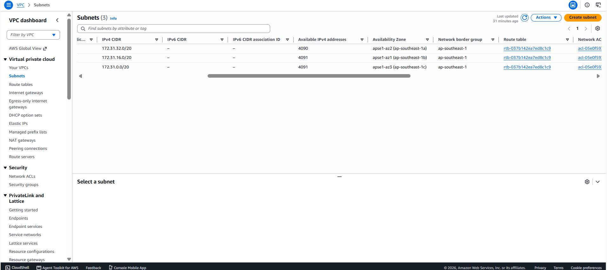
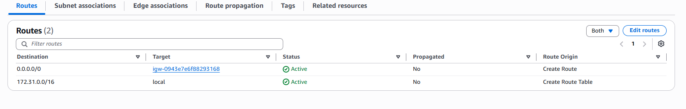
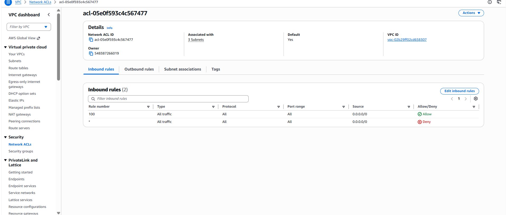
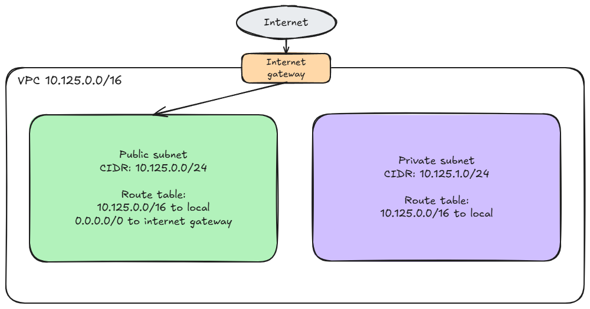

# Assignment 2 Submission

<!--
How to use this template:

1. Copy this file to submissions/assignment-2/<your-github-username>/submission.md
2. Replace every answer placeholder with your own answer. Delete the angle brackets too.
3. Save your four images in the same folder, with the exact file names below.
4. Do not write your full name or your student number in this file.
-->

## About me

- GitHub username: ExalaJohn
- Section: IV-BCSAD
- IAM user name that I signed in with: bcsad-g02
- X: 125

---

## Part A. Explore

### A1. The VPC

Default VPC IPv4 CIDR:
`172.31.0.0/16`

Number of addresses in that CIDR:

65,536

### A2. The subnets

| Availability Zone | IPv4 CIDR |
| --- | --- |
| `ap-southeast-1a` | `172.31.32.0/20` |
| `ap-southeast-1b` | `172.31.16.0/20` |
| `ap-southeast-1c` | `172.31.0.0/20` |

Screenshot 1. Save it as `screenshot-1-subnets.png` in your folder. The image line below shows it.

### A3. Available addresses

Available IPv4 addresses in each subnet:

`ap-southeast-1a` 4,090, `ap-southeast-1b` 4,091, `ap-southeast-1c` 4,091.

Why is the number lower than 4,096?

A /20 CIDR block mathematically contains 4,096 total IP addresses. However, AWS automatically reserves 5 IP addresses in every subnet for default networking services (network address, VPC router, DNS, future use, and broadcast address). 4,096 - 5 = 4,091 usable addresses.

What uses the missing address in the subnet with the lowest number?

An active AWS resource or Network Interface (ENI) provisioned in that subnet is consuming an extra IP address.

### A4. The route table

| Destination | Target |
| --- | --- |
| `0.0.0.0/0` | `igw-0943e7e6f88293168` |
| `172.31.0.0/16` | `local` |

Screenshot 2. Save it as `screenshot-2-routes.png` in your folder. The image line below shows it.

### A5. Public or private

Are the default subnets public or private? Which route proves it?

They are public subnets. The route with Destination `0.0.0.0/0` pointing to Target `igw-0943e7e6f88293168` (the Internet Gateway) proves it.

### A6. The internet gateway

State of the internet gateway:

Attached

What happens to the default subnets if the gateway is detached?

The default subnets lose all direct inbound and outbound internet connectivity, turning them into private subnets. Resources inside will no longer be accessible from or able to reach the public internet.

### A7. NAT gateways

Number of NAT gateways:

0

Can a server in a new private subnet download updates? Why?

No. A private subnet does not have direct route access to an Internet Gateway, and without a NAT Gateway to translate outbound traffic, instances in the private subnet cannot reach the internet to download updates or software packages.

### A8. The network ACL

| Rule number | Source | Allow or Deny |
| --- | --- | --- |
| 100 | `0.0.0.0/0` | Allow |
| `*` | `0.0.0.0/0` | Deny |

How is a network ACL different from a security group?

A Network ACL (NACL) is stateless and acts as a firewall at the subnet level, evaluating rules sequentially by rule number and explicitly allowing or denying traffic. In contrast, a Security Group is stateful and operates at the individual instance/resource level (ENI), automatically allowing return traffic and supporting only "Allow" rules.

Screenshot 3. Save it as `screenshot-3-network-acl.png` in your folder. The image line below shows it.

### A9. The default security group

Inbound rule (type and source):

Type: All traffic, Source: `sg-0c5b6d4081cf0a534` (the default security group itself)

Which resources can send traffic to an instance that uses it?

Only other instances or resources that are associated with this exact same default security group. External traffic or resources in other security groups cannot send inbound traffic to it.

---

## Part B. Prepare

### B1. Plan two subnets

- Public subnet CIDR: `10.125.0.0/24`
- Private subnet CIDR: `10.125.1.0/24`

### B2. Route tables

Route table of the public subnet:

| Destination | Target |
| --- | --- |
| `10.125.0.0/16` | `local` |
| `0.0.0.0/0` | internet gateway |

Route table of the private subnet:

| Destination | Target |
| --- | --- |
| `10.125.0.0/16` | `local` |

### B3. My VPC diagram

Tool used (Excalidraw, draw.io, Lucidchart, or paper):

Excalidraw

Save your diagram as `vpc-diagram.png` in your folder. The image line below shows it.

### B4. Predict a change

Can you still open the web page from your laptop? Why?

No. Removing the 0.0.0.0/0 route breaks outbound and return traffic through the Internet Gateway, making the instance unreachable from the external internet.

Can the instance still reach another instance in the VPC? Why?

Yes. Communication within the VPC uses the 10.125.0.0/16 local route, which remains active in the route table.

### B5. Place a database

Which subnet gets the database? Why?

The private subnet (10.125.1.0/24). Databases store sensitive data and should never be exposed directly to the public internet. Placing it in the private subnet protects it from external network attacks while allowing web or application servers in the public subnet to connect to it locally.

### B6. My question about VPCs

What is your question, and what made you think of it?

How does AWS handle routing priority when two routes in a route table have overlapping IP address ranges? Seeing both 0.0.0.0/0 and 10.125.0.0/16 in the same route table made me wonder how AWS decides which rule takes precedence for incoming traffic.
