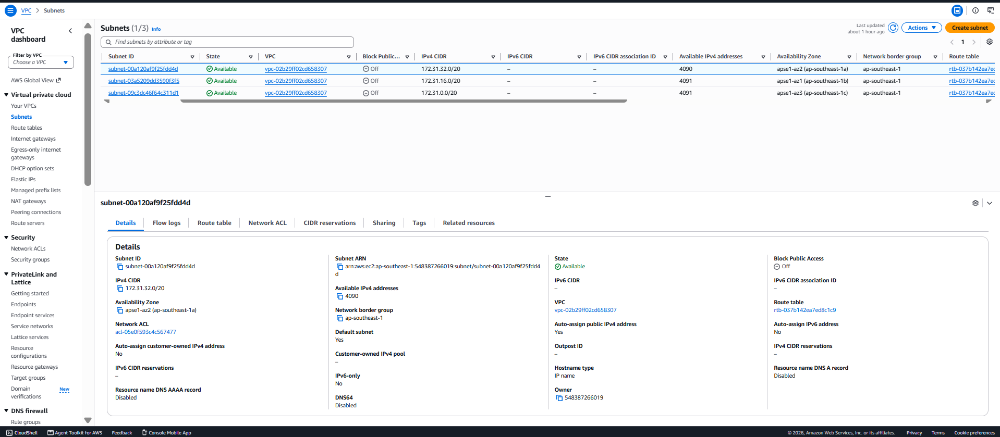
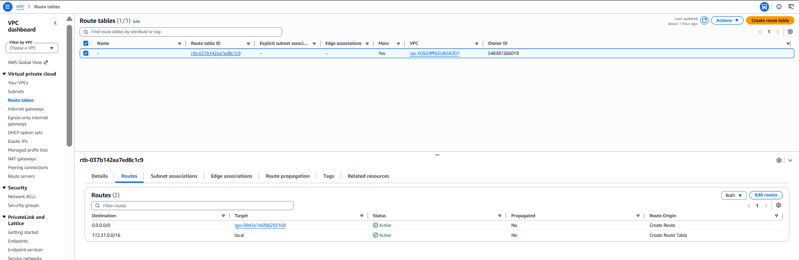
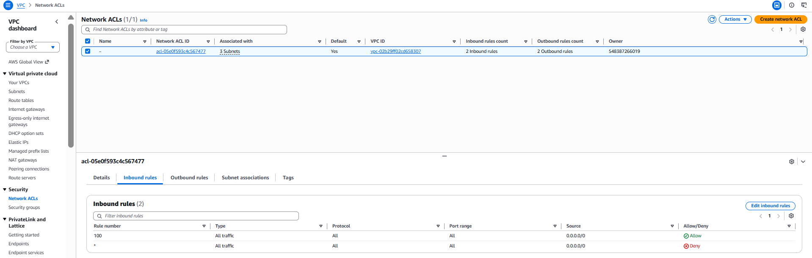
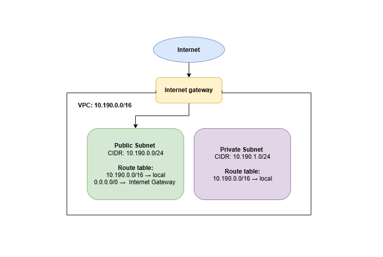

# Assignment 2 Submission

## About me

- GitHub username: JHnsu
- Section: IV-BCSAD
- IAM user name that I signed in with: bcsad-g03
- X: 190

---

## Part A. Explore

### A1. The VPC

Default VPC IPv4 CIDR:

172.31.0.0/16

Number of addresses in that CIDR:

65,536

### A2. The subnets

| Availability Zone | IPv4 CIDR |
| --- | --- |
| apse1-az2 (ap-southeast-1a)| 172.31.32.0/20 |
| apse1-az1 (ap-southeast-1b) | 172.31.16.0/20|
| apse1-az3 (ap-southeast-1c)| 172.31.0.0/20 |

Screenshot 1. Save it as `screenshot-1-subnets.png` in your folder. The image line below shows it.

### A3. Available addresses

Available IPv4 addresses in each subnet:

- apse1-az2 (ap-southeast-1a): 4,090
- apse1-az1 (ap-southeast-1b): 4,091
- apse1-az3 (ap-southeast-1c): 4,091

Why is the number lower than 4,096?

AWS reserves 5 IPv4 addresses in every subnet for networking purposes, so those 5 addresses cannot be assigned to resources.

What uses the missing address in the subnet with the lowest number?

The additional unavailable address is being used by a resource in that subnet, such as a network interface (ENI).

### A4. The route table

| Destination | Target |
| --- | --- |
| 0.0.0.0/0| igw-0943e7e6f88293168 |
| 172.31.0.0/16 | local |

Screenshot 2. Save it as `screenshot-2-routes.png` in your folder. The image line below shows it.

### A5. Public or private

Are the default subnets public or private? Which route proves it?

The default subnets are public because the route `0.0.0.0/0` points to an Internet Gateway. This gives the subnets a route to the internet.

### A6. The internet gateway

State of the internet gateway:

Attached

What happens to the default subnets if the gateway is detached?

If the Internet Gateway is detached, the default subnets will no longer have a route to the internet through the gateway. Resources in those subnets would lose their direct internet connectivity through the Internet Gateway.

### A7. NAT gateways

Number of NAT gateways:

0

Can a server in a new private subnet download updates? Why?

No. A server in a private subnet cannot directly access the internet through an Internet Gateway. It would need a NAT Gateway and a route to the NAT Gateway to access the internet for outbound connections.

### A8. The network ACL

| Rule number | Source | Allow or Deny |
| --- | --- | --- |
| 100| 0.0.0.0/0 | Allow |
| * |  0.0.0.0/0 | Deny |

How is a network ACL different from a security group?

A network ACL controls traffic at the subnet level and can have both allow and deny rules. A security group controls traffic at the resource level, such as an EC2 instance, and is stateful.

Screenshot 3. Save it as `screenshot-3-network-acl.png` in your folder. The image line below shows it.

### A9. The default security group

Inbound rule (type and source):

No inbound rules are configured by default for the default security group.

Which resources can send traffic to an instance that uses it?

Resources associated with the same default security group can communicate with the instance when allowed by the security group's rules.

---

## Part B. Prepare

### B1. Plan two subnets

- Public subnet CIDR: 10.190.0.0/24
- Private subnet CIDR: 10.190.1.0/24

### B2. Route tables

Route table of the public subnet:

| Destination | Target |
| --- | --- |
| 10.190.0.0/16 | local |
| 0.0.0.0/0| Internet Gateway |

Route table of the private subnet:

| Destination | Target |
| --- | --- |
| 10.190.0.0/16| local |

### B3. My VPC diagram

Tool used (Excalidraw, draw.io, Lucidchart, or paper):

<answer>

Save your diagram as `vpc-diagram.png` in your folder. The image line below shows it.

### B4. Predict a change

Can you still open the web page from your laptop? Why?

No. If the `0.0.0.0/0` route to the Internet Gateway is removed, the instance no longer has a route for internet traffic, so the web page cannot be accessed through the internet.

Can the instance still reach another instance in the VPC? Why?

Yes. The instance can still communicate with another instance in the same VPC because the local route for the VPC CIDR remains available.

### B5. Place a database

Which subnet gets the database? Why?

The database should be placed in the private subnet because it should not be directly exposed to the public internet. The application can communicate with the database through the VPC while the database remains private.

### B6. My question about VPCs

What is your question, and what made you think of it?

How does a private subnet access the internet if it does not have a direct route to an Internet Gateway? I thought of this because the activity showed that public subnets can use an Internet Gateway, while private subnets do not have direct internet access. This made me curious about how private servers can still download updates or access external services when needed.