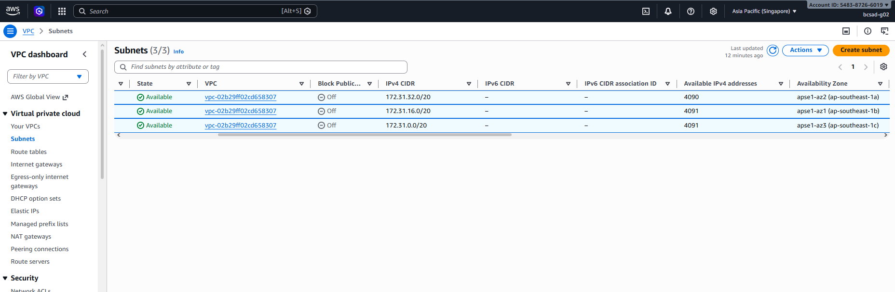
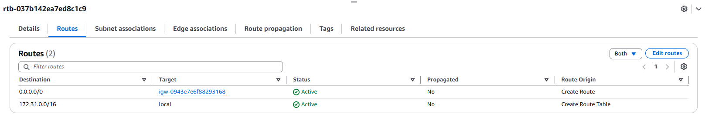
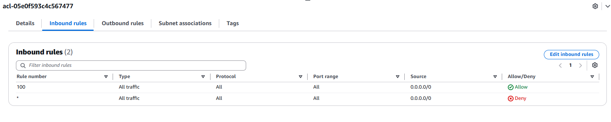
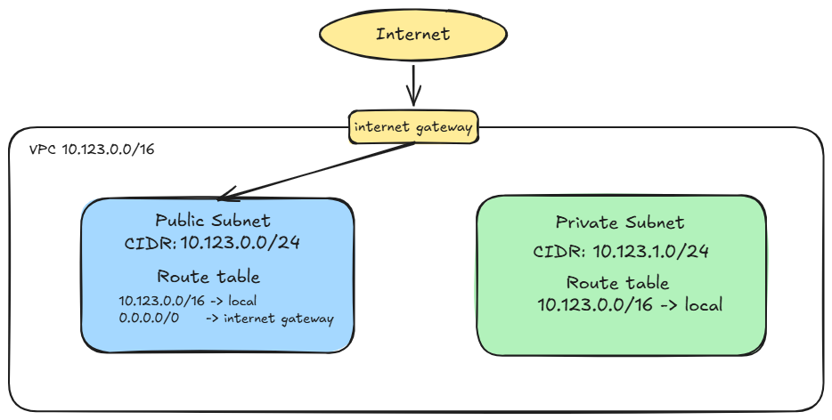

# Assignment 2 Submission

<!--
How to use this template:

1. Copy this file to submissions/assignment-2/<your-github-username>/submission.md
2. Replace every answer placeholder with your own answer. Delete the angle brackets too.
3. Save your four images in the same folder, with the exact file names below.
4. Do not write your full name or your student number in this file.
-->

## About me

- GitHub username: KennethTejam
- Section: IV-BCSAD
- IAM user name that I signed in with: `bcsad-g02`
- X: 196

---

## Part A. Explore

### A1. The VPC

Default VPC IPv4 CIDR:

`172.31.0.0/16`

Number of addresses in that CIDR:

`65,536`

### A2. The subnets

| Availability Zone | IPv4 CIDR |
| --- | --- |
| `ap-southeast-1a` | `172.31.32.0/20`  |
| `ap-southeast-1b` | `172.31.16.0/20`  |
| `ap-southeast-1c` | `172.31.0.0/20`   |

Screenshot 1. Save it as `screenshot-1-subnets.png` in your folder. The image line below shows it.

### A3. Available addresses

Available IPv4 addresses in each subnet:

`apse1-az2` 4,090, `apse1-az1`4,091, `apse1-az3` 4,091.

Why is the number lower than 4,096?

4,091 is exactly 4,096 − 5, and 4,090 means one more address is in use in that subnet.

What uses the missing address in the subnet with the lowest number?

`apse1-az2` 4,090

### A4. The route table

| Destination     | Target |
|       ---       | ---    |
| `172.31.0.0/16` | local  |
| `0.0.0.0/0`     | `igw-…`|

Screenshot 2. Save it as `screenshot-2-routes.png` in your folder. The image line below shows it.

### A5. Public or private

Are the default subnets public or private? Which route proves it?

Public. The `0.0.0.0/0` route to the internet gateway proves it
### A6. The internet gateway

State of the internet gateway:

Attached

What happens to the default subnets if the gateway is detached?

If the gateway is detached, the `0.0.0.0/0` route has nowhere to go. The default subnets lose internet access in both directions, but traffic between subnets still works through the local route.

### A7. NAT gateways

Number of NAT gateways:

there are no NAT gateways

Can a server in a new private subnet download updates? Why?

No. The private subnet has no route to the internet gateway, and with no NAT gateway it has no other way out.

### A8. The network ACL

| Rule number | Source | Allow or Deny |
| --- | --- | --- |
| `100` | `0.0.0.0/0  ` | `Allow` |
| `*` | `0.0.0.0/0  ` | `Deny` |

How is a network ACL different from a security group?

A network ACL attaches to a subnet, has allow and deny rules, and is stateless. A security group attaches to a resource, has allow rules only, and is stateful.

Screenshot 3. Save it as `screenshot-3-network-acl.png` in your folder. The image line below shows it.

### A9. The default security group

Inbound rule (type and source):

All traffic, from `sg-…`

Which resources can send traffic to an instance that uses it?

Only resources that belong to the security group named in the Source can send traffic to it.

---

## Part B. Prepare

### B1. Plan two subnets

- Public subnet CIDR: 10.123.0.0/24
- Private subnet CIDR: 10.123.1.0/24

### B2. Route tables

Route table of the public subnet:

| Destination | Target |
| --- | --- |
| `10.123.0.0/16` | local |
| `0.0.0.0/0`     | internet gateway |

Route table of the private subnet:

| Destination | Target |
| --- | --- |
| `10.123.0.0/16` | local |

### B3. My VPC diagram

Tool used (Excalidraw, draw.io, Lucidchart, or paper):

Excalidraw

Save your diagram as `vpc-diagram.png` in your folder. The image line below shows it.

### B4. Predict a change

Can you still open the web page from your laptop? Why?

No. The route 0.0.0.0/0 to the internet gateway is what gives the subnet a path to the internet.

Can the instance still reach another instance in the VPC? Why?

Yes. Traffic inside the VPC uses the local route (172.31.0.0/16 to local), which is a separate route that I did not delete.

### B5. Place a database

Which subnet gets the database? Why?

The private subnet, 10.123.1.0/24. It has no route to the internet gateway, so the internet cannot reach the database.

### B6. My question about VPCs

What is your question, and what made you think of it?
<answer>
