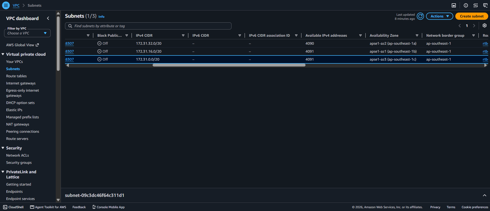
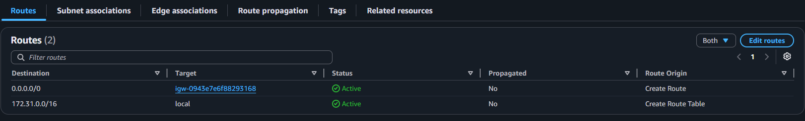
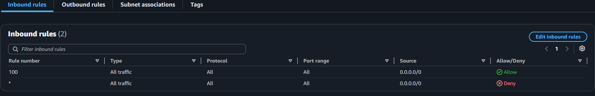
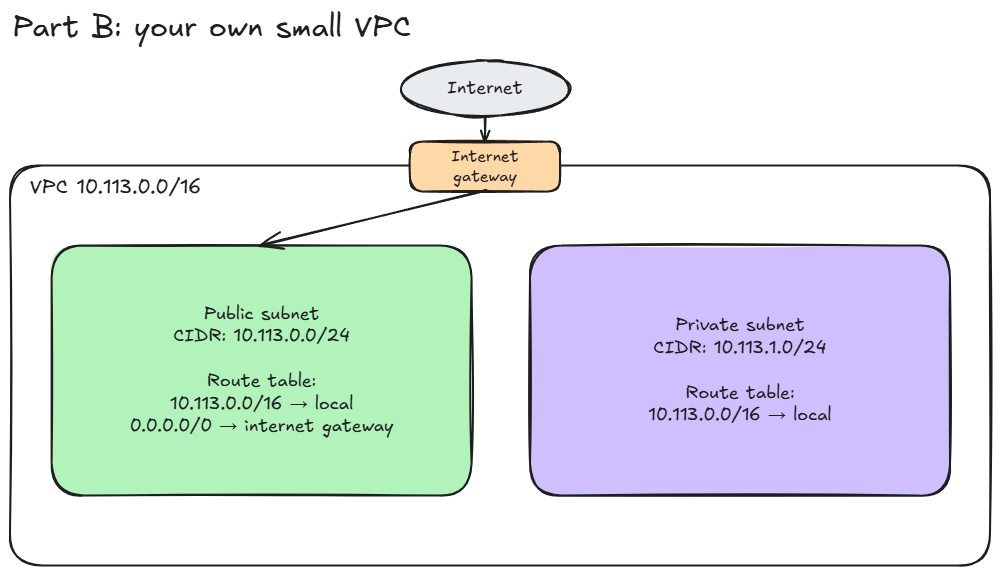

# Assignment 2 Submission

<!--
How to use this template:

1. Copy this file to submissions/assignment-2/<your-github-username>/submission.md
2. Replace every answer placeholder with your own answer. Delete the angle brackets too.
3. Save your four images in the same folder, with the exact file names below.
4. Do not write your full name or your student number in this file.
-->

## About me

- GitHub username: LouieCads
- Section: IV-BCSAD
- IAM user name that I signed in with: bcsad-g05
- X: 113

---

## Part A. Explore

### A1. The VPC

Default VPC IPv4 CIDR:

`172.31.0.0/16`

Number of addresses in that CIDR:

65,536

### A2. The subnets

| Availability Zone | IPv4 CIDR |
| --- | --- |
| `ap-southeast-1a` | `172.31.32.0/20` |
| `ap-southeast-1b` | `172.31.16.0/20` |
| `ap-southeast-1c` | `172.31.0.0/20` |

Screenshot 1. Save it as `screenshot-1-subnets.png` in your folder. The image line below shows it.

### A3. Available addresses

Available IPv4 addresses in each subnet:

`ap-southeast-1a`: 4,090; `ap-southeast-1b`: 4,091; `ap-southeast-1c`: 4,091.

Why is the number lower than 4,096?

AWS reserves five addresses in each subnet. A `/20` has 4,096 addresses, so an empty subnet has 4,091 available.

What uses the missing address in the subnet with the lowest number?

The `ap-southeast-1a` subnet has one address in use beyond the five reserved addresses, likely held by a resource's network interface. The subnet list does not identify the resource.

### A4. The route table

| Destination | Target |
| --- | --- |
| `0.0.0.0/0` | Internet gateway (`igw-...`) |
| `172.31.0.0/16` | `local` |

Screenshot 2. Save it as `screenshot-2-routes.png` in your folder. The image line below shows it.

### A5. Public or private

Are the default subnets public or private? Which route proves it?

Public. The route `0.0.0.0/0` points to an internet gateway.

### A6. The internet gateway

State of the internet gateway:

Attached to the default VPC.

What happens to the default subnets if the gateway is detached?

They lose their internet connection because the `0.0.0.0/0` route no longer has a working internet gateway. Instances can still communicate within the VPC through the `172.31.0.0/16` local route.

### A7. NAT gateways

Number of NAT gateways:

0

Can a server in a new private subnet download updates? Why?

No. There is no NAT gateway to give a private subnet an outbound path to the internet, and a private subnet would not route directly to the internet gateway.

### A8. The network ACL

| Rule number | Source | Allow or Deny |
| --- | --- | --- |
| `100` | `0.0.0.0/0` | Allow |
| `*` | `0.0.0.0/0` | Deny |

How is a network ACL different from a security group?

A network ACL applies to a subnet and can allow or deny traffic. It is stateless, so reply traffic needs a matching rule in the other direction. A security group applies to a resource, has allow rules only, and is stateful.

Screenshot 3. Save it as `screenshot-3-network-acl.png` in your folder. The image line below shows it.

### A9. The default security group

Inbound rule (type and source):

All traffic from the `default` security group itself (`sg-0c5b6d4081cf0a534`).

Which resources can send traffic to an instance that uses it?

Resources that also use this `default` security group can send traffic to the instance. The inbound rule does not allow other sources.

---

## Part B. Prepare

### B1. Plan two subnets

- Public subnet CIDR: `10.113.0.0/24`
- Private subnet CIDR: `10.113.1.0/24`

### B2. Route tables

Route table of the public subnet:

| Destination | Target |
| --- | --- |
| `10.113.0.0/16` | `local` |
| `0.0.0.0/0` | internet gateway |

Route table of the private subnet:

| Destination | Target |
| --- | --- |
| `10.113.0.0/16` | `local` |

### B3. My VPC diagram

Tool used (Excalidraw, draw.io, Lucidchart, or paper):

Excalidraw

Save your diagram as `vpc-diagram.png` in your folder. The image line below shows it.

### B4. Predict a change

Can you still open the web page from your laptop? Why?

No. The instance still has a public IPv4 address, but without the `0.0.0.0/0` route it has no path to send traffic back to my laptop on the internet.

Can the instance still reach another instance in the VPC? Why?

Yes. The VPC's `172.31.0.0/16` local route remains, so the instances can communicate within the VPC if their security rules allow it.

### B5. Place a database

Which subnet gets the database? Why?

I would put the database in the private subnet, `10.113.1.0/24`, because its route table has no direct route to the internet gateway.

### B6. My question about VPCs

What is your question, and what made you think of it?

Can a private subnet reach only selected AWS services through VPC endpoints without adding a NAT gateway, and how would its routing work? I thought of this when I saw that our VPC has zero NAT gateways and wondered whether private servers could still reach AWS services without general internet access.
