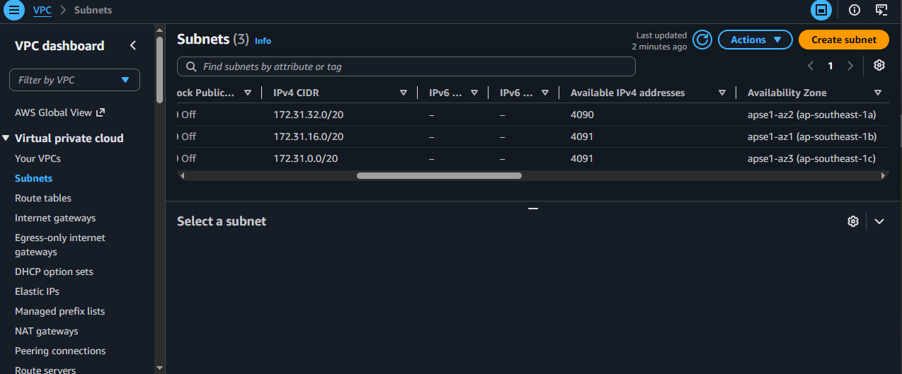
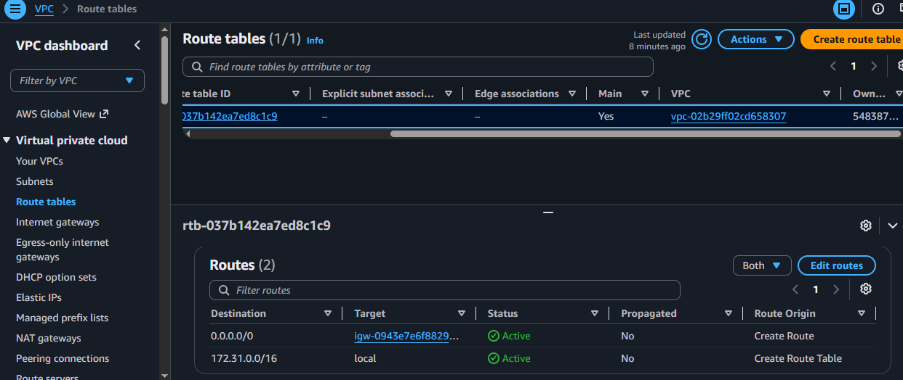
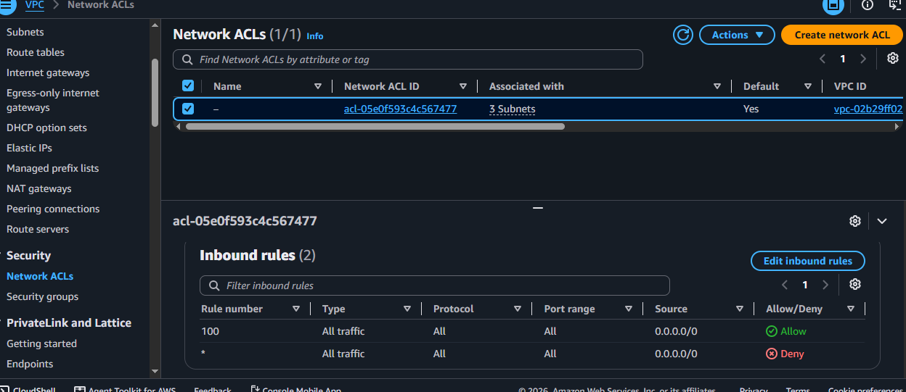
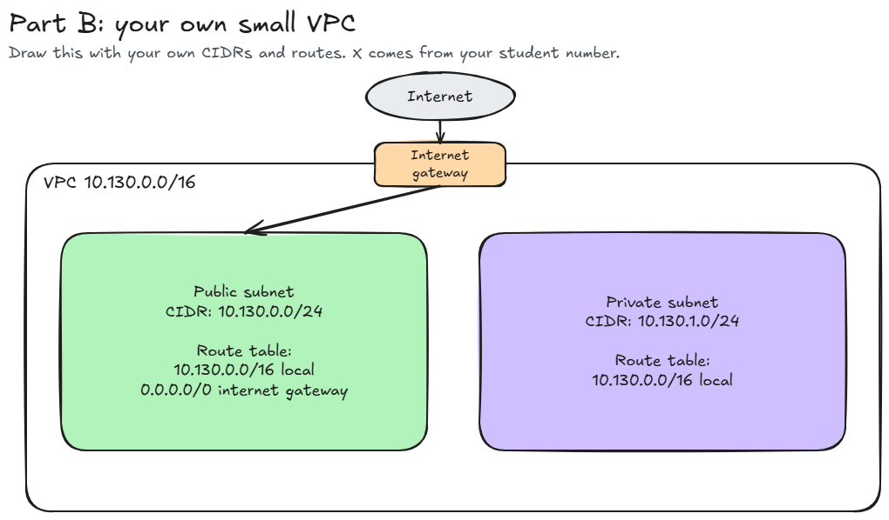

# Assignment 2 Submission

<!--
How to use this template:

1. Copy this file to submissions/assignment-2/<your-github-username>/submission.md
2. Replace every answer placeholder with your own answer. Delete the angle brackets too.
3. Save your four images in the same folder, with the exact file names below.
4. Do not write your full name or your student number in this file.
-->

## About me

- GitHub username: MalulanM
- Section: IV-BCSAD
- IAM user name that I signed in with: bcsad-g01
- X: 130

---

## Part A. Explore

### A1. The VPC

Default VPC IPv4 CIDR:

172.31.0.0/16

Number of addresses in that CIDR:

65,536

### A2. The subnets

| Availability Zone | IPv4 CIDR |
| --- | --- |
| apse1-az2 (ap-southeast-1a) | 172.31.32.0/20 |
| apse1-az1 (ap-southeast-1b) | 172.31.16.0/20 |
| apse1-az3 (ap-southeast-1c) | 172.31.0.0/20 |

Screenshot 1. Save it as `screenshot-1-subnets.png` in your folder. The image line below shows it.

### A3. Available addresses

Available IPv4 addresses in each subnet:

apse1-az2 (ap-southeast-1a) 4090, apse1-az1 (ap-southeast-1b) 4091, apse1-az3 (ap-southeast-1c) 4091
Why is the number lower than 4,096?

A `/20` prefix has 4,096 total addresses. AWS reserves 5 IP addresses in every subnet (network address, VPC router, DNS, future reservation, and broadcast), leaving 4,096 − 5 = 4,091 available addresses.

What uses the missing address in the subnet with the lowest number?

Any missing address below 4,091 is attached to an active Elastic Network Interface (ENI), such as a running or stopped EC2 instance.

### A4. The route table

| Destination | Target |
| --- | --- |
| 0.0.0.0/0 | igw-0943e7e6f88293168 |
| 172.31.0.0/16 | local |

Screenshot 2. Save it as `screenshot-2-routes.png` in your folder. The image line below shows it.

### A5. Public or private

Are the default subnets public or private? Which route proves it?

Public. The route `0.0.0.0/0` targeting the internet gateway (`igw-0943e7e6f88293168`) proves it because it gives the subnets a direct path to the internet.

### A6. The internet gateway

State of the internet gateway:

aTTACHED

What happens to the default subnets if the gateway is detached?

If detached, the route 0.0.0.0/0 loses its target. The subnets can no longer communicate with the internet (inbound or outbound), though instances inside the VPC can still communicate with each other over the local route.>

### A7. NAT gateways

Number of NAT gateways:

0

Can a server in a new private subnet download updates? Why?

The count is 0. A server in a private subnet cannot download updates from the internet because there is no NAT gateway to route its outbound requests to the internet without a public IP

### A8. The network ACL

| Rule number | Source | Allow or Deny |
| --- | --- | --- |
| 100 | 0.0.0.0/0 | Allow |
| * | 0.0.0.0/0 | Deny |

How is a network ACL different from a security group?

Security groups are stateful. If you allow inbound traffic on port 443, the response traffic on the ephemeral port is automatically allowed. Network ACLs are stateless. Every single packet is evaluated against the rules independently. 
Screenshot 3. Save it as `screenshot-3-network-acl.png` in your folder. The image line below shows it.

### A9. The default security group

Inbound rule (type and source):

All traffic, sg-0c5b6d4081cf0a534 - default

Which resources can send traffic to an instance that uses it?

Even though the type says "All traffic," the Source is set to the security group itself (sg-0c5b6d4081cf0a534). This self-referencing rule means only resources that share and use that exact same default security group can send traffic to the instance. Any traffic coming from outside that security group is blocked.

---

## Part B. Prepare

### B1. Plan two subnets

- Public subnet CIDR: 10.130.0.0/24
- Private subnet CIDR: 10.130.1.0/24

### B2. Route tables

Route table of the public subnet:

| Destination | Target |
| --- | --- |
| 10.130.0.0/16 | local |
| 0.0.0.0/0 | internet gateway |

Route table of the private subnet:

| Destination | Target |
| --- | --- |
| 10.130.0.0/16 | local |

### B3. My VPC diagram

Tool used (Excalidraw, draw.io, Lucidchart, or paper):

Excalidraw

Save your diagram as `vpc-diagram.png` in your folder. The image line below shows it.

### B4. Predict a change

Can you still open the web page from your laptop? Why?

No. While the instance retains its public IPv4 address and security group ingress rules, removing the default route (0.0.0.0/0 -> igw) severs egress routing at the network layer. The instance cannot resolve a next hop for return packets directed to the client's public IP address, causing the TCP three-way handshake (SYN-ACK) to fail and dropping incoming HTTP sessions.

Can the instance still reach another instance in the VPC? Why?

Yes. Intra-VPC routing is governed independently by the persistent local route entry (10.130.0.0/16 -> local). Under AWS longest prefix match routing, any traffic targeted at another private IP within the VPC envelope routes across the virtual network fabric without traversing the Internet Gateway.

### B5. Place a database

Which subnet gets the database? Why?

The private subnet (10.130.1.0/24). Following defense-in-depth and the principle of least privilege, stateful data stores should never have direct routing exposure to public IP space. Placing the database in a subnet without an Internet Gateway route neutralizes external network-layer ingress vectors, restricting access strictly to application nodes in the public subnet via RFC 1918 private addressing over the VPC's local route.

### B6. My question about VPCs

What is your question, and what made you think of it?

How does AWS handle connection tracking and throughput limits at the Nitro hypervisor layer when high-concurrency microservices exchange traffic entirely over the VPC local route without NAT Gateways or Internet Gateways?

What made me think of it is that while the local route eliminates NAT data processing fees and external internet hops, large-scale architectures running thousands of concurrent database queries across subnets must still encounter hypervisor-level soft limits, bandwidth caps, or flow table constraints on the underlying virtual network interfaces (ENIs).
