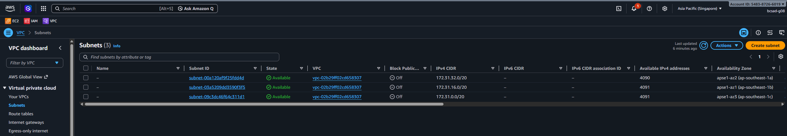
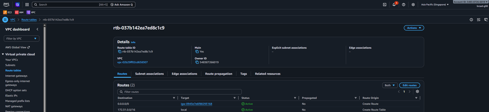
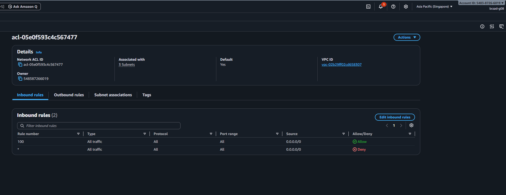
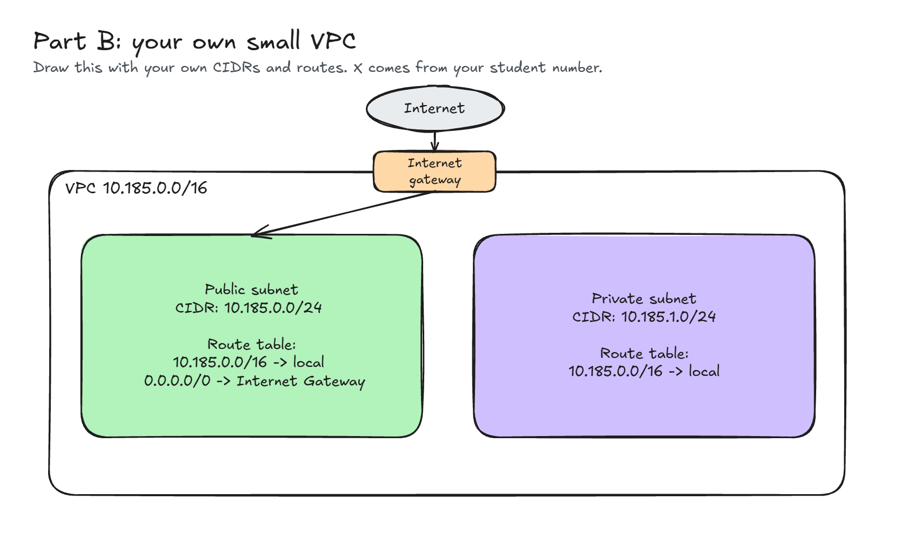

# Assignment 2 Submission

<!--
How to use this template:

1. Copy this file to submissions/assignment-2/<your-github-username>/submission.md
2. Replace every answer placeholder with your own answer. Delete the angle brackets too.
3. Save your four images in the same folder, with the exact file names below.
4. Do not write your full name or your student number in this file.
-->

## About me

- GitHub username: PorkAdubuu
- Section: IV-BCSAD
- IAM user name that I signed in with: bcsad-g08
- X: 185

---

## Part A. Explore

### A1. The VPC

Default VPC IPv4 CIDR:

172.31.0.0/16

Number of addresses in that CIDR:

65,536

### A2. The subnets

| Availability Zone | IPv4 CIDR |
| --- | --- |
| ap-southeast-1a | 172.31.32.0/20 |
| ap-southeast-1b | 172.31.16.0/20 |
| ap-southeast-1c | 172.31.0.0/20 |

Screenshot 1. Save it as `screenshot-1-subnets.png` in your folder. The image line below shows it.

### A3. Available addresses

Available IPv4 addresses in each subnet:

ap-southeast-1a: 4090
ap-southeast-1b: 4091
ap-southeast-1c: 4091

Why is the number lower than 4,096?

AWS reserves 5 IP addresses in every subnet for its own use.

What uses the missing address in the subnet with the lowest number?

One additional IP address is being used by a network interface/resource in that subnet.

### A4. The route table

| Destination | Target |
| --- | --- |
| 0.0.0.0/0 | igw-0943e7e6f88293168 |
| 172.31.0.0/16 | local |

Screenshot 2. Save it as `screenshot-2-routes.png` in your folder. The image line below shows it.

### A5. Public or private

Are the default subnets public or private? Which route proves it?

The default subnets are public because their route table has a 0.0.0.0/0 route pointing to the Internet Gateway (igw-0943e7e6f88293168).

### A6. The internet gateway

State of the internet gateway:

Attached

What happens to the default subnets if the gateway is detached?

The default subnets can no longer reach the internet because their 0.0.0.0/0 route points to the Internet Gateway, and that gateway would no longer be attached to the VPC.

### A7. NAT gateways

Number of NAT gateways:

0

Can a server in a new private subnet download updates? Why?

No. The VPC has no NAT gateway, so a private subnet has no path to the internet for outbound connections.

### A8. The network ACL

| Rule number | Source | Allow or Deny |
| --- | --- | --- |
| 100 | 0.0.0.0/0 | Allow |
| * | 0.0.0.0/0 | Deny |

How is a network ACL different from a security group?

A network ACL applies to an entire subnet and supports both allow and deny rules. A security group applies to a resource such as an instance and has allow rules only.

Screenshot 3. Save it as `screenshot-3-network-acl.png` in your folder. The image line below shows it.

### A9. The default security group

Inbound rule (type and source):

All traffic sg-0c5b6d4081cf0a534

Which resources can send traffic to an instance that uses it?

Only resources that are associated with the same security group (sg-0c5b6d4081cf0a534) can send inbound traffic to the instance.

---

## Part B. Prepare

### B1. Plan two subnets

- Public subnet CIDR: 10.185.0.0/24
- Private subnet CIDR: 10.185.1.0/24

### B2. Route tables

Route table of the public subnet:

| Destination | Target |
| --- | --- |
| 10.185.0.0/16 | local |
| 0.0.0.0/0 | internet gateway |

Route table of the private subnet:

| Destination | Target |
| --- | --- |
| 10.185.0.0/16 | local |

### B3. My VPC diagram

Tool used (Excalidraw, draw.io, Lucidchart, or paper):

Excalidraw

Save your diagram as `vpc-diagram.png` in your folder. The image line below shows it.

### B4. Predict a change

Can you still open the web page from your laptop? Why?

No. The instance will no longer have internet access because the 0.0.0.0/0 route to the Internet Gateway was removed.

Can the instance still reach another instance in the VPC? Why?

Yes. Instances can still communicate within the same VPC because the local route 172.31.0.0/16 → local remains.

### B5. Place a database

Which subnet gets the database? Why?

The database should be placed in the private subnet because it should not be directly accessible from the internet. Only authorized application servers should be able to access it.

### B6. My question about VPCs

What is your question, and what made you think of it?

Can two different VPCs use the same CIDR range and still communicate with each other?
What made me think of it: I wondered what would happen if two VPCs used the same private IP address range.
