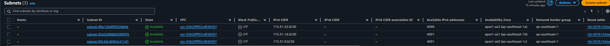
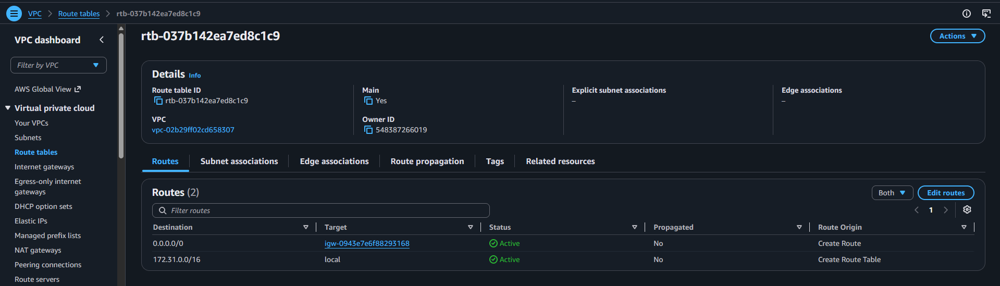
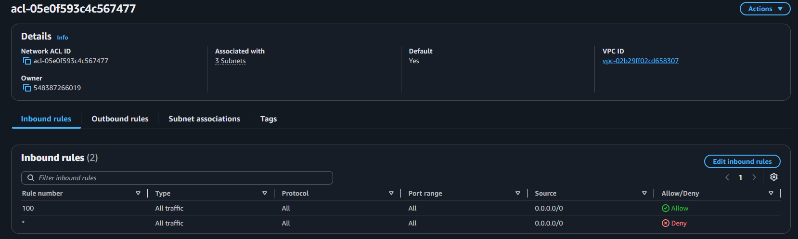
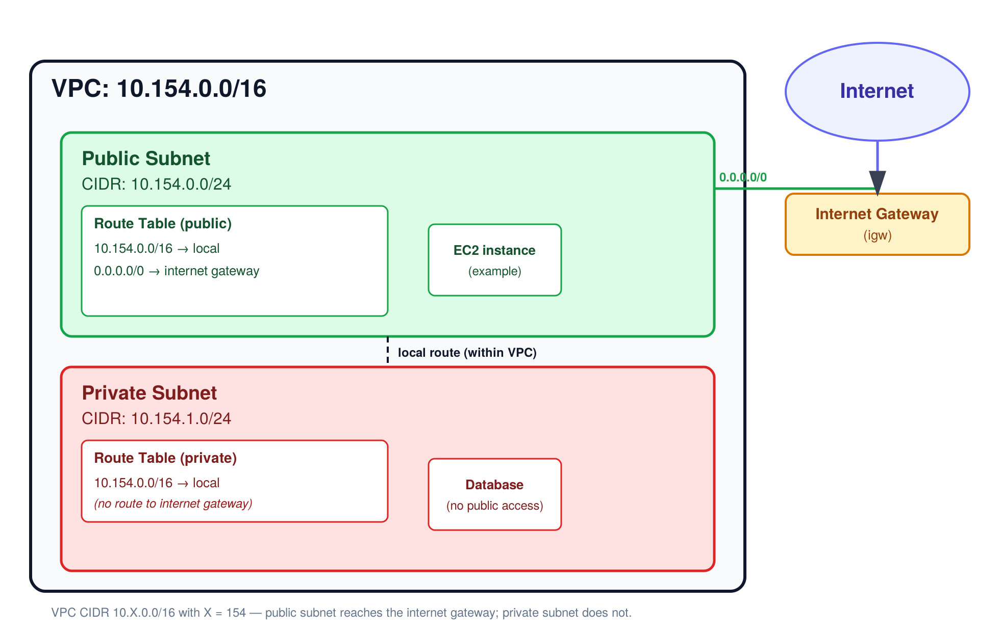

# Assignment 2 Submission

<!--
How to use this template:

1. Copy this file to submissions/assignment-2/<your-github-username>/submission.md
2. Replace every answer placeholder with your own answer. Delete the angle brackets too.
3. Save your four images in the same folder, with the exact file names below.
4. Do not write your full name or your student number in this file.
-->

## About me

- GitHub username: StarMirai
- Section: IV-BCSAD
- IAM user name that I signed in with: bcsad-g07
- X: 154

---

## Part A. Explore

### A1. The VPC

Default VPC IPv4 CIDR:

172.31.0.0/16

Number of addresses in that CIDR:

65,536

### A2. The subnets

| Availability Zone | IPv4 CIDR |
| --- | --- |
| ap-southeast-1a | 172.31.32.0/20 |
| ap-southeast-1b | 172.31.16.0/20 |
| ap-southeast-1c | 172.31.0.0/20 |

Screenshot 1. Save it as `screenshot-1-subnets.png` in your folder. The image line below shows it.

### A3. Available addresses

Available IPv4 addresses in each subnet:

ap-southeast-1a: 4,090
ap-southeast-1b: 4,091
ap-southeast-1c: 4,091

Why is the number lower than 4,096?

WS reserves 5 addresses per subnet (first 4 + last 1), so an empty /20 subnet has 4,096 − 5 = 4,091 available.

What uses the missing address in the subnet with the lowest number?

Something in that subnet is using one more IP than the baseline reservation most likely a running EC2 instance (or its network interface) sitting in that AZ. You could confirm this by checking EC2 -> Instances and seeing which AZ any running instance is in if you see one there, that's your answer to cite.

### A4. The route table

| Destination | Target |
| --- | --- |
| 0.0.0.0/0 | igw-0943e7e6f88293168 |
| 172.31.0.0/16 | local |

Screenshot 2. Save it as `screenshot-2-routes.png` in your folder. The image line below shows it.

### A5. Public or private

Are the default subnets public or private? Which route proves it?

since there's a route sending 0.0.0.0/0 to an internet gateway, that makes these subnets public

### A6. The internet gateway

State of the internet gateway:

Attached

What happens to the default subnets if the gateway is detached?

the route table has 0.0.0.0/0 -> igw-0943e7e6f88293168. If this gateway gets detached, that route's target no longer exists/works.

### A7. NAT gateways

Number of NAT gateways:

0

Can a server in a new private subnet download updates? Why?

with zero NAT gateways, think about what the README said a private subnet needs for outbound-only internet access (step-by-step in section 10). A brand-new private subnet's route table would start with just the local route no path out. So the answer should walk through why a server there couldn't download updates yet, and what would need to be added first.

### A8. The network ACL

| Rule number | Source | Allow or Deny |
| --- | --- | --- |
| 100 | 0.0.0.0/0 | Allow |
| * | 0.0.0.0/0 | Deny |

How is a network ACL different from a security group?

A network ACL applies to the whole VPC/subnets, while a security group applies to individual resources or instances. ACLs can have both Allow and Deny rules and are stateless, while security groups only allow traffic and are stateful.

Screenshot 3. Save it as `screenshot-3-network-acl.png` in your folder. The image line below shows it.

### A9. The default security group

Inbound rule (type and source):

All traffic

Which resources can send traffic to an instance that uses it?

sg-0c5b6d4081cf0a534

---

## Part B. Prepare

### B1. Plan two subnets

- Public subnet CIDR: 10.154.0.0/24
- Private subnet CIDR: 10.154.1.0/24

### B2. Route tables

Route table of the public subnet:

| Destination | Target |
| --- | --- |
| 10.154.0.0/16 | local |
| 0.0.0.0/0 | internet gateway |

Route table of the private subnet:

| Destination | Target |
| --- | --- |
| 10.154.0.0/16 | local |

### B3. My VPC diagram

Tool used (Excalidraw, draw.io, Lucidchart, or paper):

digital diagram

Save your diagram as `vpc-diagram.png` in your folder. The image line below shows it.

### B4. Predict a change

Can you still open the web page from your laptop? Why?

No, because the route for 0.0.0.0/0 has been deleted and, therefore, there is no more routing from the internet to the public IP address of the instance.

Can the instance still reach another instance in the VPC? Why?

Yes, because the local route has not been deleted and, therefore, communication between the instances in the same VPC is still possible.

### B5. Place a database

Which subnet gets the database? Why?

A database should be placed in the private subnet 10.154.1.0/24 since it is not supposed to be available directly from the internet.

### B6. My question about VPCs

What is your question, and what made you think of it?

My question is how the private subnet can have access to the internet while preventing the internet access to the instances in it. This question arose when comparing the public and private subnets based on their route tables.
