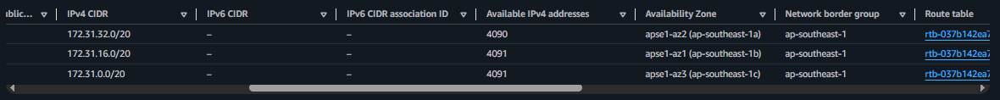
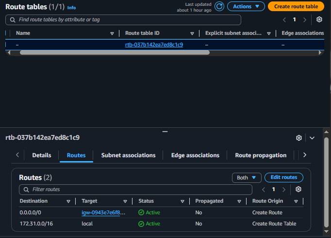
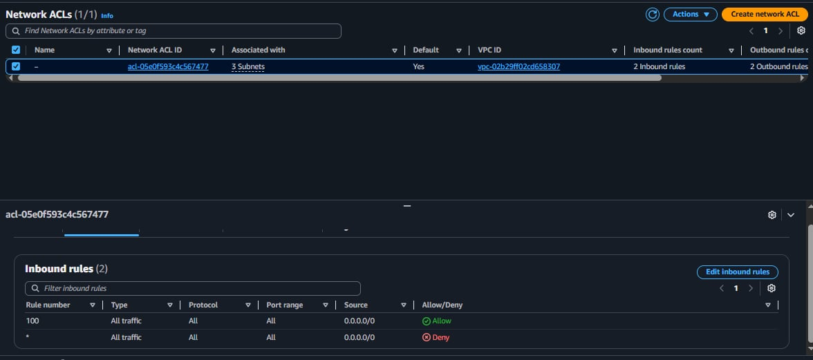
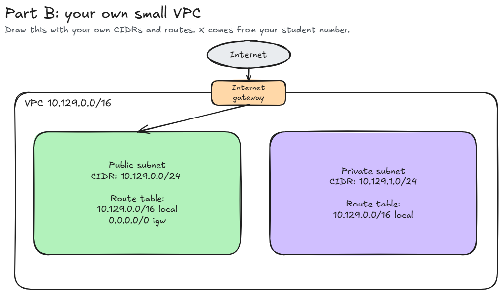

# Assignment 2 Submission

<!--
How to use this template:

1. Copy this file to submissions/assignment-2/<your-github-username>/submission.md
2. Replace every answer placeholder with your own answer. Delete the angle brackets too.
3. Save your four images in the same folder, with the exact file names below.
4. Do not write your full name or your student number in this file.
-->

## About me

- GitHub username: abijeyn
- Section: IV - BCSAD
- IAM user name that I signed in with: bcsad-g07
- X: 129

---

## Part A. Explore

### A1. The VPC

Default VPC IPv4 CIDR: 

172.31.0.0/16

Number of addresses in that CIDR:

65,536

### A2. The subnets

| Availability Zone | IPv4 CIDR |
| --- | --- |
| ap-southeast-1a | 172.31.32.0/20 |
| ap-southeast-1b | 172.31.16.0/20 |
| ap-southeast-1c | 172.31.0.0/20 |

Screenshot 1. Save it as `screenshot-1-subnets.png` in your folder. The image line below shows it.

### A3. Available addresses

Available IPv4 addresses in each subnet:

ap-southeast-1a (172.31.32.0/20): 4090   
ap-southeast-1b (172.31.16.0/20): 4091   
ap-southeast-1c (172.31.0.0/20): 4091 

Why is the number lower than 4,096?

AWS reserves 5 IP addresses in every subnet for internal networking purposes:
1. The first address (Network address)
2. The second address (VPC router)
3. The third address (AWS DNS server)
4. The fourth address (Future AWS use)
5. The last address (Network broadcast address)

Subtracting these 5 reserved addresses from the 4,096 addresses of a /20 block leaves 4,091 available IP addresses (4096 - 5 = 4091).

What uses the missing address in the subnet with the lowest number?

The missing address in ap-southeast-1a (which has 4090 instead of 4091) is in use by an active Elastic Network Interface (ENI), such as a running or stopped EC2 instance deployed in that subnet.

### A4. The route table

| Destination | Target |
| --- | --- |
| 172.31.0.0/16 | local |
| 0.0.0.0/0 | igw-... |

Screenshot 2. Save it as `screenshot-2-routes.png` in your folder. The image line below shows it.

### A5. Public or private

Are the default subnets public or private? Which route proves it?

The default subnets are public. The route that proves this is 0.0.0.0/0 targeting the internet gateway (igw-...), which allows traffic to route directly to and from the public internet.

### A6. The internet gateway

State of the internet gateway:

attached

What happens to the default subnets if the gateway is detached?

All instances within the default subnets will lose their direct connection to the public internet, preventing them from sending or receiving external internet traffic.

### A7. NAT gateways

Number of NAT gateways:

0

Can a server in a new private subnet download updates? Why?

No. A private subnet has no direct route to an Internet Gateway and requires a NAT Gateway deployed in a public subnet to route outbound requests to the internet; because there are 0 NAT Gateways in this VPC, outbound internet connectivity is unavailable.

### A8. The network ACL

| Rule number | Source | Allow or Deny |
| --- | --- | --- |
| 100 | 0.0.0.0/0 | Allow |
| * | 0.0.0.0/0 | Deny |

How is a network ACL different from a security group?

A network ACL operates at the subnet level and is stateless (requiring explicit inbound and outbound rules), whereas a security group operates at the individual instance or network interface level and is stateful (automatically allowing return traffic).

Screenshot 3. Save it as `screenshot-3-network-acl.png` in your folder. The image line below shows it.

### A9. The default security group

Inbound rule (type and source):

- Type: All traffic
- Protocol: All
- Port range: All
- Source: sg-0c5b6d4081cf0a534 (the security group itself)

Which resources can send traffic to an instance that uses it?

Only other instances or AWS resources that are explicitly assigned to this exact same default security group.

---

## Part B. Prepare

### B1. Plan two subnets

- Public subnet CIDR: 10.129.0.0/24
- Private subnet CIDR: 10.129.1.0/24

### B2. Route tables

Route table of the public subnet:

| Destination | Target |
| --- | --- |
| 10.129.0.0/16 | local |
| 0.0.0.0/0 | internet gateway |

Route table of the private subnet:

| Destination | Target |
| --- | --- |
| 10.129.0.0/16 | local |

### B3. My VPC diagram

Tool used (Excalidraw, draw.io, Lucidchart, or paper):

Excalidraw

Save your diagram as `vpc-diagram.png` in your folder. The image line below shows it.

### B4. Predict a change

Can you still open the web page from your laptop? Why?

No. The route `0.0.0.0/0` targeting the Internet Gateway is the path that directs external internet traffic into and out of the VPC; without this default route, requests from your laptop cannot reach the instance, nor can return packets leave the VPC.

Can the instance still reach another instance in the VPC? Why?

Yes. The local route (`172.31.0.0/16 local`) remains active in the route table, which preserves full private network connectivity between all subnets and instances located within the same VPC.

### B5. Place a database

Which subnet gets the database? Why?

The private subnet (`10.129.1.0/24`). A database contains sensitive application data and should never be directly accessible from the public internet; keeping it in a private subnet shields it from external inbound attacks while still allowing backend application servers in the public subnet to reach it over the local VPC network route.

### B6. My question about VPCs

What is your question, and what made you think of it?

Question: When architecting high-availability systems across multiple Availability Zones, how does an organization balance the cost of running dedicated NAT Gateways in each private AZ against the reliability risk of using a single shared NAT Gateway?

What made me think of it: While reviewing the NAT Gateway concept in Section 10, the README mentions that NAT Gateways incur hourly costs and default VPCs don't include them, which raised practical questions about fault tolerance versus operational expenses in production cloud environments.
