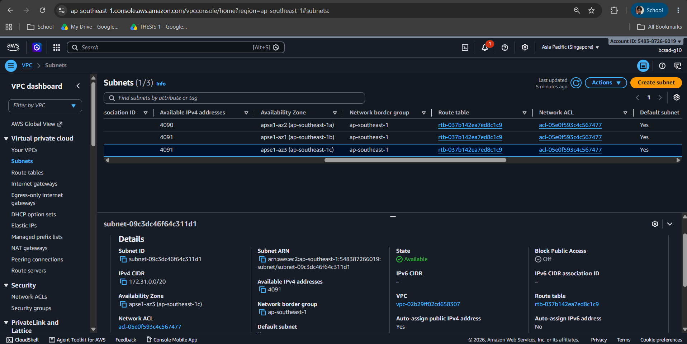
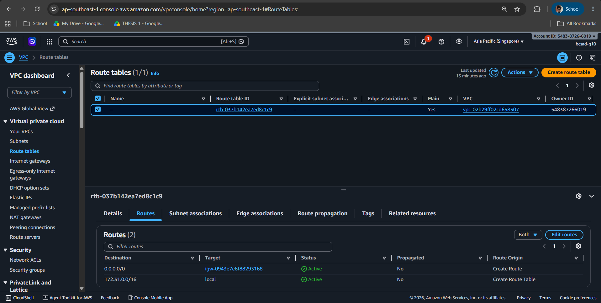
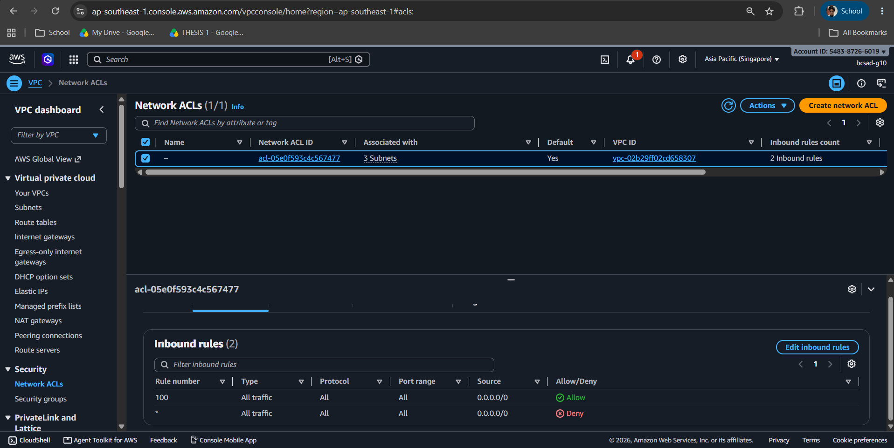
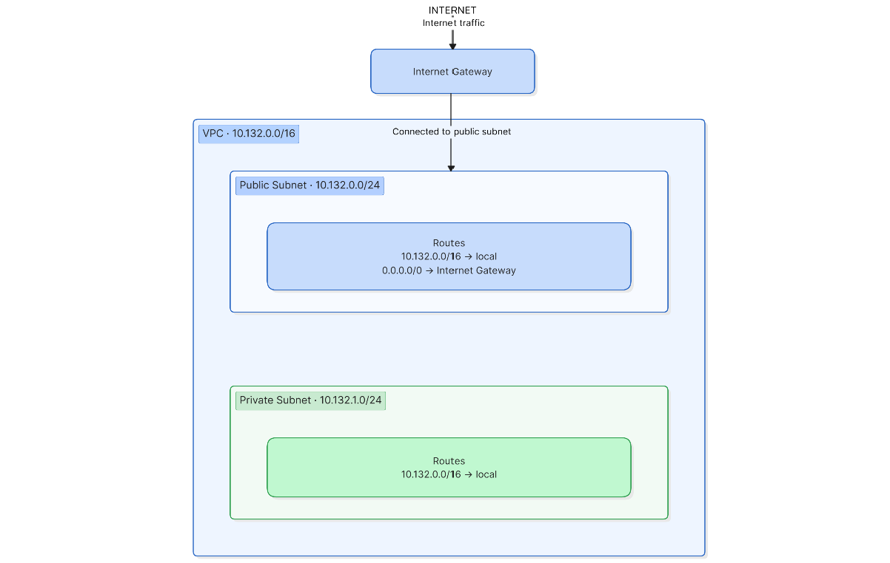

# Assignment 2 Submission

<!--
How to use this template:

1. Copy this file to submissions/assignment-2/<your-github-username>/submission.md
2. Replace every answer placeholder with your own answer. Delete the angle brackets too.
3. Save your four images in the same folder, with the exact file names below.
4. Do not write your full name or your student number in this file.
-->

## About me

- GitHub username: ambv13
- Section: BCSAD
- IAM user name that I signed in with: bcsad-g10
- X: 132

---

## Part A. Explore

### A1. The VPC

Default VPC IPv4 CIDR:

172.31.0.0/16

Number of addresses in that CIDR:

172.31.0.0/16

### A2. The subnets

| Availability Zone | IPv4 CIDR |
| --- | --- |
| apse1-az2 (ap-southeast-1a) | 172.31.32.0/20 |
| apse1-az1 (ap-southeast-1b) | 172.31.16.0/20 |
| apse1-az3 (ap-southeast-1c) | 172.31.0.0/20 |

Screenshot 1. Save it as `screenshot-1-subnets.png` in your folder. The image line below shows it.

### A3. Available addresses

Available IPv4 addresses in each subnet:

4090
4091
4091

Why is the number lower than 4,096?

AWS reserves 5 IP addresses in every subnet for networking purposes, so they cannot be used by instances.

What uses the missing address in the subnet with the lowest number?

The missing address is being used by a resource in that subnet.

### A4. The route table

| Destination | Target |
| --- | --- |
| 0.0.0.0/0 | igw-0943e7e6f88293168 |
| 172.31.0.0/16 | local |

Screenshot 2. Save it as `screenshot-2-routes.png` in your folder. The image line below shows it.

### A5. Public or private

Are the default subnets public or private? Which route proves it?

The default subnets are public because the route table has a 0.0.0.0/0 route that points to an Internet Gateway.

### A6. The internet gateway

State of the internet gateway:

Attached

What happens to the default subnets if the gateway is detached?

The default subnets can no longer use the Internet Gateway to communicate with the Internet. Instances would lose their normal Internet connection through that gateway.

### A7. NAT gateways

Number of NAT gateways:

0

Can a server in a new private subnet download updates? Why?

No. A server in a private subnet cannot directly access the Internet. It would need a NAT Gateway and a route to that NAT Gateway to download updates.

### A8. The network ACL

| Rule number | Source | Allow or Deny |
| --- | --- | --- |
| 100 | 0.0.0.0/0 | Allow |
| * | 0.0.0.0/0 | deny |

How is a network ACL different from a security group?

A Network ACL controls traffic for a subnet, while a security group controls traffic for an individual resource. A Network ACL can allow and deny traffic, while a security group mainly uses allow rules.

Screenshot 3. Save it as `screenshot-3-network-acl.png` in your folder. The image line below shows it.

### A9. The default security group

Inbound rule (type and source):

Type - All traffic
Source - sg-0c5b6d4081cf0a534 / default

Which resources can send traffic to an instance that uses it?

Resources that use the same security group can send traffic to the instance.

---

## Part B. Prepare

### B1. Plan two subnets

- Public subnet CIDR: 10.132.0.0/24
- Private subnet CIDR: 10.132.1.0/24

### B2. Route tables

Route table of the public subnet:

| Destination | Target |
| --- | --- |
| 10.132.0.0/16 | local |
| 0.0.0.0/0 | internet gateway |

Route table of the private subnet:

| Destination | Target |
| --- | --- |
| 10.132.0.0/16 | local |

### B3. My VPC diagram

Tool used (Excalidraw, draw.io, Lucidchart, or paper):

lucidchart

Save your diagram as `vpc-diagram.png` in your folder. The image line below shows it.

### B4. Predict a change

Can you still open the web page from your laptop? Why?

No. The instance can no longer use the Internet Gateway for Internet traffic because the 0.0.0.0/0 route was removed.

Can the instance still reach another instance in the VPC? Why?

Yes. The local route is still available, so instances can communicate with other resources inside the same VPC.

### B5. Place a database

Which subnet gets the database? Why?

I would put the database in the private subnet because a database normally does not need to be directly accessible from the Internet. This gives it better protection from direct Internet traffic.

### B6. My question about VPCs

What is your question, and what made you think of it?

My question is how does AWS decide which route to use when a subnet has multiple routes? I thought of this question because I learned that a route table can contain different routes, and I wanted to understand how AWS chooses the correct route for the traffic.
