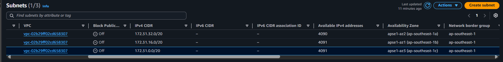
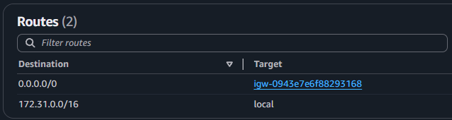
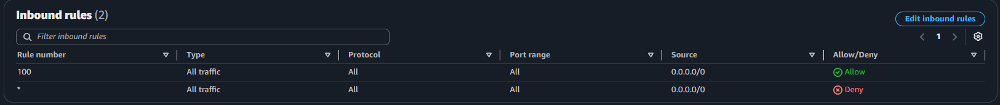
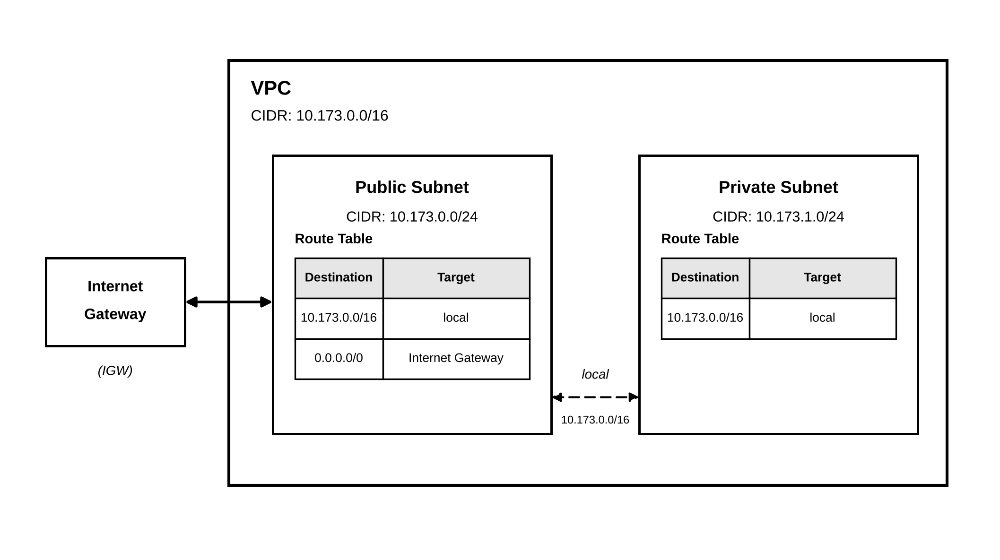

# Assignment 2 Submission

## About me

- GitHub username: `angeluuhh`
- Section: `IV-BCSAD`
- IAM user name that I signed in with: `bcsad-g04`
- X: `173`

---

## Part A. Explore

### A1. The VPC

Default VPC IPv4 CIDR:

`172.31.0.0/16`

Number of addresses in that CIDR:

`65,536`

### A2. The subnets

| Availability Zone | IPv4 CIDR |
| --- | --- |
| `apse1-az2 (ap-southeast-1a)` | `172.31.32.0/20` |
| `apse1-az1 (ap-southeast-1b)` | `172.31.16.0/20` |
| `apse1-az3 (ap-southeast-1c)` | `172.31.0.0/20` |

Screenshot 1. Save it as `screenshot-1-subnets.png` in your folder. The image line below shows it.

### A3. Available addresses

Available IPv4 addresses in each subnet:

- `172.31.32.0/20`: `4090`
- `172.31.16.0/20`: `4091`
- `172.31.0.0/20`: `4091`

Why is the number lower than 4,096?

AWS reserves 5 IP addresses in each subnet, so a `/20` subnet has 4,091 normally available addresses instead of 4,096.

What uses the missing address in the subnet with the lowest number?

`<RESOURCE USING THE EXTRA IP ADDRESS>`

### A4. The route table

| Destination | Target |
| --- | --- |
| `0.0.0.0/0` | `igw-0943e7e6f88293168` |
| `172.31.0.0/16` | `local` |

Screenshot 2. Save it as `screenshot-2-routes.png` in your folder. The image line below shows it.

### A5. Public or private

Are the default subnets public or private? Which route proves it?

The default subnets are public because the route table has a `0.0.0.0/0` route pointing to the Internet Gateway `igw-0943e7e6f88293168`.

### A6. The internet gateway

State of the internet gateway:

`Attached`

What happens to the default subnets if the gateway is detached?

The default subnets would lose their route to the internet through the Internet Gateway. Communication within the VPC can still work through the local route.

### A7. NAT gateways

Number of NAT gateways:

`0`

Can a server in a new private subnet download updates? Why?

No. There is no NAT Gateway, and a private subnet does not have a direct route to an Internet Gateway, so the server cannot access the internet to download updates.

### A8. The network ACL

| Rule number | Source | Allow or Deny |
| --- | --- | --- |
| `100` | `0.0.0.0/0` | `Allow` |
| `*` | `0.0.0.0/0` | `Deny` |

How is a network ACL different from a security group?

A network ACL works at the subnet level and can allow or deny traffic. A security group works at the resource level and uses allow rules only. A network ACL is stateless, while a security group is stateful.

Screenshot 3. Save it as `screenshot-3-network-acl.png` in your folder. The image line below shows it.

### A9. The default security group

Inbound rule (type and source):

`All traffic` — source: `sg-0c5b6d4081cf0a534`

Which resources can send traffic to an instance that uses it?

Resources that are associated with the same security group `sg-0c5b6d4081cf0a534` can send traffic to an instance using this security group.

---

## Part B. Prepare

### B1. Plan two subnets

- Public subnet CIDR: `10.173.0.0/24`
- Private subnet CIDR: `10.173.1.0/24`

### B2. Route tables

Route table of the public subnet:

| Destination | Target |
| --- | --- |
| `10.173.0.0/16` | `local` |
| `0.0.0.0/0` | `Internet Gateway` |

Route table of the private subnet:

| Destination | Target |
| --- | --- |
| `10.173.0.0/16` | `local` |

### B3. My VPC diagram

Tool used (Excalidraw, draw.io, Lucidchart, or paper):

`Claude`

Save your diagram as `vpc-diagram.png` in your folder. The image line below shows it.

### B4. Predict a change

Can you still open the web page from your laptop? Why?

No. If the `0.0.0.0/0` route is deleted, there is no default route to the Internet Gateway, so the subnet cannot access the internet through that route.

Can the instance still reach another instance in the VPC? Why?

Yes. The `10.173.0.0/16` local route remains, so resources in the same VPC can still communicate with each other.

### B5. Place a database

Which subnet gets the database? Why?

The database should be placed in the private subnet because it should not be directly accessible from the public internet. The private subnet provides better isolation for the database.

### B6. My question about VPCs

What is your question, and what made you think of it?

Question: How does AWS choose which route to use when a route table has multiple routes that could match the destination?

What made me think of it: I wanted to understand how AWS decides which route takes priority when there are multiple possible routes.