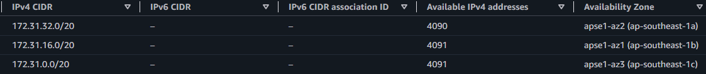
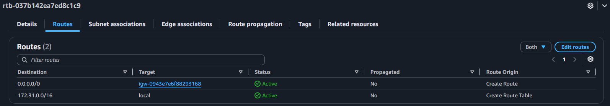
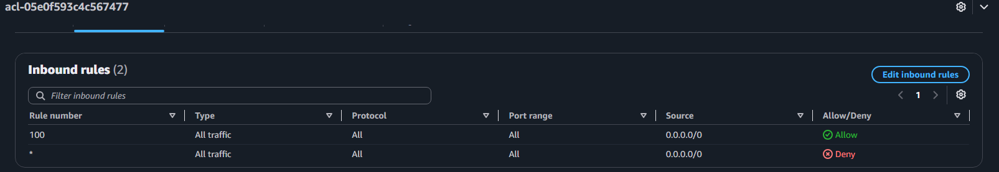
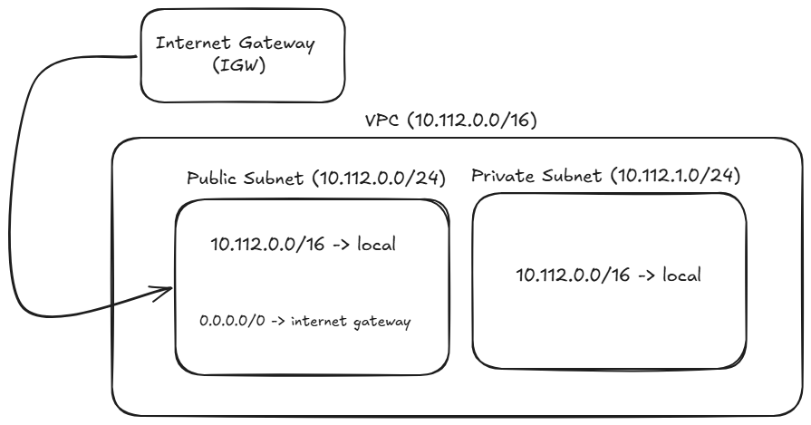

# Assignment 2 Submission

<!--
How to use this template:

1. Copy this file to submissions/assignment-2/<your-github-username>/submission.md
2. Replace every answer placeholder with your own answer. Delete the angle brackets too.
3. Save your four images in the same folder, with the exact file names below.
4. Do not write your full name or your student number in this file.
-->

## About me

- GitHub username: ctrl-amed
- Section: BCSAD
- IAM user name that I signed in with: bcsad-g04
- X: 112

---

## Part A. Explore

### A1. The VPC

Default VPC IPv4 CIDR:

172.31.0.0/16

Number of addresses in that CIDR:

65,536

### A2. The subnets

| Availability Zone | IPv4 CIDR |
| --- | --- |
| apse1-az2 (ap-southeast-1a) | 172.31.32.0/20 |
| apse1-az2 (ap-southeast-1b) | 172.31.16.0/20 |
| apse1-az2 (ap-southeast-1c) | 172.31.0.0/20 |

Screenshot 1. Save it as `screenshot-1-subnets.png` in your folder. The image line below shows it.

### A3. Available addresses

Available IPv4 addresses in each subnet:

ap-southeast-1a: 4090, ap-southeast-1b: 4091, ap-southeast-1c: 4091

Why is the number lower than 4,096?

AWS reserves 5 IP addresses in every subnet for internal networking, leaving 4,091 available addresses in an empty /20 subnet (4,096 - 5).

What uses the missing address in the subnet with the lowest number?

An active network interface attached to an EC2 instance or AWS resource in ap-southeast-1a is using that missing IP address.

### A4. The route table

| Destination | Target |
| --- | --- |
| 0.0.0.0/0 | igw-0943e7e6f88293168 |
| 172.31.0.0/16 | local |

Screenshot 2. Save it as `screenshot-2-routes.png` in your folder. The image line below shows it.

### A5. Public or private

Are the default subnets public or private? Which route proves it?

Public. The route `0.0.0.0/0` sends internet-bound traffic to the internet gateway (`igw-0943e7e6f88293168`).

### A6. The internet gateway

State of the internet gateway:

Attached

What happens to the default subnets if the gateway is detached?

The subnets lose their route to the internet, so instances will no longer be able to communicate with external internet services, though they can still reach each other locally via the 172.31.0.0/16 route.

### A7. NAT gateways

Number of NAT gateways:

0

Can a server in a new private subnet download updates? Why?

No. A private subnet has no direct route to an Internet Gateway, and without a NAT Gateway to translate and route outbound traffic, instances inside cannot reach the internet to download updates.

### A8. The network ACL

| Rule number | Source | Allow or Deny |
| --- | --- | --- |
| 100 | 0.0.0.0/0 | Allow |
| * | 0.0.0.0/0 | Deny |

How is a network ACL different from a security group?

A network ACL attaches to an entire subnet and is stateless (requiring separate inbound and outbound rules), supporting both Allow and Deny rules. A security group attaches to individual instances/resources and is stateful, supporting only Allow rules.

Screenshot 3. Save it as `screenshot-3-network-acl.png` in your folder. The image line below shows it.

### A9. The default security group

Inbound rule (type and source):

All traffic, from the default security group itself (`sg-...`).

Which resources can send traffic to an instance that uses it?

Only other instances or resources that are also assigned to the default security group.

---

## Part B. Prepare

### B1. Plan two subnets

- Public subnet CIDR: 10.112.0.0/24
- Private subnet CIDR: 10.112.1.0/24

### B2. Route tables

Route table of the public subnet:

| Destination | Target |
| --- | --- |
| 10.112.0.0/16 | local |
| 0.0.0.0/0 | internet gateway |

Route table of the private subnet:

| Destination | Target |
| --- | --- |
| 10.112.0.0/16 | local |

### B3. My VPC diagram

Tool used (Excalidraw, draw.io, Lucidchart, or paper):

Excalidraw

Save your diagram as `vpc-diagram.png` in your folder. The image line below shows it.

### B4. Predict a change

Can you still open the web page from your laptop? Why?

No. The laptop is on the internet. Without the 0.0.0.0/0 route pointing to the internet gateway, traffic between the instance and an internet address has no route. A public IP address alone is not enough.

Can the instance still reach another instance in the VPC? Why?

Yes. The local route for the 10.112.0.0/16 VPC range is still in the route table, which keeps internal subnets connected.

### B5. Place a database

Which subnet gets the database? Why?

The private subnet, 10.112.1.0/24. Its route table has no route to the internet gateway, so nobody on the internet can directly reach or attack the database.

### B6. My question about VPCs

What is your question, and what made you think of it?

Can two VPCs with overlapping CIDR blocks be connected using VPC Peering? I thought of it because subnets inside a single VPC cannot overlap, so I wondered if the same limitation applies when connecting two separate VPCs.
