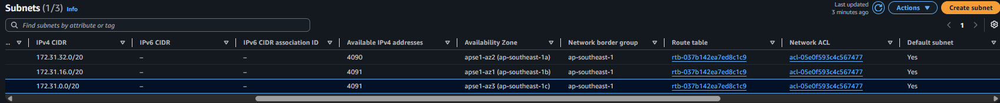
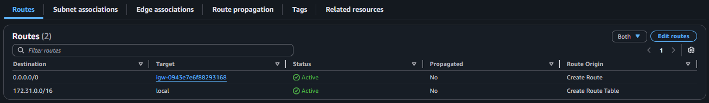
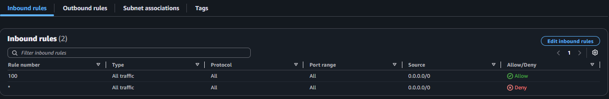
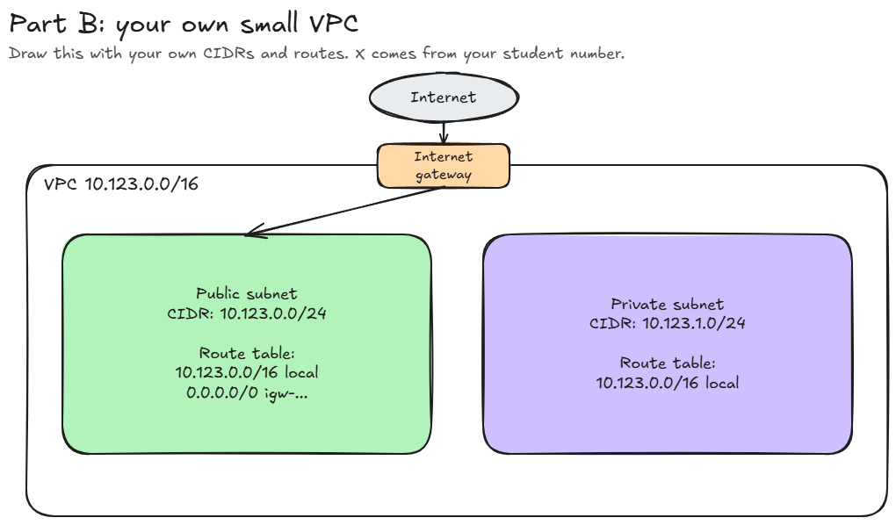

# Assignment 2 Submission

<!--
How to use this template:

1. Copy this file to submissions/assignment-2/<your-github-username>/submission.md
2. Replace every answer placeholder with your own answer. Delete the angle brackets too.
3. Save your four images in the same folder, with the exact file names below.
4. Do not write your full name or your student number in this file.
-->

## About me

- GitHub username: edjjff
- Section: IV-BCSAD
- IAM user name that I signed in with: 548387266019
- X: 123

---

## Part A. Explore

### A1. The VPC

Default VPC IPv4 CIDR:

172.31.0.0/16

Number of addresses in that CIDR:

65,536

### A2. The subnets

| Availability Zone | IPv4 CIDR |
| --- | --- |
| apse1-az2 (ap-southeast-1a) | 172.31.32.0/20 |
| apse1-az1 (ap-southeast-1b) | 172.31.16.0/20 |
| apse1-az3 (ap-southeast-1c) | 172.31.0.0/20 |

Screenshot 1. Save it as `screenshot-1-subnets.png` in your folder. The image line below shows it.

### A3. Available addresses

Available IPv4 addresses in each subnet:

172.31.32.0/20	4,090
172.31.16.0/20	4,091
172.31.0.0/20	4,091

Why is the number lower than 4,096?

AWS reserves 5 addresses in every subnet

What uses the missing address in the subnet with the lowest number?

EC2 resource

### A4. The route table

| Destination | Target |
| --- | --- |
| 0.0.0.0/0 | igw-0943e7e6f88293168 |
| 172.31.0.0/16 | local |

Screenshot 2. Save it as `screenshot-2-routes.png` in your folder. The image line below shows it.

### A5. Public or private

Are the default subnets public or private? Which route proves it?

public

### A6. The internet gateway

State of the internet gateway:

Attached

What happens to the default subnets if the gateway is detached?

they become private subnets

### A7. NAT gateways

Number of NAT gateways:

0

Can a server in a new private subnet download updates? Why?

No, a private subnet does not have a route to the Internet Gateway

### A8. The network ACL

| Rule number | Source | Allow or Deny |
| --- | --- | --- |
| 100 | 0.0.0.0/0 | Allow |
| * | 	0.0.0.0/0 | Deny |

How is a network ACL different from a security group?

A network ACL controls traffic at the subnet level and is stateless, so inbound and outbound traffic must be allowed separately. A security group controls traffic at the instance/resource level and is stateful, so return traffic is automatically allowed.

Screenshot 3. Save it as `screenshot-3-network-acl.png` in your folder. The image line below shows it.

### A9. The default security group

Inbound rule (type and source):

All traffic, https://ap-southeast-1.console.aws.amazon.com/vpcconsole/home?region=ap-southeast-1#SecurityGroup:GroupId=sg-0c5b6d4081cf0a534

Which resources can send traffic to an instance that uses it?

Only resources that are also assigned to this exact same security group

---

## Part B. Prepare

### B1. Plan two subnets

- Public subnet CIDR: 10.123.0.0/24
- Private subnet CIDR: 10.123.1.0/24

### B2. Route tables

Route table of the public subnet:

| Destination | Target |
| --- | --- |
| 10.123.0.0/16 | local |
| 0.0.0.0/0 | igw-... |

Route table of the private subnet:

| Destination | Target |
| --- | --- |
| 10.123.0.0/16 | local |

### B3. My VPC diagram

Tool used (Excalidraw, draw.io, Lucidchart, or paper):

Excalidraw

Save your diagram as `vpc-diagram.png` in your folder. The image line below shows it.

### B4. Predict a change

Can you still open the web page from your laptop? Why?

No. Deleting the 0.0.0.0/0 route removes the path to the internet gateway.

Can the instance still reach another instance in the VPC? Why?

Yes. Internal VPC traffic relies on the local route

### B5. Place a database

Which subnet gets the database? Why?

Private subnet. Because databases store sensitive information, they should be isolated from direct internet access for security.

### B6. My question about VPCs

What is your question, and what made you think of it?

What happens if my company’s VPC or subnet completely runs out of available IP addresses? We learned that a /24 subnet only has 251 usable addresses.
