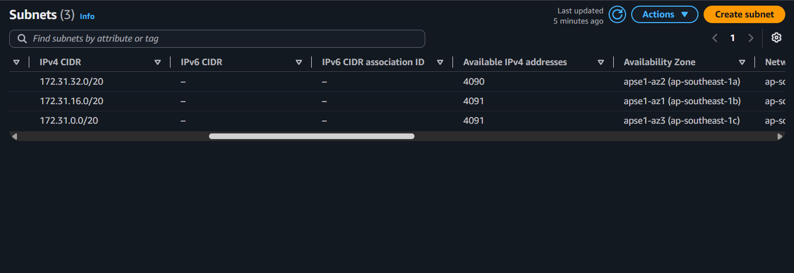
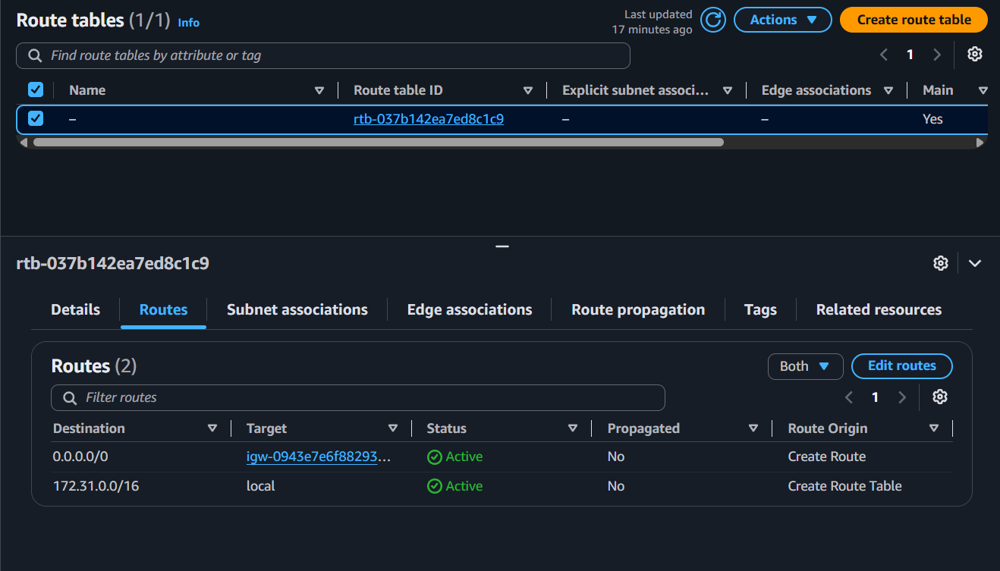
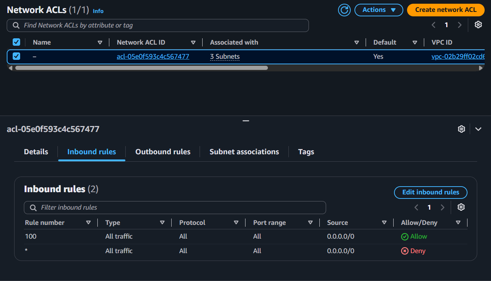
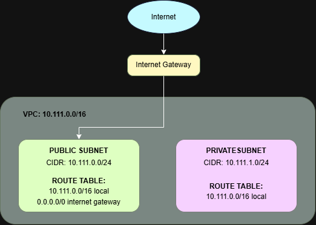

# Assignment 2 Submission

<!--
How to use this template:

1. Copy this file to submissions/assignment-2/<your-github-username>/submission.md
2. Replace every answer placeholder with your own answer. Delete the angle brackets too.
3. Save your four images in the same folder, with the exact file names below.
4. Do not write your full name or your student number in this file.
-->

## About me

- GitHub username: <ehrickkk>
- Section: <IV-BCSAD>
- IAM user name that I signed in with: <bcsad-g05>
- X: 111

---

## Part A. Explore

### A1. The VPC

Default VPC IPv4 CIDR:

172.31.0.0/16

Number of addresses in that CIDR:

65,536

### A2. The subnets

| Availability Zone | IPv4 CIDR        |
| ----------------- | ---------------- |
| `ap-southeast-1a` | `172.31.32.0/20` |
| `ap-southeast-1b` | `172.31.16.0/20` |
| `ap-southeast-1c` | `172.31.0.0/20`  |

Screenshot 1. Save it as `screenshot-1-subnets.png` in your folder. The image line below shows it.

### A3. Available addresses

Available IPv4 addresses in each subnet:

`ap-southeast-1b`: 4,090, `ap-southeast-1a`: 4,091, `ap-southeast-1c`: 4,091

Why is the number lower than 4,096?

A /20 subnet has 4,096 addresses. AWS reserves 5 addresses in every subnet for internal networking purposes... An empty /20 subnet therefore starts with 4,096 − 5 = 4,091 available addresses.

What uses the missing address in the subnet with the lowest number?

The subnet `ap-southeast-1b` has 4,090 available addresses, which is 1 less than the empty subnet count of 4,091[cite: 3]. That missing address is held by an active network interface (ENI) belonging to a resource deployed in that subnet, such as an EC2 instance[cite: 2, 3].

### A4. The route table

| Destination     | Target                  |
| --------------- | ----------------------- |
| `0.0.0.0/0`     | `igw-0943e7e6f88293168` |
| `172.31.0.0/16` | `local`                 |

Screenshot 2. Save it as `screenshot-2-routes.png` in your folder. The image line below shows it.

### A5. Public or private

Are the default subnets public or private? Which route proves it?

The subnets are public because their route table contains a default route (0.0.0.0/0) directed to the Internet Gateway, enabling direct internet access.

### A6. The internet gateway

State of the internet gateway:

Attached

What happens to the default subnets if the gateway is detached?

Detaching the internet gateway removes the functional network path to the internet. While the route `0.0.0.0/0` still exists in the route table, its target becomes unreachable, breaking all inbound and outbound internet connectivity for instances in the subnets. However, instances inside the VPC can still communicate with each other using the `local` route.

### A7. NAT gateways

Number of NAT gateways:

0

Can a server in a new private subnet download updates? Why?

No. A private subnet does not have a direct route to an Internet Gateway, and without a NAT gateway deployed in a public subnet with a corresponding route (`0.0.0.0/0`) pointing to it, servers in the private subnet cannot initiate outbound connections to download updates from the internet.

### A8. The network ACL

| Rule number | Source      | Allow or Deny |
| ----------- | ----------- | ------------- |
| 100         | `0.0.0.0/0` | Allow         |
| `*`         | `0.0.0.0/0` | Deny          |

How is a network ACL different from a security group?

A network ACL operates at the subnet level, whereas a security group operates at the individual instance or resource level. Additionally, network ACLs are stateless (requiring explicit inbound and outbound rules for response traffic) and support both Allow and Deny rules evaluated in numerical order. In contrast, security groups are stateful (automatically allowing return traffic) and only support Allow rules.

Screenshot 3. Save it as `screenshot-3-network-acl.png` in your folder. The image line below shows it.

### A9. The default security group

Inbound rule (type and source):

All traffic, from `sg-0c5b6d4081cf0a534` (the `default` security group itself).

Which resources can send traffic to an instance that uses it?

Only resources that are assigned to this same `default` security group can send traffic to the instance. Because no other inbound rules exist, traffic originating from any other source or external IP address is blocked.

---

## Part B. Prepare

### B1. Plan two subnets

- Public subnet CIDR: `10.111.0.0/24`
- Private subnet CIDR: `10.111.1.0/24`

### B2. Route tables

Route table of the public subnet:

| Destination     | Target           |
| --------------- | ---------------- |
| `10.111.0.0/16` | `local`          |
| `0.0.0.0/0`     | internet gateway |

Route table of the private subnet:

| Destination     | Target  |
| --------------- | ------- |
| `10.111.0.0/16` | `local` |

### B3. My VPC diagram

Tool used (Excalidraw, draw.io, Lucidchart, or paper):

draw.io

Save your diagram as `vpc-diagram.png` in your folder. The image line below shows it.

### B4. Predict a change

Can you still open the web page from your laptop? Why?

No. Deleting the `0.0.0.0/0` route removes the path between the instance and the internet. Without a default route pointing to the Internet Gateway, network traffic cannot be routed to or from an external IP address, even if the instance has a public IP assigned.

Can the instance still reach another instance in the VPC? Why?

Yes. The `local` route (`10.111.0.0/16` -> `local`) remains active in the route table. This local route connects all subnets within the VPC, allowing instances to communicate directly with each other.

### B5. Place a database

Which subnet gets the database? Why?

The private subnet (`10.111.1.0/24`). Placing the database in the private subnet keeps it isolated from direct internet access because its route table has no route to an Internet Gateway. This protects sensitive data from external internet threats while still allowing web or application servers in the public subnet to communicate with it using the VPC's local route.

### B6. My question about VPCs

What is your question, and what made you think of it?

If a VPC has multiple public subnets across different Availability Zones, does each subnet need its own Internet Gateway, or can all public subnets in the same VPC share a single Internet Gateway? I thought of it because we attached only one Internet Gateway to the entire VPC, even though subnets are isolated per Availability Zone.
