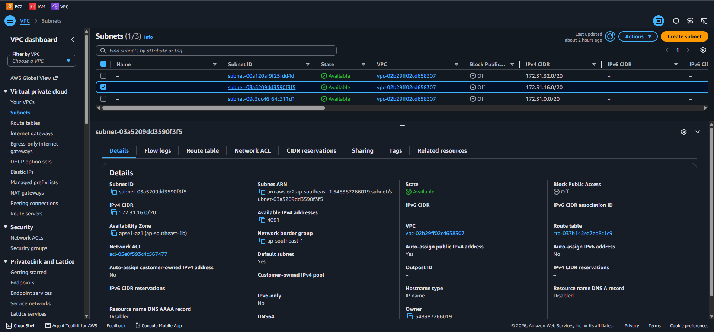
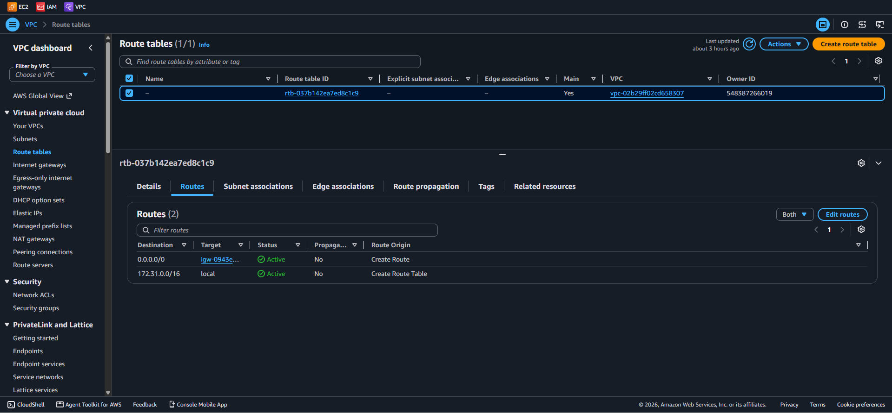
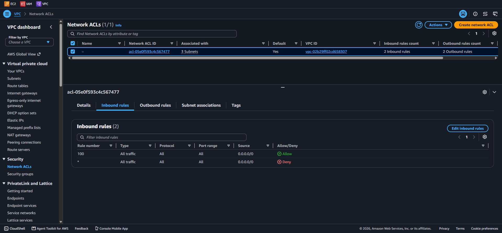
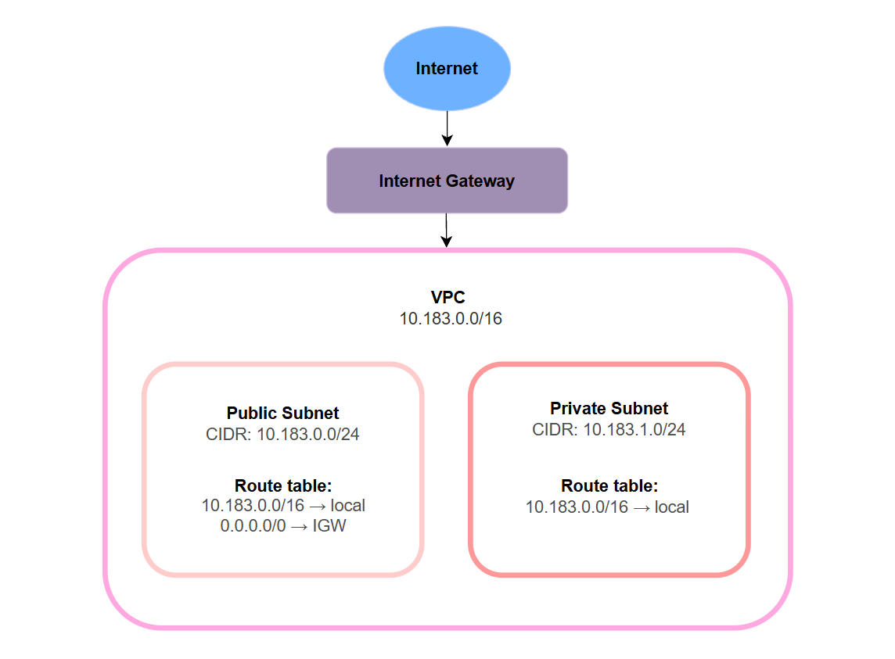

# Assignment 2 Submission

<!--
How to use this template:

1. Copy this file to submissions/assignment-2/<your-github-username>/submission.md
2. Replace every answer placeholder with your own answer. Delete the angle brackets too.
3. Save your four images in the same folder, with the exact file names below.
4. Do not write your full name or your student number in this file.
-->

## About me

- GitHub username: jarulfoa12345783
- Section: BCSAD
- IAM user name that I signed in with: bcsad-g08
- X: 183

---

## Part A. Explore

### A1. The VPC

Default VPC IPv4 CIDR:

172.31.0.0/16

Number of addresses in that CIDR:

65,536

### A2. The subnets

| Availability Zone | IPv4 CIDR |
| --- | --- |
| ap-southeast-1a | 172.31.32.0/20 |
| ap-southeast-1b | 172.31.16.0/20 |
| ap-southeast-1c | 172.31.0.0/20 |

Screenshot 1. Save it as `screenshot-1-subnets.png` in your folder. The image line below shows it.

### A3. Available addresses

Available IPv4 addresses in each subnet:

ap-southeast-1a 4090, ap-southeast-1b 4091, ap-southeast-1c 4091

Why is the number lower than 4,096?

A `/20` has 4,096 addresses, but AWS reserves 5 addresses in every subnet for its own networking functions. Therefore, an empty `/20` has 4,091 available addresses.

What uses the missing address in the subnet with the lowest number?

The missing address is used by an EC2 instance through its network interface (ENI).

### A4. The route table

| Destination | Target |
| --- | --- |
| 0.0.0.0/0 | igw-0943e7e6f88293168 |
| 172.31.0.0/16 | local |

Screenshot 2. Save it as `screenshot-2-routes.png` in your folder. The image line below shows it.

### A5. Public or private

Are the default subnets public or private? Which route proves it?

The default subnets are public. The route `0.0.0.0/0` to the internet gateway proves that they have a path to the internet.

### A6. The internet gateway

State of the internet gateway:

Attached

What happens to the default subnets if the gateway is detached?

If the internet gateway is detached, the default subnets lose their working path to the internet because the 0.0.0.0/0 route points to that gateway. The local route still allows communication between resources inside the VPC.

### A7. NAT gateways

Number of NAT gateways:

0

Can a server in a new private subnet download updates? Why?

No. A private subnet has no direct route to the internet gateway, and without a NAT gateway there is no path for the private server to start internet connections.

### A8. The network ACL

| Rule number | Source | Allow or Deny |
| --- | --- | --- |
| 100 | 0.0.0.0/0 | ALLOW |
| * | 0.0.0.0/0 | DENY |

How is a network ACL different from a security group?

A network ACL protects an entire subnet, while a security group protects an individual resource such as an EC2 instance. A network ACL is stateless and can have both allow and deny rules, while a security group is stateful and uses allow rules only.

Screenshot 3. Save it as `screenshot-3-network-acl.png` in your folder. The image line below shows it.

### A9. The default security group

Inbound rule (type and source):

Type: All traffic, Source:sg-0c5b6d4081cf0a534 - default

Which resources can send traffic to an instance that uses it?

Only resources that also use the default security group can send inbound traffic through this rule.

---

## Part B. Prepare

### B1. Plan two subnets

- Public subnet CIDR: 10.183.0.0/24
- Private subnet CIDR: 10.183.1.0/24

### B2. Route tables

Route table of the public subnet:

| Destination | Target |
| --- | --- |
| 10.183.0.0/16 | local |
| 0.0.0.0/0 | Internet Gateway |

Route table of the private subnet:

| Destination | Target |
| --- | --- |
| 10.183.0.0/16 | local |

### B3. My VPC diagram

Tool used (Excalidraw, draw.io, Lucidchart, or paper):

draw.io

Save your diagram as `vpc-diagram.png` in your folder. The image line below shows it.

### B4. Predict a change

Can you still open the web page from your laptop? Why?

No. The instance loses its route to the internet because the 0.0.0.0/0 route was removed. Having a public IPv4 address alone is not enough without a route to the internet gateway.

Can the instance still reach another instance in the VPC? Why?

Yes. The local route for the VPC CIDR is still present. The local route allows resources in the VPC to communicate with each other.

### B5. Place a database

Which subnet gets the database? Why?

### B5. Place a database

Which subnet gets the database? Why?

The database should be placed in the private subnet, `10.183.1.0/24`, because it does not have a route to the internet gateway. This prevents direct access to the database from the internet.

### B6. My question about VPCs

What is your question, and what made you think of it?

What is the difference between connecting two VPCs using VPC peering and using a transit gateway? I thought of this because the activity explained communication inside one VPC, which made me wonder how separate VPC networks communicate with each other.
