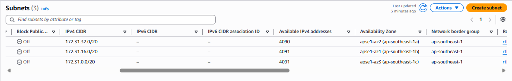
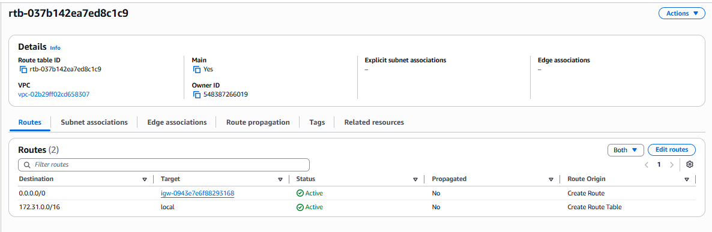
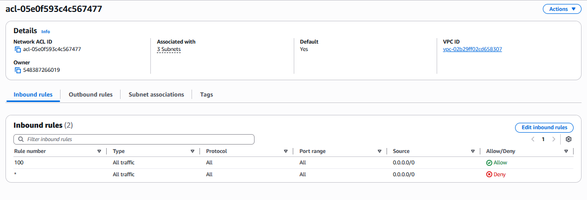
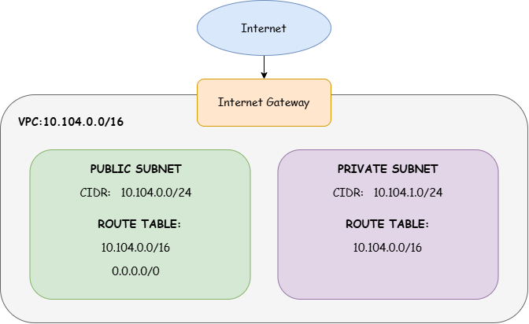

# Assignment 2 Submission

<!--
How to use this template:

1. Copy this file to submissions/assignment-2/<your-github-username>/submission.md
2. Replace every answer placeholder with your own answer. Delete the angle brackets too.
3. Save your four images in the same folder, with the exact file names below.
4. Do not write your full name or your student number in this file.
-->

## About me

- GitHub username: julienaulosayu
- Section: IV-BCSAD
- IAM user name that I signed in with: bcsad-g08
- X: 104

---

## Part A. Explore

### A1. The VPC

Default VPC IPv4 CIDR:

- 172.31.0.0/16

Number of addresses in that CIDR:

- 65,536

### A2. The subnets

| Availability Zone | IPv4 CIDR |
| --- | --- |
| ap-southeast-1a | 172.31.16.0/20 |
| ap-southeast-1b | 172.31.16.0/20 |
| ap-southeast-1c | 172.31.0.0/20 |

Screenshot 1. Save it as `screenshot-1-subnets.png` in your folder. The image line below shows it.

### A3. Available addresses

Available IPv4 addresses in each subnet:

- 172.31.32.0/20: 4090
- 172.31.16.0/20: 4091
- 172.31.0.0/20: 4091

Why is the number lower than 4,096?

- AWS reserves five IP addresses in each subnet, so only 4,091 addresses are normally available from a /20 subnet.

What uses the missing address in the subnet with the lowest number?

- One additional IP address is currently being used by a resource in the subnet, resulting in 4,090 available addresses.

### A4. The route table

| Destination | Target |
| --- | --- |
| 0.0.0.0/0 | igw-0943e7e6f88293168 |
| 172.31.0.0/16 | local |

Screenshot 2. Save it as `screenshot-2-routes.png` in your folder. The image line below shows it.

### A5. Public or private

Are the default subnets public or private? Which route proves it?

- The default subnets are public because the route `0.0.0.0/0` points to the Internet Gateway.

### A6. The internet gateway

State of the internet gateway:

- Attached

What happens to the default subnets if the gateway is detached?

- The default subnets would lose their internet connectivity through the Internet Gateway.

### A7. NAT gateways

Number of NAT gateways:

- 0

Can a server in a new private subnet download updates? Why?

- No. There is no NAT Gateway, so a server in the private subnet would not have a route that allows it to access the internet for downloading updates.

### A8. The network ACL

| Rule number | Source | Allow or Deny |
| --- | --- | --- |
| 100  | 0.0.0.0/0  | Allow |
| * | 0.0.0.0/0 | Deny |

How is a network ACL different from a security group?

- A network ACL operates at the subnet level and is stateless. It supports both allow and deny rules. A security group operates at the resource level, is stateful, and only has allow rules.

Screenshot 3. Save it as `screenshot-3-network-acl.png` in your folder. The image line below shows it.

### A9. The default security group

Inbound rule (type and source):

- All traffic — source: sg-0c5b6d4081cf0a534

Which resources can send traffic to an instance that uses it?

- Resources associated with the same security group can send traffic to the instance.

---

## Part B. Prepare

### B1. Plan two subnets

- Public subnet CIDR: 10.104.0.0/24
- Private subnet CIDR: 10.104.1.0/24

### B2. Route tables

Route table of the public subnet:

| Destination | Target |
| --- | --- |
| 10.104.0.0/16 | local |
| 0.0.0.0/0 | Internet Gateway |

Route table of the private subnet:

| Destination | Target |
| --- | --- |
| 10.104.0.0/16 | local |

### B3. My VPC diagram

Tool used (Excalidraw, draw.io, Lucidchart, or paper):

- draw.io

Save your diagram as `vpc-diagram.png` in your folder. The image line below shows it.

### B4. Predict a change

Can you still open the web page from your laptop? Why?

- No. Without the `0.0.0.0/0` route to the Internet Gateway, the instance would no longer have a route for internet traffic from the laptop.

Can the instance still reach another instance in the VPC? Why?

- Yes. The local route `10.104.0.0/16 - local` still allows communication between resources within the VPC.

### B5. Place a database

Which subnet gets the database? Why?

- The database should be placed in the private subnet because it does not need to be directly accessible from the internet.

### B6. My question about VPCs

What is your question, and what made you think of it?

- Why can resources in a private subnet still communicate? perhaps with the resources in the public subnet?
