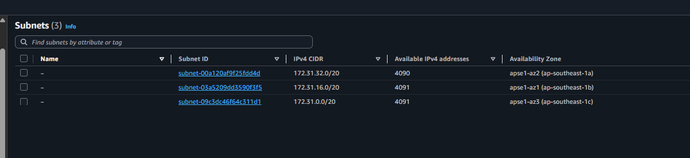
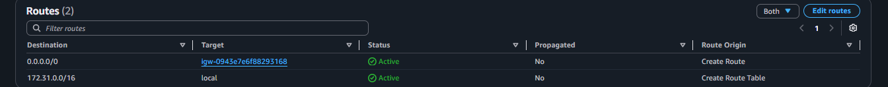
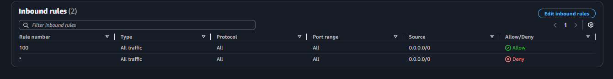
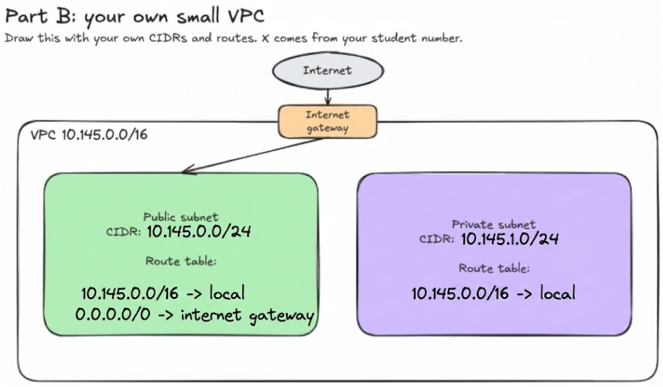

# Assignment 2 Submission

## About me

- GitHub username: jyjstn
- Section: BCSAD
- IAM user name that I signed in with: bcsad-g09
- X: 145

---

## Part A. Explore

### A1. The VPC

Default VPC IPv4 CIDR:

172.31.0.0/16

Number of addresses in that CIDR:

65,536

### A2. The subnets

| Availability Zone | IPv4 CIDR |
| --- | --- |
| ap-southeast-1a | 172.31.32.0/20 |
| ap-southeast-1b | 172.31.16.0/20 |
| ap-southeast-1c | 172.31.0.0/20 |

Screenshot 1. Save it as `screenshot-1-subnets.png` in your folder. The image line below shows it.

### A3. Available addresses

Available IPv4 addresses in each subnet:

4090, 4091, 4091

Why is the number lower than 4,096?

A `/20` CIDR block mathematically contains 4,096 total IP addresses. However, AWS automatically reserves 5 IP addresses per subnet—specifically the first four and the last one—for internal networking. This leaves exactly 4,091 available addresses in a completely empty `/20` subnet.

What uses the missing address in the subnet with the lowest number?

The subnet `172.31.32.0/20` in `ap-southeast-1a` shows 4,090 available addresses, which is one fewer than the 4,091 baseline. This indicates that exactly one IP address is currently allocated to a resource. It is held by a network interface, for example, from an instance launched in Lab 2.

### A4. The route table

| Destination | Target |
| --- | --- |
| 0.0.0.0/0 | igw-... |
| 172.31.0.0/16 | local |

Screenshot 2. Save it as `screenshot-2-routes.png` in your folder. The image line below shows it.

### A5. Public or private

Are the default subnets public or private? Which route proves it?

The default subnets are public. This is proven by the route with the destination 0.0.0.0/0 pointing to the target igw-.... This specific route directs traffic to an Internet Gateway, granting the associated subnets direct access to the public internet.

### A6. The internet gateway

State of the internet gateway:

Attached

What happens to the default subnets if the gateway is detached?

When the Internet Gateway is detached from the VPC, the `0.0.0.0/0` route pointing to `igw-...` remains in the route table, but its status changes from "Active" to "Blackhole". Because the gateway is no longer connected to the VPC, any internet-bound traffic attempting to use this route is immediately dropped, effectively rendering the associated subnets private.

### A7. NAT gateways

Number of NAT gateways:

0

Can a server in a new private subnet download updates? Why?

No. For a server in a private subnet to reach the internet, its route table must direct outbound traffic to a NAT gateway located in a public subnet. Because this VPC currently has 0 NAT gateways, there is no available path for the server to connect to the internet and download updates.

### A8. The network ACL

| Rule number | Source | Allow or Deny |
| --- | --- | --- |
| 100 | 0.0.0.0/0 | Allow |
| * | 0.0.0.0/0 | Deny |

How is a network ACL different from a security group?

Network ACLs operate at the subnet level and evaluate both allow and deny rules, while security groups attach directly to individual resources like EC2 instances and only support allow rules. Additionally, ACLs are stateless, meaning return traffic requires its own explicit outbound rule, whereas stateful security groups automatically permit return responses for any allowed inbound request.

Screenshot 3. Save it as `screenshot-3-network-acl.png` in your folder. The image line below shows it.

### A9. The default security group

Inbound rule (type and source):

Type: All traffic. Source: the default security group itself (`sg-0c5b6d4081cf0a534`).

Which resources can send traffic to an instance that uses it?

Because the source is set to the security group's own ID, only other resources (like EC2 instances) that have this exact same default security group attached to them can send traffic to the instance. It allows all resources within the group to communicate with each other freely, while blocking unsolicited inbound traffic from anything outside the group.

---

## Part B. Prepare

### B1. Plan two subnets

- Public subnet CIDR: 10.145.0.0/24
- Private subnet CIDR: 10.145.1.0/24

### B2. Route tables

Route table of the public subnet:

| Destination | Target |
| --- | --- |
| 10.145.0.0/16 | local |
| 0.0.0.0/0 | internet gateway |

Route table of the private subnet:

| Destination | Target |
| --- | --- |
| 10.145.0.0/16 | local |

### B3. My VPC diagram

Tool used (Excalidraw, draw.io, Lucidchart, or paper):

Excalidraw

Save your diagram as `vpc-diagram.png` in your folder. The image line below shows it.

### B4. Predict a change

Can you still open the web page from your laptop? Why?

No. Deleting the `0.0.0.0/0` route removes the subnet's path to the Internet Gateway, meaning external devices like your laptop can no longer route inbound traffic to the instance.

Can the instance still reach another instance in the VPC? Why?

Yes. The `172.31.0.0/16` route pointing to `local` remains in the route table, so internal traffic between instances within the default VPC will still route normally.

### B5. Place a database

Which subnet gets the database? Why?

The database should be placed in the private subnet for security. It does not need direct internet access, and keeping it isolated prevents external exposure while still allowing it to communicate with application servers using the VPC's local route.

### B6. My question about VPCs

What is your question, and what made you think of it?

If a private subnet has no NAT gateway, what is the most secure way for instances inside it to access AWS services (like S3) or download necessary software patches without making the subnet public?

What made me think of it: seeing the NAT gateway count at 0 in part A7 made me wonder how isolated instances in real-world environments handle critical updates or offsite backups when they are completely cut off from the public internet.
