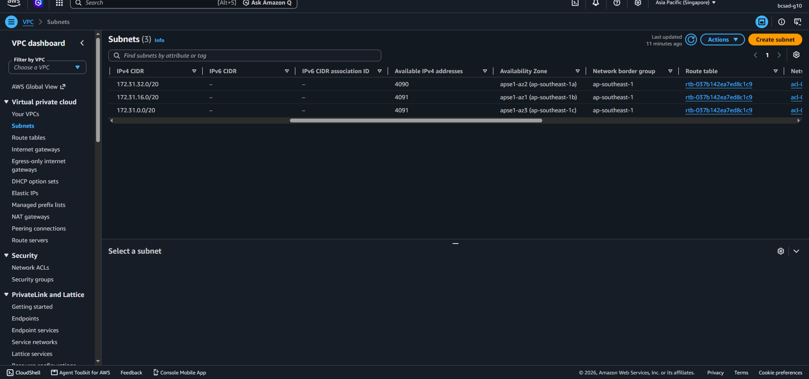
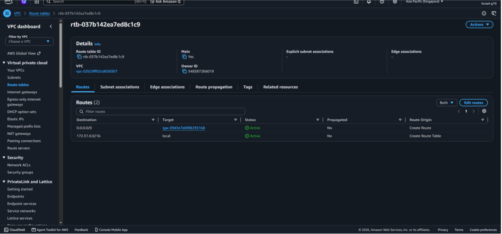
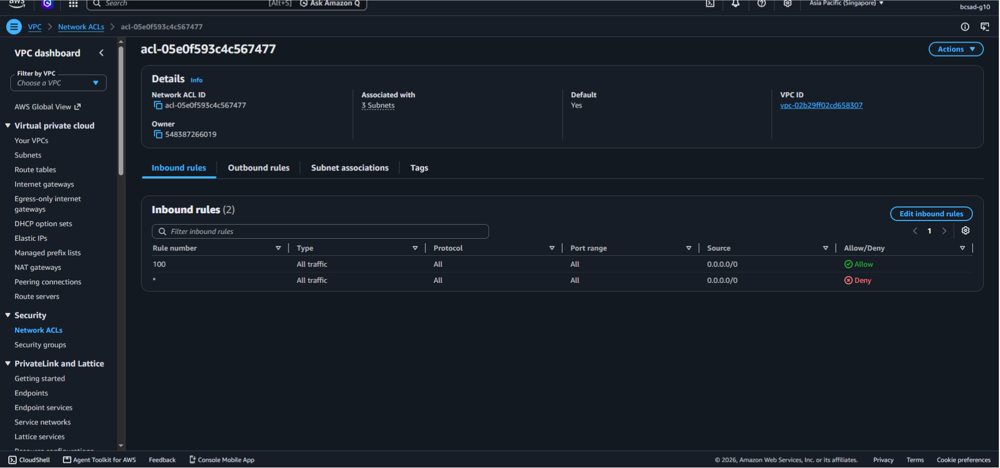
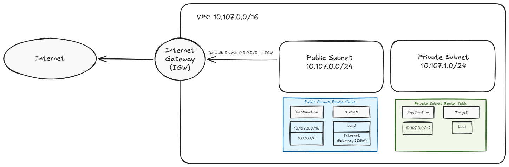

# Assignment 2 Submission

## About me

- GitHub username: DrMacky
- Section: IV-BCSAD
- IAM user name that I signed in with: bcsad-g10
- X: 155

---

## Part A. Explore

### A1. The VPC

Default VPC IPv4 CIDR:

172.31.0.0/16

Number of addresses in that CIDR:

65,536 IPv4 addresses.

### A2. The subnets

| Availability Zone | IPv4 CIDR |
| --- | --- |
| apse1-az2 (ap-southeast-1a) | 172.31.32.0/20 |
| apse1-az1 (ap-southeast-1b) | 172.31.16.0/20 |
| apse1-az3 (ap-southeast-1c) | 172.31.0.0/20 |

Screenshot 1. Save it as `screenshot-1-subnets.png` in your folder. The image line below shows it.

### A3. Available addresses

Available IPv4 addresses in each subnet:

- ap-southeast-1a: 4,090
- ap-southeast-1b: 4,091
- ap-southeast-1c: 4,091

Why is the number lower than 4,096?

AWS automatically reserves 5 IP addresses in every subnet for system stuff (like setting up the network, router, and DNS). That leaves 4,091 IPs for us to actually use (4,096 - 5 = 4,091).

What uses the missing address in the subnet with the lowest number?

The subnet in ap-southeast-1a has 4,090 IPs because an active resource in our lab account (like an active network interface or a running server) is using up one extra address.

### A4. The route table

| Destination | Target |
| --- | --- |
| 0.0.0.0/0 | igw-0943e7e6f88293168 |
| 172.31.0.0/16 | local |

Screenshot 2. Save it as `screenshot-2-routes.png` in your folder. The image line below shows it.

### A5. Public or private

Are the default subnets public or private? Which route proves it?

They are public. The route showing 0.0.0.0/0 connected to the Internet Gateway (igw-...) proves it because that rule sends traffic out to the open internet.

### A6. The internet gateway

State of the internet gateway:

Attached.

What happens to the default subnets if the gateway is detached?

If you detach the Internet Gateway, the subnets lose their connection to the outside world, so internet traffic stops. However, servers inside the same VPC can still talk to each other through the local route.

### A7. NAT gateways

Number of NAT gateways:

No NAT gateways found.

Can a server in a new private subnet download updates? Why?

No. Since it's in a private subnet, it has no direct route to the internet. Without a NAT Gateway to bridge the connection, it can't reach the outside to download updates.

### A8. The network ACL

| Rule number | Source | Allow or Deny |
| --- | --- | --- |
| 100 | 0.0.0.0/0 | Allow |
| * | 0.0.0.0/0 | Deny |

How is a network ACL different from a security group?

A Network ACL controls incoming and outgoing traffic for an entire subnet, while a Security Group controls traffic for specific resources, such as EC2 instances. Network ACLs can allow or deny traffic, while Security Groups only have allow rules. Also, Network ACLs are stateless, while Security Groups are stateful.

Screenshot 3. Save it as `screenshot-3-network-acl.png` in your folder. The image line below shows it.

### A9. The default security group

Inbound rule (type and source):

- Type: All traffic
- Source: sg-0c5b6d4081cf0a534 (default Security Group)

Which resources can send traffic to an instance that uses it?

Only other resources that share the exact same default Security Group. Traffic coming from outside or from other security groups is blocked.

---

## Part B. Prepare

### B1. Plan two subnets

- Public subnet CIDR: 10.107.0.0/24
- Private subnet CIDR: 10.107.1.0/24

### B2. Route tables

Route table of the public subnet:

| Destination | Target |
| --- | --- |
| 10.107.0.0/16 | local |
| 0.0.0.0/0 | internet gateway |

Route table of the private subnet:

| Destination | Target |
| --- | --- |
| 10.107.0.0/16 | local |

### B3. My VPC diagram

Tool used (Excalidraw, draw.io, Lucidchart, or paper):

Excalidraw

Save your diagram as `vpc-diagram.png` in your folder. The image line below shows it.

### B4. Predict a change

Can you still open the web page from your laptop? Why?

No. Removing the route to the Internet Gateway breaks the connection between my laptop and the server, so the web page won't load.

Can the instance still reach another instance in the VPC? Why?

Yes. Internal traffic still works because the local route (10.107.0.0/16 local) wasn't removed.

### B5. Place a database

Which subnet gets the database? Why?

I would place the database server in the private subnet (10.107.1.0/24) because it does not need to be directly accessible from the internet. This would help protect the database from unwanted public access while still allowing authorized resources within the VPC to communicate with it.

### B6. My question about VPCs

What is your question, and what made you think of it?

Question: How do two VPCs located in different AWS regions talk to each other privately?

Reason: After seeing how the local route connects everything inside one VPC, I got curious about how AWS links separate VPCs across different parts of the world.
