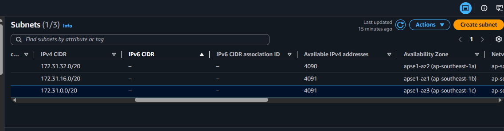
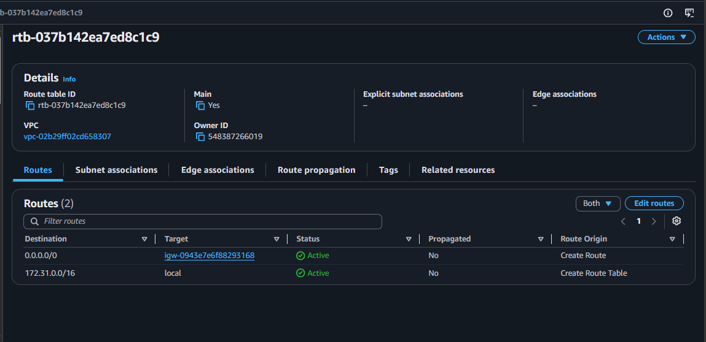
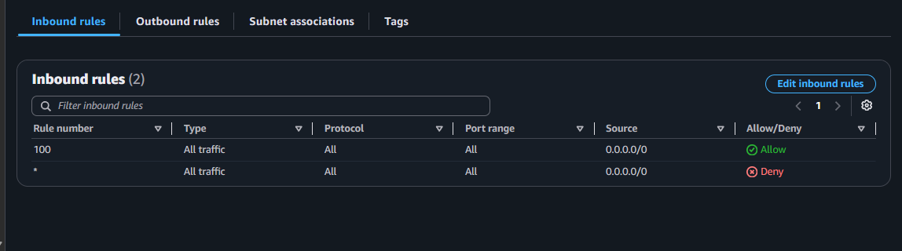
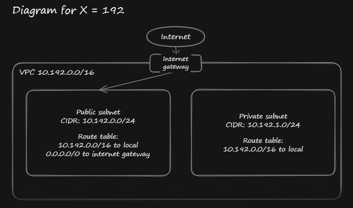

# Assignment 2 Submission

## About me

- GitHub username: leksxee
- Section: IV-BCSAD
- IAM user name that I signed in with: bcsad-g04
- X: 192

---

## Part A. Explore

### A1. The VPC

Default VPC IPv4 CIDR:

172.31.0.0/16

Number of addresses in that CIDR:

65,536

### A2. The subnets

| Availability Zone | IPv4 CIDR |
| --- | --- |
| ap-southeast-1a | 172.31.32.0/20 |
| ap-southeast-1b | 172.31.16.0/20 |
| ap-southeast-1c | 172.31.0.0/20 |

Screenshot 1. Save it as `screenshot-1-subnets.png` in your folder. The image line below shows it.

### A3. Available addresses

Available IPv4 addresses in each subnet:

- ap-southeast-1a: 4090
- ap-southeast-1b: 4091
- ap-southeast-1c: 4091

Why is the number lower than 4,096?

AWS reserves 5 IP addresses in every subnet for internal networking purposes (the network address, VPC router, DNS resolver, AWS future reservation, and broadcast address). Therefore, an unused /20 subnet starts with at most 4,091 available addresses.

What uses the missing address in the subnet with the lowest number?

An active resource or network interface (such as an EC2 instance, Elastic Network Interface, or load balancer) is deployed in that subnet and consuming the IP address[cite: 2].

### A4. The route table

| Destination | Target |
| --- | --- |
| 0.0.0.0/0 | igw-0943e7e6f88293168 |
| 172.31.0.0/16 | local |

Screenshot 2. Save it as `screenshot-2-routes.png` in your folder. The image line below shows it.

### A5. Public or private

Are the default subnets public or private? Which route proves it?

They are public. The route 0.0.0.0/0 pointing to an internet gateway target (igw-0943e7e6f88293168) proves it, as it allows two-way routing directly to and from the public internet.

### A6. The internet gateway

State of the internet gateway:

attached

What happens to the default subnets if the gateway is detached?

The default subnets lose their route to the public internet and effectively become private. External users can no longer access instances using public IP addresses, and instances inside those subnets cannot reach the public internet.

### A7. NAT gateways

Number of NAT gateways:

0

Can a server in a new private subnet download updates? Why?

No. A private subnet does not have a route to an internet gateway. For an instance in a private subnet to download updates without receiving inbound connections, it requires a NAT gateway in a public subnet. Because there are 0 NAT gateways, outbound internet requests cannot be routed.

### A8. The network ACL

| Rule number | Source | Allow or Deny |
| --- | --- | --- |
| 100 | 0.0.0.0/0 | Allow |
| * | 0.0.0.0/0 | Deny |

How is a network ACL different from a security group?

A network ACL operates at the subnet level, is stateless (inbound and outbound rules must be specified independently), and evaluates ordered rules containing both Allow and Deny. A security group attaches directly to instances or network interfaces, is stateful (return traffic is automatically allowed), and supports Allow rules only.

Screenshot 3. Save it as `screenshot-3-network-acl.png` in your folder. The image line below shows it.

### A9. The default security group

Inbound rule (type and source):

All traffic from the default security group itself (self-referencing security group ID).

Which resources can send traffic to an instance that uses it?

Only other instances or resources within the VPC that are explicitly assigned this exact default security group.

---

## Part B. Prepare

### B1. Plan two subnets

- Public subnet CIDR: 10.192.0.0/24
- Private subnet CIDR: 10.192.1.0/24

### B2. Route tables

Route table of the public subnet:

| Destination | Target |
| --- | --- |
| 10.192.0.0/16 | local |
| 0.0.0.0/0 | internet gateway |

Route table of the private subnet:

| Destination | Target |
| --- | --- |
| 10.192.0.0/16 | local |

### B3. My VPC diagram

Tool used (Excalidraw, draw.io, Lucidchart, or paper):

Excalidraw

Save your diagram as `vpc-diagram.png` in your folder. The image line below shows it.

### B4. Predict a change

Can you still open the web page from your laptop? Why?

No. Deleting 0.0.0.0/0 removes the route to the Internet Gateway. The VPC router cannot route outgoing HTTP response packets back across the public internet to your laptop, causing the connection to time out.

Can the instance still reach another instance in the VPC? Why?

Yes. Intra-VPC traffic uses the local route (172.31.0.0/16 to local), which remains active and continues to route traffic directly between subnets within the VPC.

### B5. Place a database

Which subnet gets the database? Why?

The private subnet (10.192.1.0/24). Databases contain sensitive application data and should never have direct inbound exposure to the public internet. Web or application servers in the public subnet can still access the database internally using the VPC's local route.

### B6. My question about VPCs

What is your question, and what made you think of it?

Question: If a private subnet cannot connect to the internet without an expensive NAT gateway, how do production architectures securely connect private databases to managed AWS services like Amazon S3 or AWS Secrets Manager without incurring NAT Gateway costs?
What made me think of it: Seeing that private subnets are isolated from the internet and learning that NAT gateways incur continuous hourly fees made me wonder how cloud systems connect private instances to internal AWS services cost-effectively.