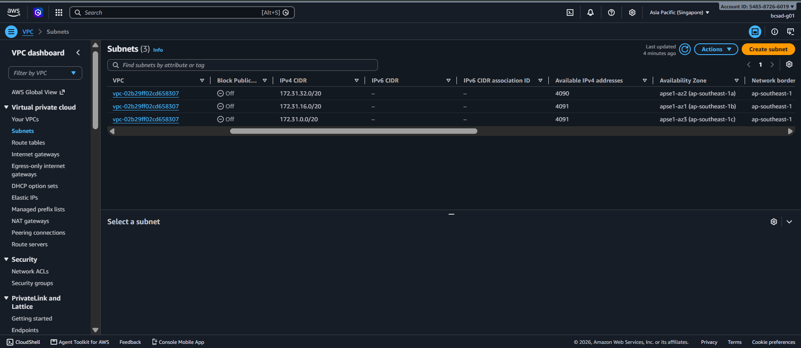
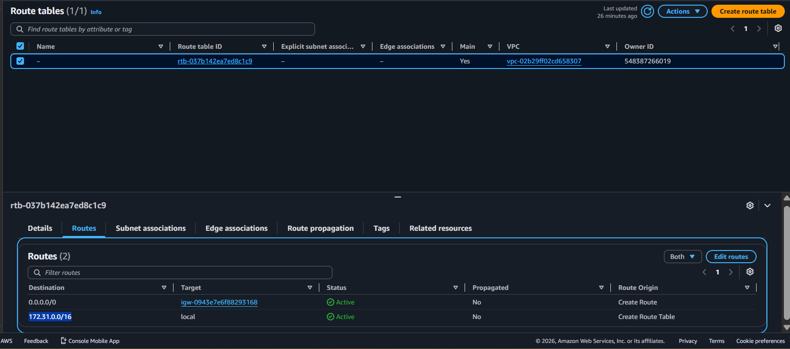
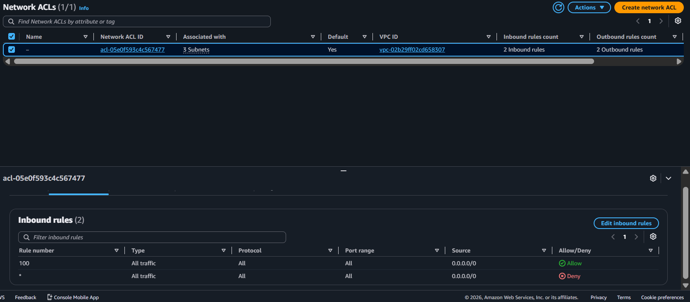
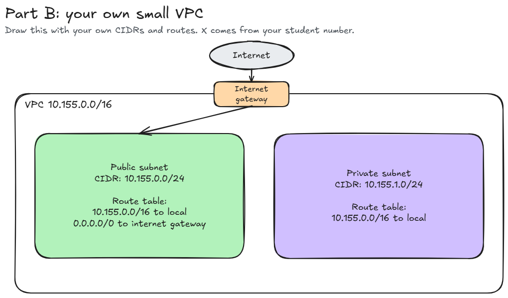

# Assignment 2 Submission

<!--
How to use this template:

1. Copy this file to submissions/assignment-2/<your-github-username>/submission.md
2. Replace every answer placeholder with your own answer. Delete the angle brackets too.
3. Save your four images in the same folder, with the exact file names below.
4. Do not write your full name or your student number in this file.
-->

## About me

- GitHub username: mrkjeniel
- Section: 4-BCSAD
- IAM user name that I signed in with: bcsad-g01
- X: 155

---

## Part A. Explore

### A1. The VPC

Default VPC IPv4 CIDR:

172.31.0.0/16

Number of addresses in that CIDR:

65, 536

### A2. The subnets

| Availability Zone           | IPv4 CIDR      |
| ---                         | ---            |
| apse1-az2 (ap-southeast-1a) | 172.31.32.0/20 |
| apse1-az1 (ap-southeast-1b) | 172.31.16.0/20 |
| apse1-az3 (ap-southeast-1c) | 172.31.0.0/20  |

Screenshot 1. Save it as `screenshot-1-subnets.png` in your folder. The image line below shows it.

### A3. Available addresses

Available IPv4 addresses in each subnet:

| IPv4 CIDR      | Available IPv4 addresses |
| ---            | ---                      |
| 172.31.32.0/20 | 4090                     |
| 172.31.16.0/20 | 4091                     |
| 172.31.0.0/20  | 4091                     |

Why is the number lower than 4,096?

AWS automatically reserves 5 IP addresses to each subnet. These reserved subnets are used for network address, the VPC local router, the AWS DNS server, future reserved use, and network broadcast addresses. 

What uses the missing address in the subnet with the lowest number?

For the subnet with the lowest number, there is a active AWS resources running inside the specific Availability Zone. 

### A4. The route table

| Destination   | Target                |
| ---           | ---                   |
| 0.0.0.0/0     | igw-0943e7e6f88293168 |
| 172.31.0.0/16 | local                 |

Screenshot 2. Save it as `screenshot-2-routes.png` in your folder. The image line below shows it.

### A5. Public or private

Are the default subnets public or private? Which route proves it?

The default subnet is public. The route that proves this is 0.0.0.0/0 as destination and igw-0943e7e6f88293168 as target, which connects the subnet to the internet.

### A6. The internet gateway

State of the internet gateway:

Attached

What happens to the default subnets if the gateway is detached?

The internet access will be broken off as and nothing can access it from the out side anymore.

### A7. NAT gateways

Number of NAT gateways:

0

Can a server in a new private subnet download updates? Why?

No, it cannot. Private servers lack route to internet gateway, which means that they are totally cut off and cannot be reach by outside servers.

### A8. The network ACL

| Rule number | Source    | Allow or Deny |
| ---         | ---       | ---           |
| 100         | 0.0.0.0/0 | Allow         |
| *           | 0.0.0.0/0 | Deny          |

How is a network ACL different from a security group?

Network ACL works like a big dome encompassing its protection to every resources inside the subnet, meanwhile, Security Group works like an umbrella or a roof that protects a specific resource. 

Screenshot 3. Save it as `screenshot-3-network-acl.png` in your folder. The image line below shows it.

### A9. The default security group

Inbound rule (type and source):

The inbound rule's type is 'All traffic' and source is 'sg-0c5b6d4081cf0a534'.

Which resources can send traffic to an instance that uses it?

It can only send traffic to resources that are assigned the same default security group. 

---

## Part B. Prepare

### B1. Plan two subnets

- Public subnet CIDR: 10.155.0.0/24
- Private subnet CIDR: 10.155.1.0/24

### B2. Route tables

Route table of the public subnet:

| Destination   | Target           |
| ---           | ---              |
| 0.0.0.0/0     | internet gateway |
| 10.155.0.0/16 | local            |

Route table of the private subnet:

| Destination   | Target      |
| ---           | ---         |
| 10.155.0.0/16 | local       |

### B3. My VPC diagram

Tool used (Excalidraw, draw.io, Lucidchart, or paper):

Excalidraw

Save your diagram as `vpc-diagram.png` in your folder. The image line below shows it.

### B4. Predict a change

Can you still open the web page from your laptop? Why?

You can't. By removing the 0.0.0.0/0 route, we also removed the access to internet. It loses its connection to external servers, including the laptop.

Can the instance still reach another instance in the VPC? Why?

You can. The default handles all internal VPC traffic and since it's not deleted, intances can still communicate freely.

### B5. Place a database

Which subnet gets the database? Why?

It should be placed inside a private subnet. Databases can contain sensitive information that can ba at risk of exposure if placed inside a public subnet.

### B6. My question about VPCs

What is your question, and what made you think of it?

Why does the subnet need those 5 specific ip taken out for each subnet? I kind of get why there are missing besides the 5, but just really curious why only those 5.
