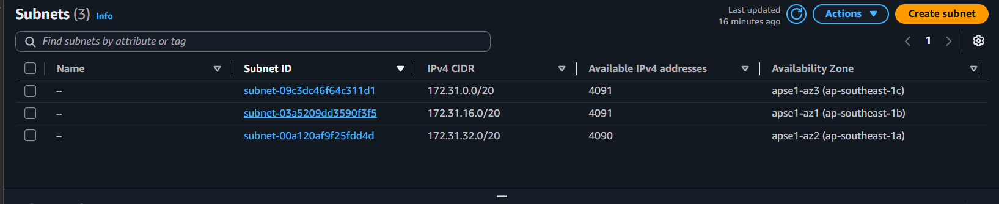
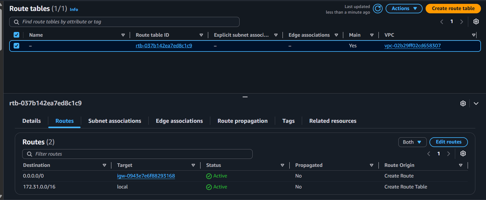
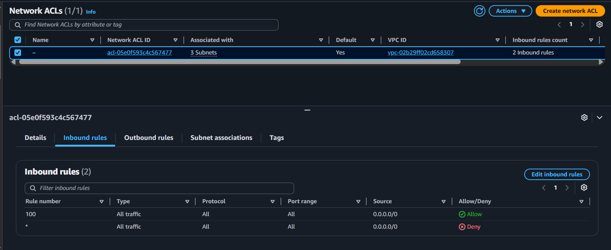
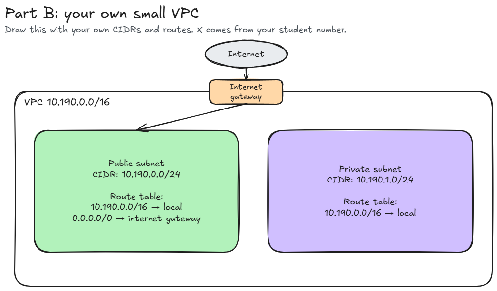

# Assignment 2 Submission

<!--
How to use this template:

1. Copy this file to submissions/assignment-2/<your-github-username>/submission.md
2. Replace every answer placeholder with your own answer. Delete the angle brackets too.
3. Save your four images in the same folder, with the exact file names below.
4. Do not write your full name or your student number in this file.
-->

## About me

- GitHub username: o4o29
- Section: IV-BCSAD
- IAM user name that I signed in with: bcsad-g07
- X: 190

---

## Part A. Explore

### A1. The VPC

Default VPC IPv4 CIDR:

- 172.31.0.0/16

Number of addresses in that CIDR:

- 65,536

### A2. The subnets

| Availability Zone | IPv4 CIDR |
| --- | --- |
| ap-southeast-1a | 172.31.32.0/20 |
| ap-southeast-1b | 172.31.16.0/20 |
| ap-southeast-1c | 172.31.0.0/20 |

Screenshot 1. Save it as `screenshot-1-subnets.png` in your folder. The image line below shows it.

### A3. Available addresses

Available IPv4 addresses in each subnet:

- ap-southeast-1a: 4,090; ap-southeast-1b: 4,091; ap-southeast-1c: 4,091

Why is the number lower than 4,096?

1. AWS reserves 5 addresses in every subnet for its own use, so they cannot be assigned to instances. Since a /20 subnet has 4,096 addresses, 4,096 − 5 = 4,091 available addresses.

What uses the missing address in the subnet with the lowest number?

2. The ap-southeast-1a subnet has 4,090 available addresses, which is one less than the other subnets with 4,091. This means one additional address is already in use by a network interface, probably from an instance in that subnet.

### A4. The route table

| Destination | Target |
| --- | --- |
| 172.31.0.0/16 | local |
| 0.0.0.0/0 | igw-... |

Screenshot 2. Save it as `screenshot-2-routes.png` in your folder. The image line below shows it.

### A5. Public or private

Are the default subnets public or private? Which route proves it?

- The default subnets are public because the route 0.0.0.0/0 goes to the internet gateway.

### A6. The internet gateway

State of the internet gateway: 

- attached

What happens to the default subnets if the gateway is detached?

- If the gateway is detached, the route 0.0.0.0/0 has no working target, so the subnets lose their path to the internet. The instances can still reach each other because the local route connects the subnets within the VPC.

### A7. NAT gateways

Number of NAT gateways:

- 0

Can a server in a new private subnet download updates? Why?

- No, because a private subnet has no route to the internet gateway and the account has no NAT gateway. It would need a NAT gateway and a route 0.0.0.0/0 to the NAT gateway to be able to download updates.

### A8. The network ACL

| Rule number | Source | Allow or Deny |
| --- | --- | --- |
| 100 | 0.0.0.0/0 | Allow |
| * | 0.0.0.0/0 | Deny |

How is a network ACL different from a security group?

- A security group is applied at the resource level and can only allow traffic, while a network ACL works at the subnet level and can either allow or deny traffic. Security groups are stateful, whereas network ACLs are stateless and follow the lowest-numbered rule first.

Screenshot 3. Save it as `screenshot-3-network-acl.png` in your folder. The image line below shows it.

### A9. The default security group

Inbound rule (type and source):

- All traffic and sg-...

Which resources can send traffic to an instance that uses it?

- Only resources that are associated with the same security group (sg-...) can send traffic to an instance that uses it.

---

## Part B. Prepare

### B1. Plan two subnets

- Public subnet CIDR: 10.190.0.0/24
- Private subnet CIDR: 10.190.1.0/24

### B2. Route tables

Route table of the public subnet:

| Destination | Target |
| --- | --- |
| 10.190.0.0/16 | local |
| 0.0.0.0/0 | internet gateway |

Route table of the private subnet:

| Destination | Target |
| --- | --- |
| 10.190.0.0/16 | local |

### B3. My VPC diagram

Tool used (Excalidraw, draw.io, Lucidchart, or paper):

<answer>

Save your diagram as `vpc-diagram.png` in your folder. The image line below shows it.

### B4. Predict a change

Can you still open the web page from your laptop? Why?

<answer>

Can the instance still reach another instance in the VPC? Why?

<answer>

### B5. Place a database

Which subnet gets the database? Why?

<answer>

### B6. My question about VPCs

What is your question, and what made you think of it?

<answer>
