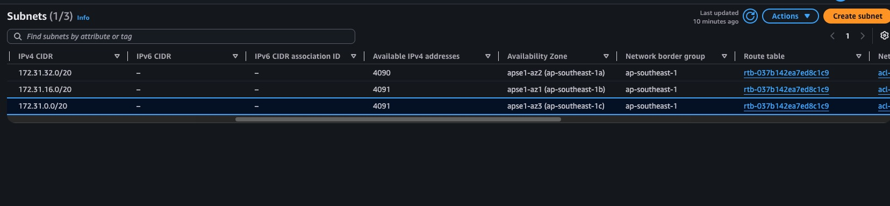
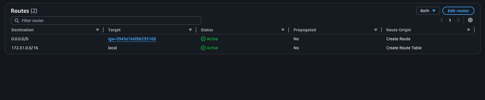
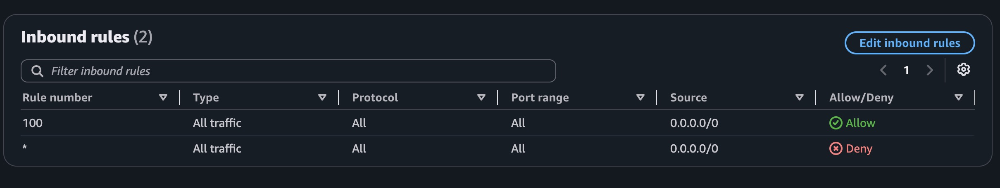
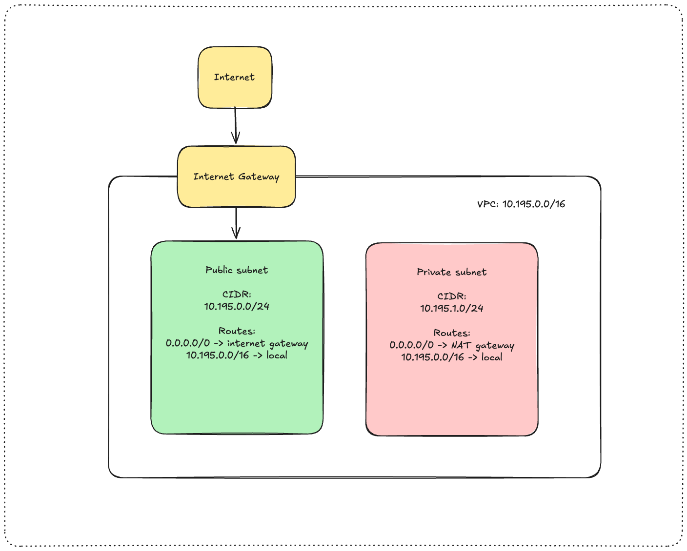

# Assignment 2 Submission

<!--
How to use this template:

1. Copy this file to submissions/assignment-2/<your-github-username>/submission.md
2. Replace every answer placeholder with your own answer. Delete the angle brackets too.
3. Save your four images in the same folder, with the exact file names below.
4. Do not write your full name or your student number in this file.
-->

## About me

- GitHub username: pruvk
- Section: IV-BCSAD
- IAM user name that I signed in with: bcsad-g06
- X: 195

---

## Part A. Explore

### A1. The VPC

Default VPC IPv4 CIDR:

`172.31.0.0/16`

Number of addresses in that CIDR:

65,536

### A2. The subnets

| Availability Zone | IPv4 CIDR |
| --- | --- |
| apse1-az2 (ap-southeast-1a) | 172.31.32.0/20 |
| apse1-az1 (ap-southeast-1b) | 172.31.16.0/20 |
| apse1-az3 (ap-southeast-1c) | 172.31.0.0/20 |

Screenshot 1. Save it as `screenshot-1-subnets.png` in your folder. The image line below shows it.

### A3. Available addresses

Available IPv4 addresses in each subnet:

`ap-southeast-1a` 4,090, `ap-southeast-1b` 4,091, `ap-southeast-1c` 4,091

Why is the number lower than 4,096?

a `/20` subnet has 4,096 addresses and AWS keeps 5 from it, so 4,091 are usable (4096 - 5 = 4091 addresses)

What uses the missing address in the subnet with the lowest number?

`ap-southeast-1a` has 1 fewer addresses than the others. One network interface hold one address, and it belongs to a instance.

### A4. The route table

| Destination | Target |
| --- | --- |
| `0.0.0.0/0` | igw-... |
| `172.31.0.0/16` | local |

Screenshot 2. Save it as `screenshot-2-routes.png` in your folder. The image line below shows it.

### A5. Public or private

Are the default subnets public or private? Which route proves it?

the default subnets are public, as they use the route 0.0.0.0/0 bound to the IGW (Internet gateway)

### A6. The internet gateway

State of the internet gateway:

Attached

What happens to the default subnets if the gateway is detached?

The subnets loses their access to the internet but the instances can still communicate with each other through local route.

### A7. NAT gateways

Number of NAT gateways:

0

Can a server in a new private subnet download updates? Why?

No, not yet. The new private subnet uses a route table with local route only. The route and the NAT gateway must be set first in order to download updates.

### A8. The network ACL

| Rule number | Source | Allow or Deny |
| --- | --- | --- |
| 100 | 0.0.0.0/0 | Allow |
| * | 0.0.0.0/0 | Deny |

How is a network ACL different from a security group?

Security Groups are stateful, instance-level firewalls, while Network ACLs are stateless, subnet-level firewalls.

Screenshot 3. Save it as `screenshot-3-network-acl.png` in your folder. The image line below shows it.

### A9. The default security group

Inbound rule (type and source):

All traffic, from `sg-0c5b6d4081cf0a534`. The source is the `default` security group itself.

Which resources can send traffic to an instance that uses it?

Only resources that also use the `default` security group. Any sources that does not belong to the default group will be blocked by the security group.

---

## Part B. Prepare

### B1. Plan two subnets

- Public subnet CIDR: `10.195.0.0/24`
- Private subnet CIDR: `10.195.1.0/24`

### B2. Route tables

Route table of the public subnet:

| Destination | Target |
| --- | --- |
| `0.0.0.0/0` | internet gateway |
| `10.195.0.0/16` | local |

Route table of the private subnet:

| Destination | Target |
| --- | --- |
| `0.0.0.0/0` | NAT gateway |
| `10.195.0.0/16` | local |

### B3. My VPC diagram

Tool used (Excalidraw, draw.io, Lucidchart, or paper):

Excalidraw

Save your diagram as `vpc-diagram.png` in your folder. The image line below shows it.

### B4. Predict a change

Can you still open the web page from your laptop? Why?

No, because removing the 0.0.0.0/0 route cuts off the path to the internet, rendering the public IP address insufficient on its own.

Can the instance still reach another instance in the VPC? Why?

Yes, they can still communicate because the local route connecting all VPC subnets remains intact within the route table.

### B5. Place a database

Which subnet gets the database? Why?

It should go in your private subnet (10.195.1.0/24). This keeps the database secure from outside access because its route table lacks a path to the internet gateway.

### B6. My question about VPCs

What is your question, and what made you think of it?

I am wondering if two VPCs within the same account can communicate and whether they require different CIDR blocks to do so. This came to mind because many AWS accounts share the same default 172.31.0.0/16 network range.