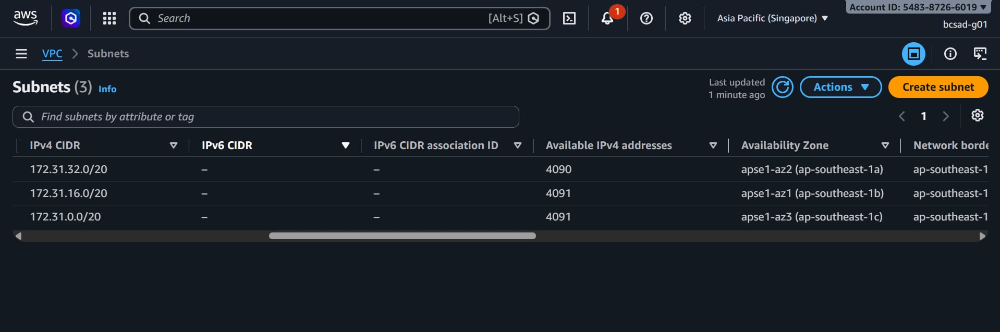
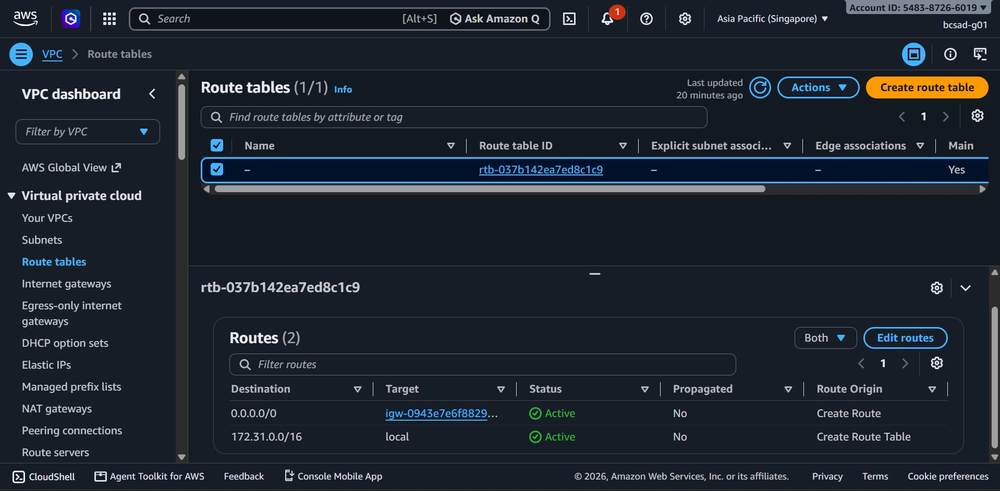
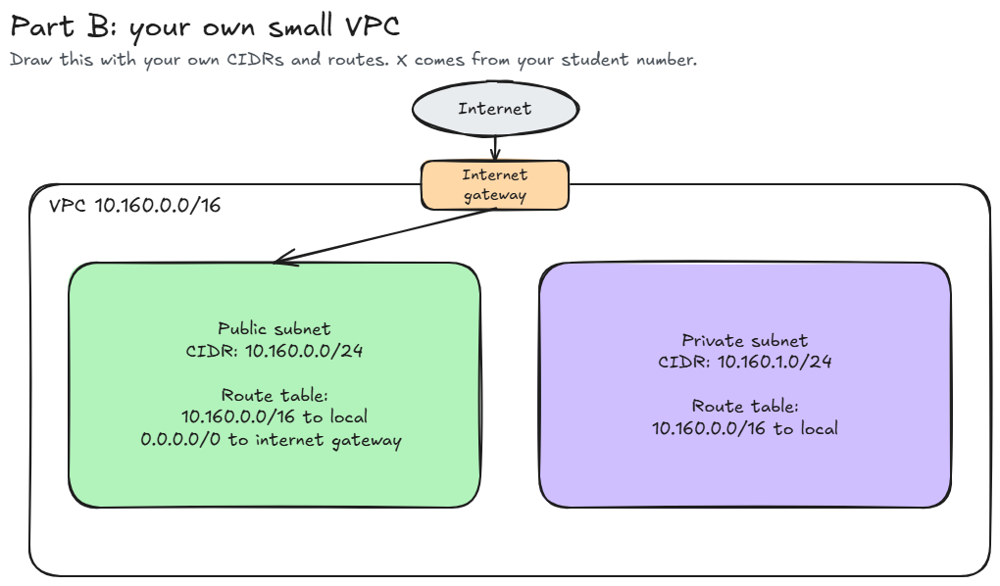

# Assignment 2 Submission

<!--
How to use this template:

1. Copy this file to submissions/assignment-2/<your-github-username>/submission.md
2. Replace every answer placeholder with your own answer. Delete the angle brackets too.
3. Save your four images in the same folder, with the exact file names below.
4. Do not write your full name or your student number in this file.
-->

## About me

- GitHub username: qinglow
- Section: IV-BCSAD
- IAM user name that I signed in with: bcsad-g01
- X: 160

---

## Part A. Explore

### A1. The VPC

Default VPC IPv4 CIDR: 

172.31.0.0/16

Number of addresses in that CIDR:

65,536

### A2. The subnets

| Availability Zone | IPv4 CIDR |
| --- | --- |
| ap-southeast-1a | 172.31.32.0/20 |
| ap-southeast-1b | 172.31.16.0/20 |
| ap-southeast-1c | 172.31.0.0/20 |

Screenshot 1. Save it as `screenshot-1-subnets.png` in your folder. The image line below shows it.

### A3. Available addresses

Available IPv4 addresses in each subnet:

`ap-southeast-1a` 4,090, `ap-southeast-1b` 4,091, `ap-southeast-1c` 4,091.

Why is the number lower than 4,096?

a /20 has 4,096 addresses, AWS reserves 5 in every subnet, and 4,096 − 5 = 4,091.

What uses the missing address in the subnet with the lowest number?

one address is used by one network interface in ap-southeast-1a. Each network interface holds one address.

### A4. The route table

| Destination | Target |
| --- | --- |
| 0.0.0.0/0 | igw-0943e7e6f88293168 |
| 172.31.0.0/16 | local  |

Screenshot 2. Save it as `screenshot-2-routes.png` in your folder. The image line below shows it.

### A5. Public or private

Are the default subnets public or private? Which route proves it?

public, and the proof is the route 0.0.0.0/0 pointing to internet gateway

### A6. The internet gateway

State of the internet gateway:

Attached

What happens to the default subnets if the gateway is detached?

The route 0.0.0.0/0 would have no working target, so the subnets lose their path to the internet. The instances can still reach each other through the local route.

### A7. NAT gateways

Number of NAT gateways:

Zero

Can a server in a new private subnet download updates? Why?

not yet. A private subnet would only have the local route, and there is no NAT gateway. It would need a NAT gateway and a route 0.0.0.0/0 to it before it can download updates.

### A8. The network ACL

| Rule number | Source | Allow or Deny |
| --- | --- | --- |
| 100 | 0.0.0.0/0 | Allow |
| * | 0.0.0.0/0 | <Deny> |

How is a network ACL different from a security group?

a network ACL protects a whole subnet while a security group protects one resource, a network ACL has allow and deny rules while a security group has allow only, and a network ACL is stateless while a security group is stateful.

Screenshot 3. Save it as `screenshot-3-network-acl.png` in your folder. The image line below shows it.

### A9. The default security group

Inbound rule (type and source):

Type: All traffic 
Source: sg-0c5b6d4081cf0a534 - default

Which resources can send traffic to an instance that uses it?

if the source is the security group itself, only resources that also use that default group can send traffic to it. Traffic from any other source is blocked.

---

## Part B. Prepare

### B1. Plan two subnets

- Public subnet CIDR: 10.160.0.0/24
- Private subnet CIDR: 10.160.1.0/24

### B2. Route tables

Route table of the public subnet:

| Destination | Target |
| --- | --- |
| `10.160.0.0/16` | `local` |
| `0.0.0.0/0` | internet gateway |

Route table of the private subnet:

| Destination | Target |
| --- | --- |
| `10.160.0.0/16` | `local` |

### B3. My VPC diagram

Tool used (Excalidraw, draw.io, Lucidchart, or paper):

Excalidraw

Save your diagram as `vpc-diagram.png` in your folder. The image line below shows it.

### B4. Predict a change

Can you still open the web page from your laptop? Why?

no. Without the route 0.0.0.0/0, there is no path between the instance and the internet. A public IP address alone is not enough.

Can the instance still reach another instance in the VPC? Why?

yes. The local route for the VPC range is still in the route table and is not affected.

### B5. Place a database

Which subnet gets the database? Why?

the private subnet 10.160.1.0/24. Its route table has no route to the internet gateway, so nobody on the internet can reach the database.

### B6. My question about VPCs

What is your question, and what made you think of it?

Why does a NAT gateway cost money when an internet gateway doesn't?
I thought of this because in A6 I saw that the default VPC has an internet gateway that is attached, and in A7 I found that there are zero NAT gateways. The README says the class account has none because a NAT gateway costs money. Both gateways connect the VPC to the internet, so I wondered why only one of them is charged.
