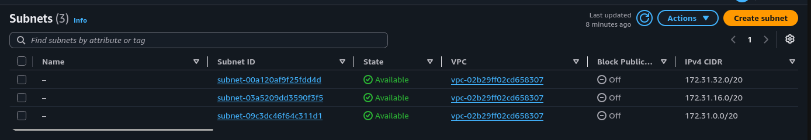
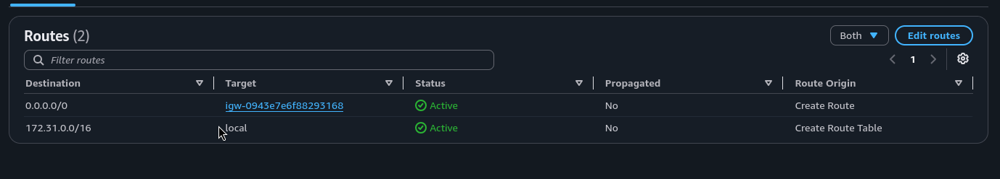
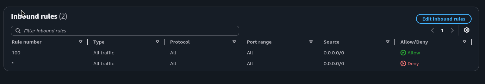
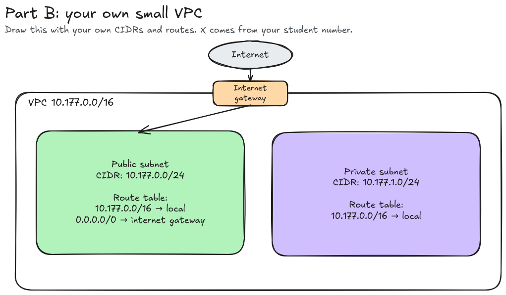

# Assignment 2 Submission

<!--
How to use this template:

1. Copy this file to submissions/assignment-2/<your-github-username>/submission.md
2. Replace every answer placeholder with your own answer. Delete the angle brackets too.
3. Save your four images in the same folder, with the exact file names below.
4. Do not write your full name or your student number in this file.
-->

## About me

- GitHub username: samjoshuadud
- Section: IV - BCSAD
- IAM user name that I signed in with: bcsad-g06
- X: 177

---

## Part A. Explore

### A1. The VPC

Default VPC IPv4 CIDR:

`172.31.0.0/16`

Number of addresses in that CIDR:

65,536

### A2. The subnets

| Availability Zone | IPv4 CIDR |
| --- | --- |
| apse1-az2 (ap-southeast-1a) | 172.31.32.0/20 |
| apse1-az1 (ap-southeast-1b) | 172.31.16.0/20 |
| apse1-az3 (ap-southeast-1c) | 172.31.0.0/20 |

Screenshot 1. Save it as `screenshot-1-subnets.png` in your folder. The image line below shows it.

### A3. Available addresses

Available IPv4 addresses in each subnet:

`apse1-az2 (ap-southeast-1a)` 4,090, `apse1-az1 (ap-southeast-1b)` 4,091, `apse1-az3 (ap-southeast-1c)` 4,091.

Why is the number lower than 4,096?

A /20 subnet has a total of 4,096 IP addresses. AWS reserves five addresses for its internal networking functions, leaving 4,091 usable addresses when no other resources are using them.

What uses the missing address in the subnet with the lowest number?

This subnet has one additional address in use compared with the other two subnets. The extra address is assigned to a network interface.

### A4. The route table

| Destination | Target |
| --- | --- |
| `0.0.0.0/0`     | `igw-...` |
| `172.31.0.0/16` | `local`   |

Screenshot 2. Save it as `screenshot-2-routes.png` in your folder. The image line below shows it.

### A5. Public or private

Are the default subnets public or private? Which route proves it?

They are public because their default route, `0.0.0.0/0`, has the internet gateway as its target.

### A6. The internet gateway

State of the internet gateway:

Attached

What happens to the default subnets if the gateway is detached?

Without the attached gateway, the internet route cannot forward traffic, causing the subnets to lose internet access. However, the `local` route remains available for communication within the VPC.

### A7. NAT gateways

Number of NAT gateways:

0

Can a server in a new private subnet download updates? Why?

No, not with the current configuration. There is no NAT gateway available for the private subnet to use for outbound internet access.

### A8. The network ACL

| Rule number | Source      | Allow or Deny |
| ----------- | ----------- | ------------- |
| 100         | `0.0.0.0/0` | Allow         |
| *           | `0.0.0.0/0` | Deny          |

How is a network ACL different from a security group?

A network ACL controls traffic at the subnet level by checking numbered allow and deny rules for both inbound and outbound traffic. A security group is attached to specific resources, only uses allow rules, and automatically keeps track of connections to allow return traffic.

Screenshot 3. Save it as `screenshot-3-network-acl.png` in your folder. The image line below shows it.

### A9. The default security group

Inbound rule (type and source):

All traffic, from `sg-0c5b6d4081cf0a534`. The source is the `default` security group itself.

Which resources can send traffic to an instance that uses it?

An instance can receive allowed traffic from another resource whose network interface is linked to the same default security group.

---

## Part B. Prepare

### B1. Plan two subnets

- Public subnet CIDR: `10.177.0.0/24`
- Private subnet CIDR: `10.177.1.0/24`

### B2. Route tables

Route table of the public subnet:

| Destination | Target |
| --- | --- |
| `10.177.0.0/16` | local |
| `0.0.0.0/0` | internet gateway |

Route table of the private subnet:

| Destination | Target |
| --- | --- |
| `10.177.0.0/16` | local |

### B3. My VPC diagram

Tool used (Excalidraw, draw.io, Lucidchart, or paper):

Excalidraw

Save your diagram as `vpc-diagram.png` in your folder. The image line below shows it.

### B4. Predict a change

Can you still open the web page from your laptop? Why?

No. After removing the default route, the instance no longer has a path to the internet through the internet gateway, even though it still has a public IP address.

Can the instance still reach another instance in the VPC? Why?

Yes. The local route is still available, allowing traffic between resources within the VPC.

### B5. Place a database

Which subnet gets the database? Why?

The database should be placed in the private subnet because it does not have a direct internet route through an internet gateway.

### B6. My question about VPCs

What is your question, and what made you think of it?

In A9, I noticed that the default security group's only inbound rule uses itself as the source. This means that only resources associated with the same security group can communicate with each other. Why does AWS use this as the default instead of blocking all traffic or allowing communication from the entire VPC CIDR? What is the reason behind this specific default setting?

