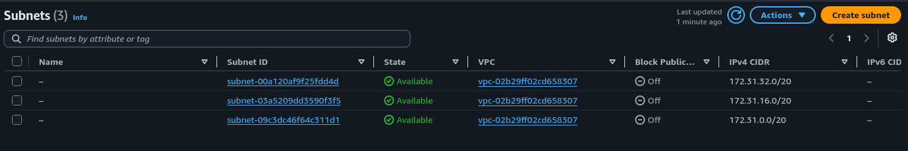
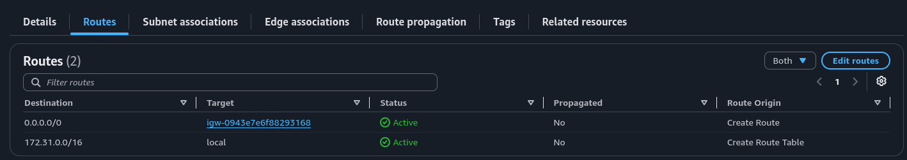
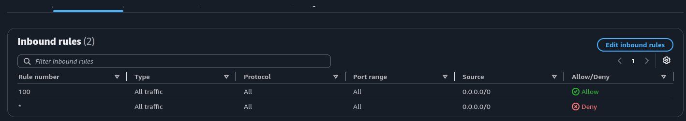
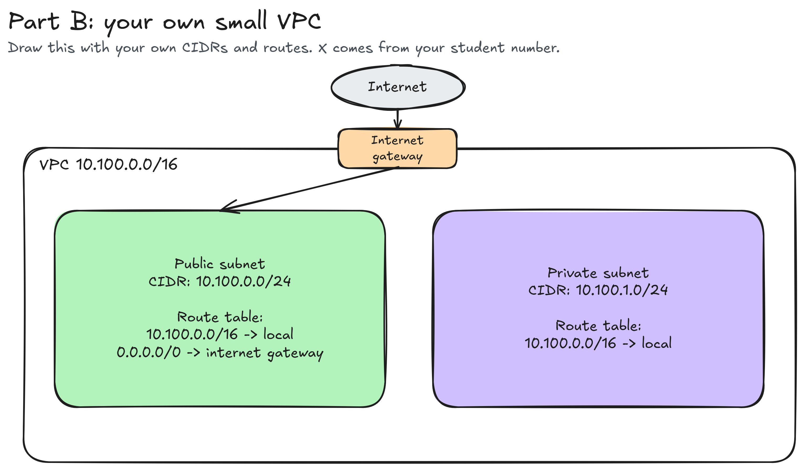

# Assignment 2 Submission

<!--
How to use this template:

1. Copy this file to submissions/assignment-2/<your-github-username>/submission.md
2. Replace every answer placeholder with your own answer. Delete the angle brackets too.
3. Save your four images in the same folder, with the exact file names below.
4. Do not write your full name or your student number in this file.
-->

## About me

- GitHub username: samthology
- Section: IV-BCSAD
- IAM user name that I signed in with: bcsad-g06
- X: 100

---

## Part A. Explore

### A1. The VPC

Default VPC IPv4 CIDR:

`172.31.0.0/16`

Number of addresses in that CIDR:

65,536

### A2. The subnets

| Availability Zone             | IPv4 CIDR        |
| ----------------------------- | ---------------- |
| `apse1-az2 (ap-southeast-1a)` | `172.31.32.0/20` |
| `apse1-az1 (ap-southeast-1b)` | `172.31.16.0/20` |
| `apse1-az3 (ap-southeast-1c)` | `172.31.0.0/20`  |

Screenshot 1. Save it as `screenshot-1-subnets.png` in your folder. The image line below shows it.

### A3. Available addresses

Available IPv4 addresses in each subnet:

`apse1-az2 (ap-southeast-1a)` 4,090, `apse1-az1 (ap-southeast-1b)` 4,091, `apse1-az3 (ap-southeast-1c)` 4,091.

Why is the number lower than 4,096?

A `/20` subnet holds 4,096 total IP addresses. Because AWS reserves 5 addresses per subnet, 4,091 remain available for use.

What uses the missing address in the subnet with the lowest number?

Unlike the other two subnets, this subnet has one additional address assigned, which is tied to a network interface.

### A4. The route table

| Destination     | Target                  |
| --------------- | ----------------------- |
| `0.0.0.0/0`     | `igw-0943e7e6f88293168` |
| `172.31.0.0/16` | `local`                 |

Screenshot 2. Save it as `screenshot-2-routes.png` in your folder. The image line below shows it.

### A5. Public or private

Are the default subnets public or private? Which route proves it?

They are classified as public because their default route of `0.0.0.0/0` points directly to an internet gateway.

### A6. The internet gateway

State of the internet gateway:

Attached

What happens to the default subnets if the gateway is detached?

Without the gateway attached, the internet route is disabled, cutting off external access for the subnets. Traffic within the VPC, however, still flows using the local route.

### A7. NAT gateways

Number of NAT gateways:

0

Can a server in a new private subnet download updates? Why?

No, because the account lacks a NAT gateway, the private subnet has no outbound route to the internet.

### A8. The network ACL

| Rule number | Source      | Allow or Deny |
| ----------- | ----------- | ------------- |
| 100         | `0.0.0.0/0` | Allow         |
| *           | `0.0.0.0/0` | Deny          |

How is a network ACL different from a security group?

A network ACL filters traffic at the subnet boundary and evaluates numbered allow and deny rules separately for each direction. A security group is attached to a resource, has allow rules, and tracks connections for replies.

Screenshot 3. Save it as `screenshot-3-network-acl.png` in your folder. The image line below shows it.

### A9. The default security group

Inbound rule (type and source):

All traffic is allowed, provided it originates from security group `sg-0c5b6d4081cf0a534`, which means the `default` security group itself is set as the source.

Which resources can send traffic to an instance that uses it?

An instance will accept matching traffic from any resource whose network interface shares this default security group.

---

## Part B. Prepare

### B1. Plan two subnets

- Public subnet CIDR: `10.100.0.0/24`
- Private subnet CIDR: `10.100.1.0/24`

### B2. Route tables

Route table of the public subnet:

| Destination     | Target           |
| --------------- | ---------------- |
| `10.100.0.0/16` | `local`          |
| `0.0.0.0/0`     | internet gateway |

Route table of the private subnet:

| Destination     | Target  |
| --------------- | ------- |
| `10.100.0.0/16` | `local` |

### B3. My VPC diagram

Tool used (Excalidraw, draw.io, Lucidchart, or paper):

Excalidraw

Save your diagram as `vpc-diagram.png` in your folder. The image line below shows it.

### B4. Predict a change

Can you still open the web page from your laptop? Why?

No, because removing that default route leaves packets bound for your laptop with no path to the internet gateway, even if the instance retains its public IP.

Can the instance still reach another instance in the VPC? Why?

Yes. Traffic sent to another address within the VPC continues to match the `local` route, which stays active in the route table.

### B5. Place a database

Which subnet gets the database? Why?

Place the database in the private subnet so it lacks a direct route from the internet via an internet gateway.

### B6. My question about VPCs

What is your question, and what made you think of it?

Can two VPCs in the same Region use overlapping CIDR blocks, and what limitation would that create if you later wanted to connect them with VPC peering? I wondered because VPCs are isolated networks, but they can also be connected to share resources.
