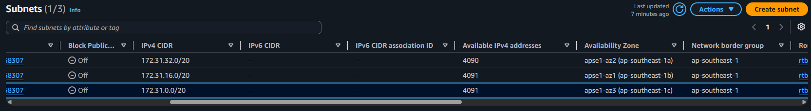
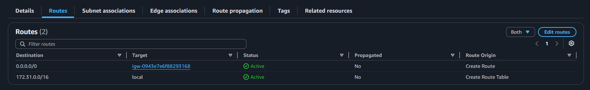
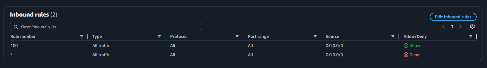
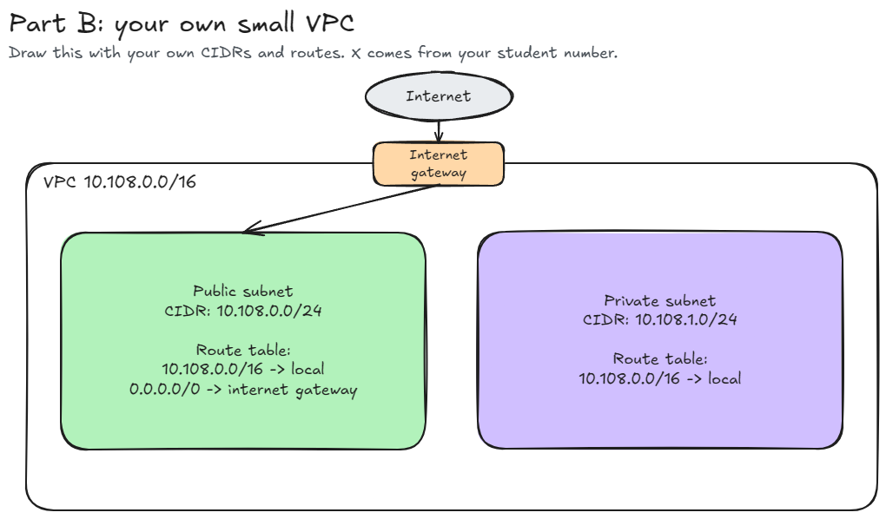

# Assignment 2 Submission

<!--
How to use this template:

1. Copy this file to submissions/assignment-2/<your-github-username>/submission.md
2. Replace every answer placeholder with your own answer. Delete the angle brackets too.
3. Save your four images in the same folder, with the exact file names below.
4. Do not write your full name or your student number in this file.
-->

## About me

- GitHub username: sonisunn
- Section: IV-BCSAD
- IAM user name that I signed in with: bcsad-g05
- X: 108

---

## Part A. Explore

### A1. The VPC

Default VPC IPv4 CIDR:

172.31.0.0/16

Number of addresses in that CIDR:

65,536

### A2. The subnets

| Availability Zone | IPv4 CIDR |
| --- | --- |
| apse1-az2 (ap-southeast-1a) | 172.31.32.0/20 |
| apse1-az1 (ap-southeast-1b) | 172.31.16.0/20 |
| apse1-az3 (ap-southeast-1c) | 172.31.0.0/20 |

Screenshot 1. Save it as `screenshot-1-subnets.png` in your folder. The image line below shows it.

### A3. Available addresses

Available IPv4 addresses in each subnet:

`apse1-az2 (ap-southeast-1a)` 4,090, 
`apse1-az1 (ap-southeast-1b)` 4,091, 
`apse1-az3 (ap-southeast-1c)` 4,091.

Why is the number lower than 4,096?

A `/20` subnet has a total of 4,096 IP addresses. However, AWS reserves 5 IP addresses in every subnet for management and routing:
1. The network address (first address)
2. The VPC router
3. The Amazon DNS server
4. Reserved by AWS for future use
5. The network broadcast address (last address)
Therefore, an empty `/20` subnet has at most 4,096 − 5 = 4,091 available addresses.

What uses the missing address in the subnet with the lowest number?

Any active cloud resource deployed in that subnet—such as an Elastic Network Interface (ENI) for a running EC2 instance, a NAT gateway, or a load balancer—takes up one private IPv4 address, which decreases the available address count.

### A4. The route table

| Destination | Target |
| --- | --- |
| 0.0.0.0/0 | igw-0943e7e6f88293168 |
| 172.31.0.0/16 | local |

Screenshot 2. Save it as `screenshot-2-routes.png` in your folder. The image line below shows it.

### A5. Public or private

Are the default subnets public or private? Which route proves it?

The default subnets are public. The route 0.0.0.0/0 → igw-0943e7e6f88293168 proves it.

### A6. The internet gateway

State of the internet gateway:

Attached

What happens to the default subnets if the gateway is detached?

If the internet gateway were detached, the default subnets would lose their connection to the internet. Any resources deployed in those subnets (like web servers, databases, or EC2 instances) would no longer be able to send traffic to or receive traffic from the internet. They could still communicate with each other within the VPC, but they would be isolated from the outside world.

### A7. NAT gateways

Number of NAT gateways:

0

Can a server in a new private subnet download updates? Why?

No, unless you also deploy a NAT gateway in a public subnet and add the appropriate route.

### A8. The network ACL

| Rule number | Source | Allow or Deny |
| --- | --- | --- |
| 100 | 0.0.0.0/0 | Allow |
| * | 0.0.0.0/0 | Deny |

How is a network ACL different from a security group?

A Network Access Control List (NACL) acts as a firewall at the subnet level, controlling traffic both into and out of the entire subnet. It is stateless, meaning rules must be defined separately for inbound and outbound traffic, and it checks all traffic against its numbered rules in order. In contrast, a Security Group acts as a virtual firewall at the instance level. It is stateful, so if traffic is allowed in one direction, return traffic is automatically allowed. Security Groups only evaluate traffic for the instances they are attached to, not the entire subnet.

Screenshot 3. Save it as `screenshot-3-network-acl.png` in your folder. The image line below shows it.

### A9. The default security group

Inbound rule (type and source):

All traffic, from `sg-0c5b6d4081cf0a534` (the `default` security group itself).

Which resources can send traffic to an instance that uses it?

Any instance that is also using this same default security group can send traffic to any other instance that uses it.

---

## Part B. Prepare

### B1. Plan two subnets

- Public subnet CIDR: 10.108.0.0/24
- Private subnet CIDR: 10.108.1.0/24

### B2. Route tables

Route table of the public subnet:

| Destination | Target |
| --- | --- |
| 10.108.0.0/16 | local |
| 0.0.0.0/0 | internet gateway |

Route table of the private subnet:

| Destination | Target |
| --- | --- |
| 10.108.0.0/16 | local |

### B3. My VPC diagram

Tool used (Excalidraw, draw.io, Lucidchart, or paper):

Excalidraw

Save your diagram as `vpc-diagram.png` in your folder. The image line below shows it.

### B4. Predict a change

Can you still open the web page from your laptop? Why?

No, because the route table of the public subnet would no longer have a route to the internet gateway, so the instance would not be able to connect to the internet.

Can the instance still reach another instance in the VPC? Why?

Yes, because the route table of the public subnet would still have a route to the local VPC, so the instance would still be able to connect to other instances in the VPC.

### B5. Place a database

Which subnet gets the database? Why?

The private subnet (10.108.1.0/24). Databases hold sensitive data and should never be directly accessible from the public internet. Putting it in the private subnet shields it from external attacks, while still allowing the web server in the public subnet to reach it via the VPC's local route.

### B6. My question about VPCs

What is your question, and what made you think of it?

If a database in a private subnet needs to download security patches and software updates from the internet without accepting any inbound connections from the outside, how is that configured in AWS? I thought of this when answering A7 and B5, which mentioned that private subnets have no route to an internet gateway.

