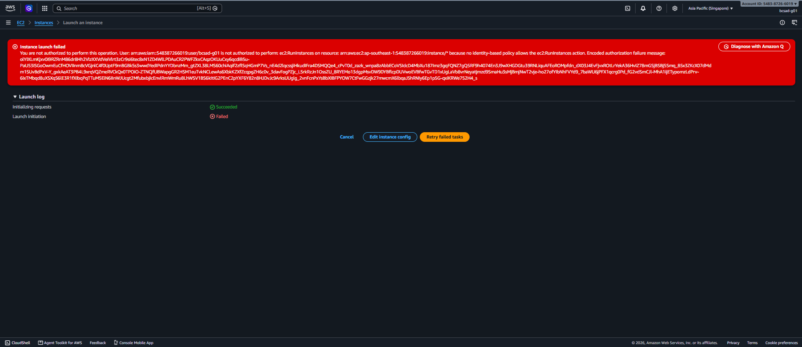
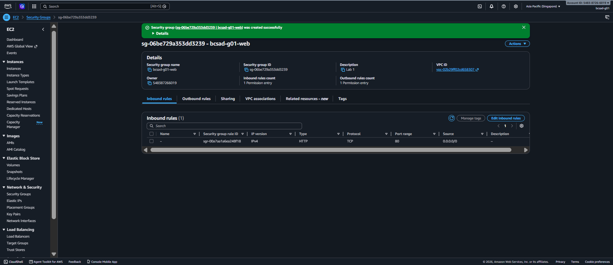
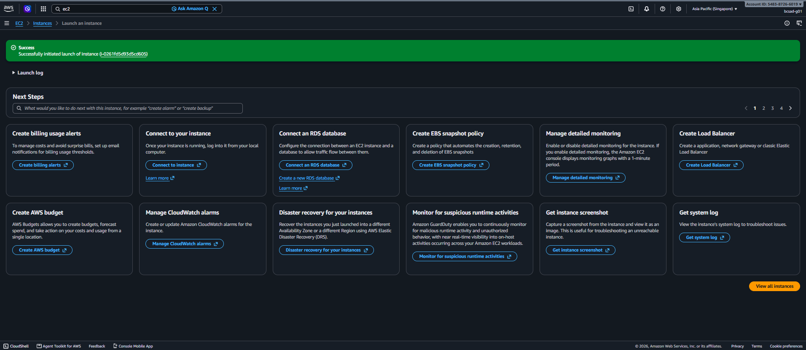
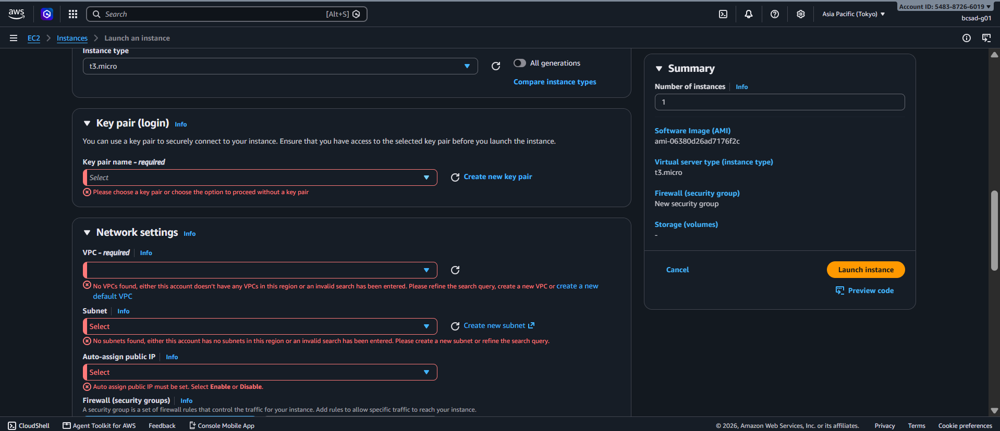
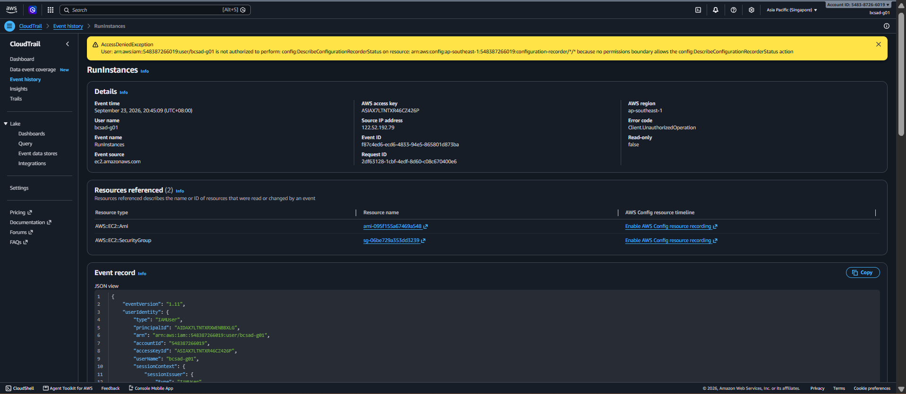

# Lab 1 Submission

## Part B
**Error Action Name:** You are not authorized to perform this operation. User: arn:aws:iam::548387266019:user/bcsad-g01 is not authorized to perform: **ec2:RunInstances** on resource: arn:aws:ec2:ap-southeast-1:548387266019:instance/* because no identity-based policy allows the ec2:RunInstances action. Encoded authorization failure message: olYIXLmKjxv0i9RZRnM86dr8Hh2VlzXXVdVeiVlrt3zCr9si6tec8xN1ZD4WlLPDAuCR2PWFZkxCAqzOKUuCxy6qcdiB5u-PaU53iSGoOwmEuCfHOVIInm8cVGjnlC4f0UptF9mBGBk5s3wwdYedIPdnYYDbnzMm_gtZXL38LMS60chiAqif2zflSqHGmP7Vs_nE4d2lqcssjiHkudIFra4DSMQQe4_cPvT0d_zazk_wnpa8zAbbECoVSIdcD4MbXu187Imz3gqFQNZ7gQ5RF9h4074En3J9wXHGDGtu39RNLiquAFEoROMpfdn_dX03J4EvFjvxROtLrYekA36HvIZ78mGSjBSBj5Smq_85x3ZKcX07dMdm1SUvBdPxV-Y_gxkAeAT3PB4L9xrqVQZmeRVCkQx0TPOiO-ZTNCjfUBWapgGR2HSM1euTvkNCLewAs6XbkKZXfZcqpgZH6c0v_3davFogPZjc_L5rkRzJn1OssZU_8RYEMo13dgpMsvDW9DYBflcpDUVwoEVBfwTGvTD1xUgLaVb8vrNeyatjmzd9SmaHu3sMjBmjNwT2vje-ho27ofYIbNhFVYd9_7baWU6jPFX1qcrg0Pd_fG2vdSmCJl-MhA1ijETypomzLdPrv-6ixTMbqd8uXSXqS6lE3R1fXIbqPqTTuM5EiN6IInWJUcgt2MfubxbjIcEnvlRmWmRu8LhWSV1BS6kItIG2PEnC2pYXF6Y82n8HJDvJc9ArksUUglg_2vnFcnPxYsBbXIBFPYOW7CtFwGGzjk27mwcmX6lbqaJ5hRNIy6Ep1p5G-qxiKRWe752H4_s

**Screenshot (Part B launch denial with username visible):**

## Part C
**Policy Statement Blanks:**
- `"Action"`: ec2:RunInstance
- `"Resource"`: arn:aws:ec2:ap-southeast-1:548387266019:instance
- `"ec2:InstanceType"`: t3.micro

## Part D
**Security Group Error Text:** You are not authorized to perform this operation. User: arn:aws:iam::548387266019:user/bcsad-g01 is not authorized to perform: ec2:CreateSecurityGroup on resource: arn:aws:ec2:ap-southeast-1:548387266019:security-group/* because no identity-based policy allows the ec2:CreateSecurityGroup action. Encoded authorization failure message: yXGPP_yPmKczVgnt4poFb_fJyYnWSTFlje2ezfckKlHsG9--j073omeetumPcIr0ZyjiUcFzJ7x5YkzbKnaQzR9l2-7G7jGCP0FI7XBZlEjY4NHfkJwgUPutlFA-RjDGFdDTZRQG7x7JkNnWcf-1R3gPKQKfCB1-mo1iwcMw600a7NuWLvx6SrGr76nwV282FguNQhgGPVAZE2cjo7sQia17Y5lf8kHiNkmXy9yFsqSbDMFv0eQqwxsgj4sQzxin8zAWfcYjcKu2FLBcI_kBGerNpMxg5ii2CJTeU6dHzQlz2em1ygpXS__F7SxDNmjSCPozZvwx6hbwhjv4odjuWNKoPY4zdm8SHOvuCk0LfqnnwRlD_vkRoUGp0TehnbXJCqagR726OCkiPlYprPhLIr-h7yu2DsGHYnHtQX3dVesNgKJZuS3gncHq6evCkQVkeoBBpZsq6uiNaowoCTp4tNakNS9gUNZCL6gNz5CqUj14QL-kdeY3YG5X6KYh3EEXiD4_Dv8YA0W7P0p7ieAKSRWkUrjQZ0ESY6UGm-ea2wSX

**Running Instance Time:** 2026/09/23 20:24 GMT+8

**Screenshot 1 (Permissions tab listing <user>-launch):**

**Screenshot 2 (Instance in Running state):**

## Part E
**t3.small / Tokyo Denial Error:** **VPC:** No VPCs found, either this account doesn’t have any VPCs in this region or an invalid search has been entered. Please refine the search query, create a new VPC or create a new default VPC.
**AMI:** The AMI ID (ami-06380d26ad7176f2c) is not valid. The AMI might no longer exist or may be specific to another account or Region.

**Screenshot 1 (t3.small or Tokyo denial):**

**Screenshot 2 (CloudTrail event showing errorMessage):**

## Part F Questions
1. Which action did the Part B error name?
    It named the action `ec2:RunInstances`.
2. In your policy, which condition limits `ec2:RunInstances`?
   The condition that checks if the instance type is exactly `t3.micro`.
3. After you attached `ec2:*` on `*`, why was `t3.small` still denied? Name the boundary statement.
   It was denied because of the `DenyAnyInstanceTypeButT3Micro` boundary statement overriding the identity policy.
4. Why is `ec2:*` on `*` a poor policy even with a boundary?
   Because granting star permissions means the user gets broad, unneeded access to any EC2 actions or resources that the boundary doesn't explicitly block.
5. In two sentences: what does the boundary control that your policy cannot?
   A boundary sets an absolute maximum ceiling on what permissions can be exercised in the account. An identity policy can only grant actual access up to that predefined limit, regardless of how broad the policy is written.
