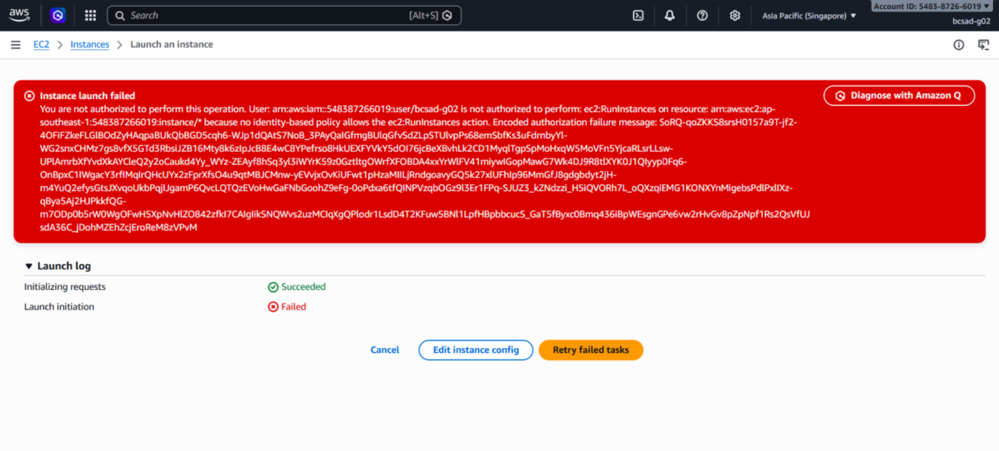
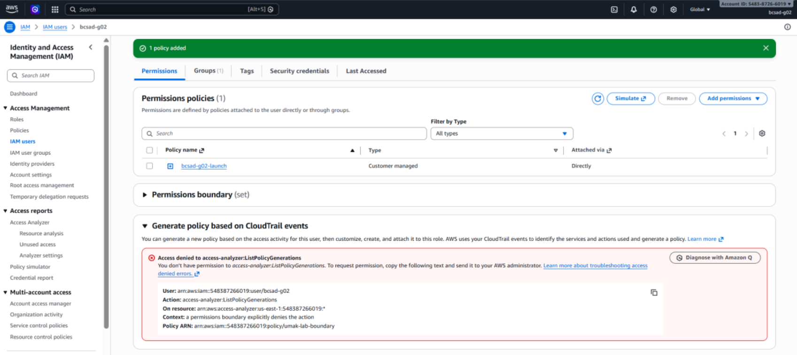
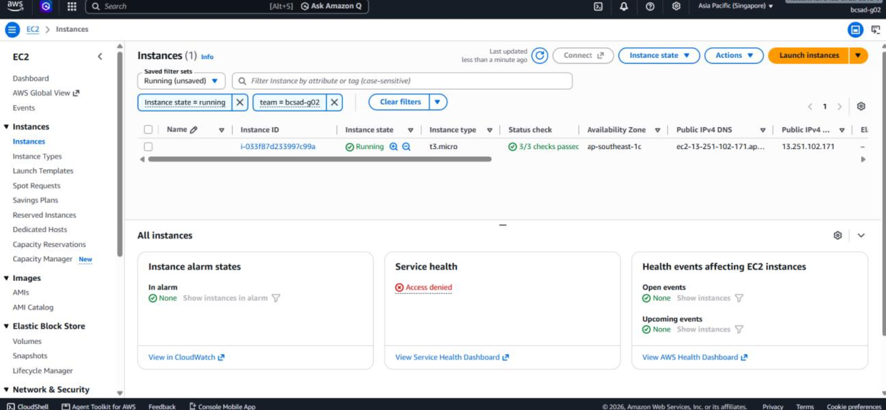
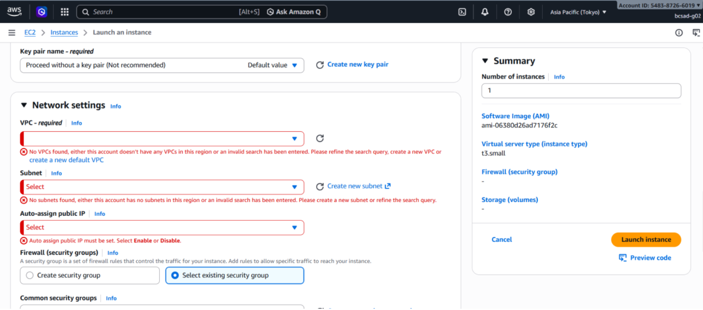
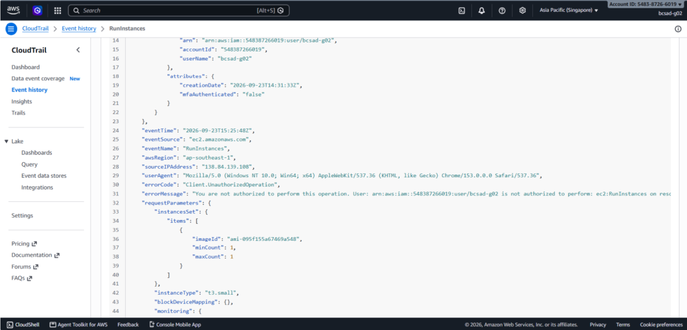

# Lab 1 Submission

## Part B
**Error Action Name:** Instance launch failed
You are not authorized to perform this operation. User: arn:aws:iam::548387266019:user/bcsad-g02 is not authorized to perform: **ec2:RunInstances** on resource: arn:aws:ec2:ap-southeast-1:548387266019:instance/* because no identity-based policy allows the ec2:RunInstances action. Encoded authorization failure message: SoRQ-qoZKKS8srsH0157a9T-jf2-4OFiFZkeFLGlBOdZyHAqpaBUkQbBGD5cqh6-WJp1dQAtS7NoB_3PAyQaIGfmgBUlqGfvSdZLpSTUlvpPs68emSbfKs3uFdrnbyYl-WG2snxCHMz7gs8vfX5GTd3RbsiJZB16Mty8k6zIpJcB8E4wC8YPefrso8HkUEXFYVkY5dOI76jcBeXBvhLk2CD1MyqlTgpSpMoHxqW5MoVFn5YjcaRLsrLLsw-UPlAmrbXfYvdXkAYCleQ2y2oCaukd4Yy_WYz-ZEAyf8hSq3yl3iWYrK59z0GztltgOWrfXFOBDA4xxYrWlFV41miywIGopMawG7Wk4DJ9R8tlXYK0J1QIyypDFq6-OnBpxC1IWgacY3rfIMqIrQHcUYx2zFprXfsO4u9qtMBJCMnw-yEVvjxOvKiUFwt1pHzaMIILjRndgoavyGQ5k27xlUFhIp96MmGfJ8gdgbdyt2jH-m4YuQ2efysGtsJXvqoUkbPqjIJgamP6QvcLQTQzEVoHwGaFNbGoohZ9eFg-0oPdxa6tfQINPVzqbOGz9l3Er1FPq-SJUZ3_kZNdzzi_H5iQVORh7L_oQXzqiEMG1KONXYnMigebsPdlPxlIXz-qBya5Aj2HJPkkfQG-m7ODp0b5rW0WgOFwH5XpNvHlZO842zfkI7CAIgIikSNQWvs2uzMCIqXgQPlodr1LsdD4T2KFuw5BNl1LpfHBpbbcucS_GaT5fByxc0Bmq436iBpWEsgnGPe6vw2rHvGv8pZpNpf1Rs2QsVfUJsdA36C_jDohMZEhZcjEroReM8zVPvM

**Screenshot (Part B launch denial with username visible):**

## Part C
**Policy Statement Blanks:**
- `"Action"`: `ec2:RunInstances`
- `"Resource"`: `arn:aws:ec2:ap-southeast-1:548387266019:instance`
- `"ec2:InstanceType"`: `t3.micro`

## Part D
**Security Group Error Text:** `You are not authorized to perform this operation. User: arn:aws:iam::548387266019:user/bcsad-g02 is not authorized to perform: ec2:CreateSecurityGroup on resource: arn:aws:ec2:ap-southeast-1:548387266019:security-group/* because no identity-based policy allows the ec2:CreateSecurityGroup action. Encoded authorization failure message: DOSEG-Gja8kkFMD2n59qCSS9YVCJSjvjmZFk0VTCb959VLvQ0Ahfs2ulyJxkWTcVE6zdvCylVlBx1yHwfHOtx1wUQbokbCiBSOSCIjD-jvzzzbza3PNt_3ILFKe9gidhowJEcJYBdT5dBFUMf7Zv0_WKLFvN4pUuRQSSzoGEU8QS-tgBUROgqYvGKxinJXi0f602AEOwRA-lzhhIi2gk7Lq-DfF4djcoqC7K-XgugT2X-0jvCBlzrOfZYEJUqn-VTh5L-E2gb48yXpUJ5BjlF9E6np5emoMXMWGcdgIjaHwVSlskoMDFLoP7MYa3m7UN9PjkaBJRGlePwFQchLZ89E8hAckqK4Z0C3lXh6jiWmJEPseo8gLT5STjo7keFBL6HIKB2rJ0fq5o4lI3v8bb5QFKsXWNvEoMPds5rZlBXqaPuf4AxlX7a1qJwH_dXv4zc0_mTsvpWCNBOw6Mt85vbQH04u5-vW2S5_A-q80UMohw_HWQWRtyUJnqgnXDpjqmGDbCVQSzRm3ta9RoUeoUyQc-EzNEWElGnsokuhWa1Zrp`

**Running Instance Time:** `23:14:29 (UTC+08:00)`

**Screenshot 1 (Permissions tab listing <user>-launch):**

**Screenshot 2 (Instance in Running state):**

## Part E
**t3.small / Tokyo Denial Error:** `Instance launch failed
You are not authorized to perform this operation. User: arn:aws:iam::548387266019:user/bcsad-g02 is not authorized to perform: ec2:RunInstances on resource: arn:aws:ec2:ap-southeast-1:548387266019:instance/* with an explicit deny in a permissions boundary: arn:aws:iam::548387266019:policy/umak-lab-boundary. Encoded authorization failure message: 3YJV6fzuRfTl7OenuoinEjd1CNaegCaFYj1McsGrz1SUQH6KzGbonqDqPUaFDoKufFf6gYZ5UWZbGgjC28pnHbgHWUL_vvlXkMQK5P7HEeXCCgIvHRGSwBvHQQBlk5zSiHHPq95F1LCNnkYdeBCzTqIGp7uHeV0lkHPIHbeF3zQYie9CI9JiRbu9Q2vbEmGJ2jAy6Ei3-KKPuZZX1H_i5MATNJBVb-acjGZKJMOfkUvbd-mslOlS6nIW4XUQwX6psTaIJ4I9j7FqxlLPUw_RnSbvKzy562huhZA6TIOnc-tqipbYuF5BXaA9kjADwe6aKsj_YVJf6fLCfZBf6GwammCQDMB1Ai8nrDswXv0P4dZ15ja8TAbMBlOgPUmZ87cp59c1OvnZ6MiXdCFzyWthpHpKbT-hif452unUh_fQPbX-I3BV3atUullV2MHm_R8tbhvjvIFDMTHlVsxHhr36L7AFzrs4QKhpPD9SrqWFvp6IYhpwqTEAYjxMwfx-KZa3vIZjufOvbNjtW6mNlKGWQU1K0LE6Xtq25i3thkFE2VQtNClX4Eg-Ago4auzDqXIr5Pp1msfwsewpB0k1TR9-SVMo5-HrB_bJtoqjH4o5B4JLQ5KtEgA_iv3-2qLgDebhHQgBfxA5iJZRuSRPiOBdl_bqaRlIWfsmBwfrcDmHcU11VLXxdJPJ94-tBgiEam-vYUVzxalzAKkUYE3F1HQHGAZcZXzs1gYy5CyMtY20jh1PEqnY6u4azf6Z7xIZQrHbTB1KW1iBq6p5hZF3Ghju5dmm5RWMBS3ThaHYgANK8z1LT-AaC-PkEDm1Q3V3GtY4eVRtyXkx-z2Izc6pVV-H9i9rgUEv-md_9dDKcwqOcZYLqwx21RqaV2HAg1qdfTaA_7RMeB-Egioi7iTFeCRTcBYFbi5UfxKtGU8aP_7r-7Nz1faQ0d8ANjAcomG7zxL2`

**Screenshot 1 (t3.small or Tokyo denial):**

**Screenshot 2 (CloudTrail event showing errorMessage):**

## Part F Questions
1. Which action did the Part B error name?
   `ec2:RunInstances`
2. In your policy, which condition limits `ec2:RunInstances`?
   `ec2:InstanceType (configured to allow only t3.micro)`
3. After you attached `ec2:*` on `*`, why was `t3.small` still denied? Name the boundary statement.
   `The launch was denied because the permissions boundary enforces an explicit deny rule. The specific boundary statement is DenyAnyInstanceTypeButT3Micro.`
4. Why is `ec2:*` on `*` a poor policy even with a boundary?
   `Granting ec2:* on * violates the principle of least privilege, exposes all EC2 actions across the account, makes auditing difficult, and creates a major security risk if the permissions boundary is ever modified or detached.`
5. In two sentences: what does the boundary control that your policy cannot?
   `A permissions boundary establishes an absolute maximum permission ceiling for an IAM entity, ensuring that effective permissions can never exceed those guardrails regardless of what identity-based policies are added. It protects against accidental over-provisioning by acting as a restrictive envelope that standard policies cannot override.`
