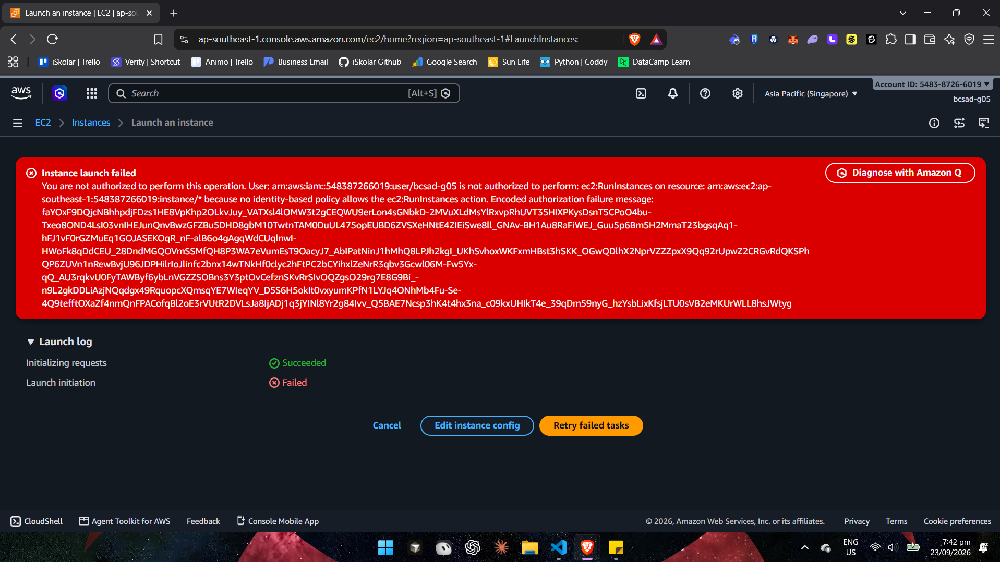
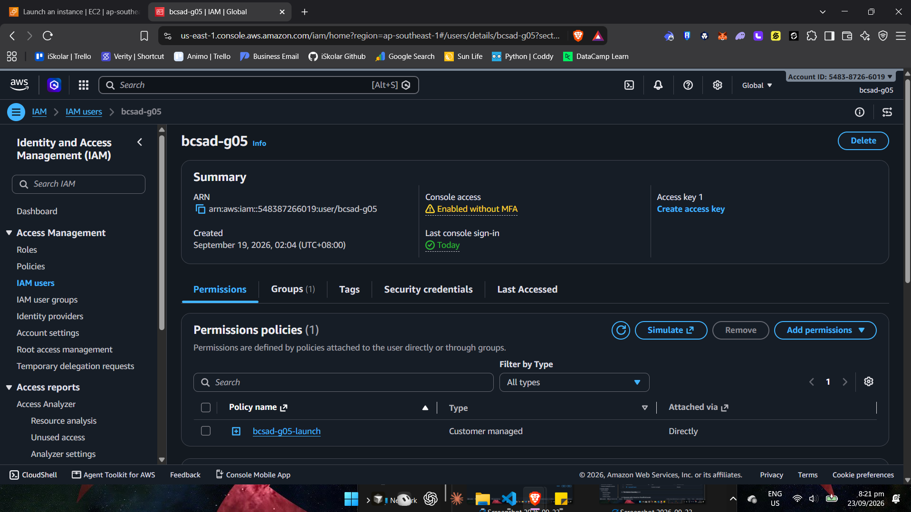
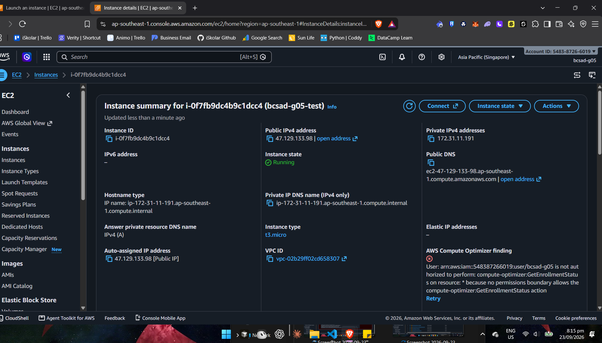
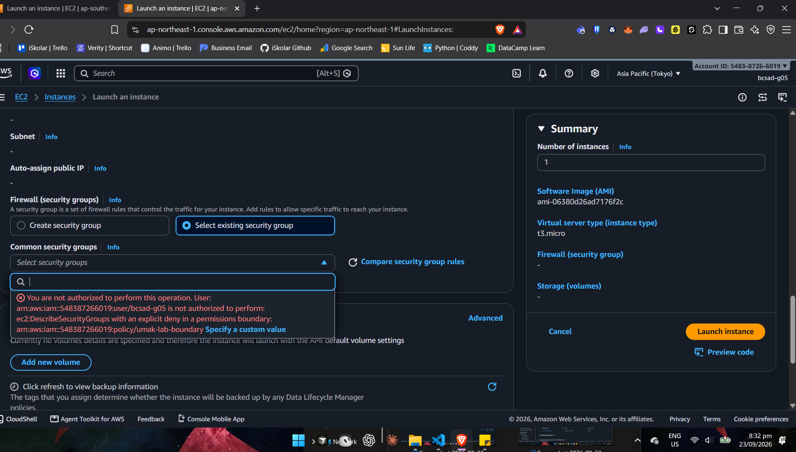
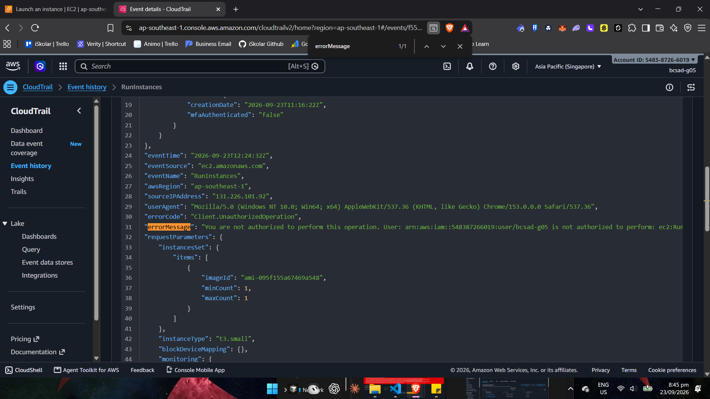

# Lab 1 Submission

## Part B
**Error Action Name:**
You are not authorized to perform this operation. User: arn:aws:iam::548387266019:user/bcsad-g05 is not authorized to perform: **ec2:RunInstances** on resource: arn:aws:ec2:ap-southeast-1:548387266019:instance/* because no identity-based policy allows the ec2:RunInstances action.

**Screenshot (Part B launch denial with username visible):**

## Part C
**Policy Statement Blanks:**
- `"Action"`: `ec2:RunInstances`
- `"Resource"`: `instance` (→ `arn:aws:ec2:ap-southeast-1:548387266019:instance/*`)
- `"ec2:InstanceType"`: `t3.micro`

## Part D
**Security Group Error Text:**
You are not authorized to perform this operation. User: arn:aws:iam::548387266019:user/bcsad-g05 is not authorized to perform: **ec2:CreateSecurityGroup** on resource: arn:aws:ec2:ap-southeast-1:548387266019:security-group/* because no identity-based policy allows the ec2:CreateSecurityGroup action.

**Running Instance Time:** Wed Sep 23 2026 20:14:53 GMT+0800 (Philippine Standard Time) (instance i-0f7fb9dc4b9c1dcc4)

**Screenshot 1 (Permissions tab listing <user>-launch):**

**Screenshot 2 (Instance in Running state):**

## Part E
**t3.small / Tokyo Denial Error:**
You are not authorized to perform this operation. User: arn:aws:iam::548387266019:user/bcsad-g05 is not authorized to perform: ec2:RunInstances on resource: arn:aws:ec2:ap-southeast-1:548387266019:instance/* **with an explicit deny in a permissions boundary**: arn:aws:iam::548387266019:policy/umak-lab-boundary.

**CloudTrail errorMessage (RunInstances, Error code: Client.UnauthorizedOperation, eventTime 2026-09-23T12:24:32Z, instanceType t3.small):**
> You are not authorized to perform this operation. User: arn:aws:iam::548387266019:user/bcsad-g05 is not authorized to perform: ec2:RunInstances on resource: arn:aws:ec2:ap-southeast-1:548387266019:instance/* with an explicit deny in a permissions boundary: arn:aws:iam::548387266019:policy/umak-lab-boundary. Encoded authorization failure message: qM8QPrewJjoOL80iQBVBSZq5WUc_98xldhhCRFJaH_YpY46b319crBxDo2xEs-pK-qq8V6Mho1hiGcbH_I6OgEcBsiZ7ZguQFFFvn7iwR-cA6JcN3pjXJwAPm06SvxddT4N-... (truncated)

**Tokyo Region Denial Error:**
You are not authorized to perform this operation. User: arn:aws:iam::548387266019:user/bcsad-g05 is not authorized to perform: ec2:DescribeSecurityGroups **with an explicit deny in a permissions boundary**: arn:aws:iam::548387266019:policy/umak-lab-boundary. (Triggered by switching Region to Asia Pacific (Tokyo) and attempting to launch an instance.)

**Screenshot 1 (t3.small or Tokyo denial):**

**Screenshot 2 (CloudTrail event showing errorMessage):**

## Part F Questions
1. Which action did the Part B error name?
   `ec2:RunInstances`
2. In your policy, which condition limits `ec2:RunInstances`?
   In statement `RunOnlyT3MicroInstances`, the condition `"StringEquals": { "ec2:InstanceType": "t3.micro" }` only allows the launch when the instance type is exactly t3.micro.
3. After you attached `ec2:*` on `*`, why was `t3.small` still denied? Name the boundary statement.
   The permissions boundary `umak-lab-boundary` has a statement `DenyAnyInstanceTypeButT3Micro` that explicitly denies `ec2:RunInstances` for any instance type other than t3.micro. A permissions boundary sets a hard ceiling on what an identity policy can grant — an explicit Deny in the boundary always wins, no matter how permissive the attached policy is.
4. Why is `ec2:*` on `*` a poor policy even with a boundary?
   It grants far more access than the task needs (full control over every EC2 resource in the account), violating least privilege. It only stayed safe here because the account happens to have a boundary attached; in any account without that boundary, or if the boundary were ever changed, this policy alone could let the user terminate, modify, or spin up unlimited resources belonging to anyone.
5. In two sentences: what does the boundary control that your policy cannot?
   The boundary enforces account-wide guardrails that no identity policy is allowed to override, such as the Singapore-only region lock, the t3.micro-only instance type cap, and the launch time window. My own policy can only grant permissions within that ceiling — it can never expand access beyond what the boundary allows, even if I write it too broadly.
