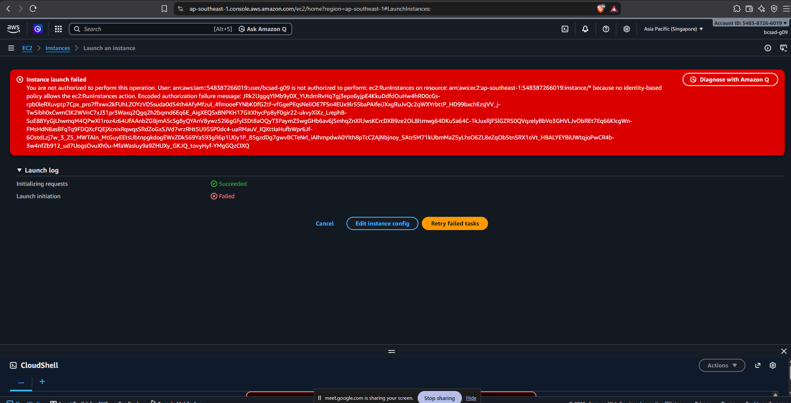
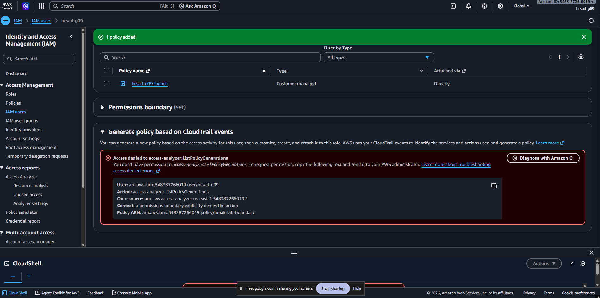
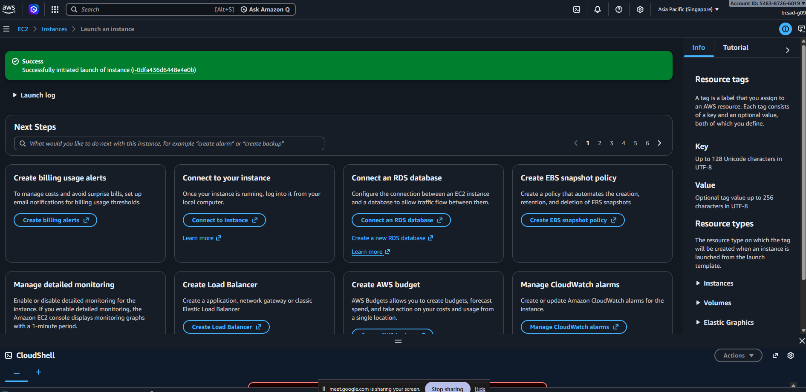
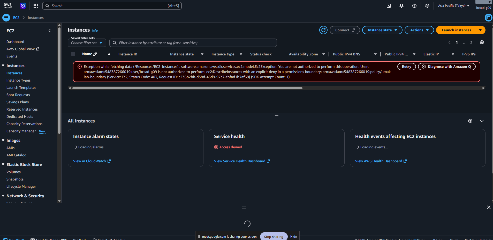
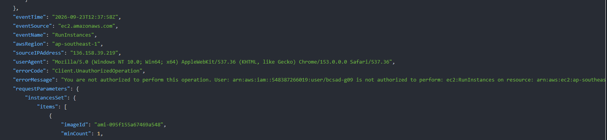

# Lab 1 Submission

## Part B
**Error Action Name:** Instance launch failed You are not authorized to perform this operation. User: arn:aws:iam::548387266019:user/bcsad-g09 is not authorized to perform: **ec2:RunInstances** on resource: arn:aws:ec2:ap-southeast-1:548387266019:instance/* because no identity-based policy allows the ec2:RunInstances action. Encoded authorization failure message: JRk2UggqYlMb9yDX_YUtdmRvHq7gj3epo6yjpE4KkuDdfdOuHw4hRD0cGs-rpb0leRXuvptp7Cpx_pro7ffxwx2kFUhLZOYzVDSsuda0d54th4AfyMfzul_4fmooeFYNbKDfG2tf-vfGgePEqsNeliOE7FSn4EUx9lr55baPAifeiJXxgRuJvQc2qWXYrbttP_HD99bxchEzsjVV_j-Tw5ibh0xCwmClK2WVnC7xJ31pr3Waxq2Qgq2h2bqmd6Eq6E_AigXEQSxBNPKH17GitXhycPp8yF0gir22-ukvyXiXz_LrephB-SuE88YyGjLhwmqM4QPwXl1roz4z64UfAAnbZGBjmA5cSg8yQYAnV8ywz52l6gGfyl3Dt8aOQyT3PaymZ5wgGHb6av6jSmhqZnXRJwsKCrcDXB9ze2OL8ltmwg64DKuSa64C-1kJuxRjF5lGZRS0QVqzelyBbVo3GHVLJvObREt7Eq66KIcgWn-FMsHdN8asBFqTq9FDQXcFQEjXcnixRqwqsSRdZoGxSJVd7vrzRHt5U955P0dc4-uaRMauV_IQXttIaHufbWpr6Jf-6OstdLzj7w_3_Z5_MWTAln_MtGuyEEtsUbtnpgkdogEWxZDk569YaS93gR6p1lJ0y1P_85gzdDg7gwvBCTeNrl_iAIhmpdwA0YIth8pTcC2AjNbjnoy_SAtr5M71kUbmMaZ5yLhsO6ZL8eZqOb5tnSRX1oVt_HBALYEYBiUWtqjoPwCR4b-3w4nfZb912_ud7UogsOvuXh0u-MfaWasIuy9a9ZHUXy_GKJQ_tovyHyf-YMgGQzCIXQ

**Screenshot (Part B launch denial with username visible):**

## Part C
**Policy Statement Blanks:**
- `"Action"`: `ec2:RunInstances`
- `"Resource"`: `instance` (full ARN: `arn:aws:ec2:ap-southeast-1:548387266019:instance/*`)
- `"ec2:InstanceType"`: `t3.micro`

## Part D
**Security Group Error Text:** There was an error creating your security group Details Creating security group You are not authorized to perform this operation. User: arn:aws:iam::548387266019:user/bcsad-g09 is not authorized to perform: ec2:CreateSecurityGroup on resource: arn:aws:ec2:ap-southeast-1:548387266019:security-group/* because no identity-based policy allows the ec2:CreateSecurityGroup action. Encoded authorization failure message: cEyPqtIuKe829eyZpeo2sRGtpT54guQYliL7n8Rtb3F8RI3RJrPypofLUtW5Xh_F7ggJ4ok1OHHdZOVeSC4lZaNrYSYh7_refVANp8LtWOsui6xDtaELfy9yI0kCFDYKs7gp-BptD4rcfQCNm8gk9JWMjADYMwT9vvDdgGhEhB7ilpam6poEZg5LvmKY731y4AxB1z8qwtlX1lwgnTxdstgfJZ5PpKCb5vkXBuAnoapkAsjCv_sADnqQB7xJ5wW3Zz2VbM5xBvTe5Jxc1eoG_9W40Tod3WO-7DXiB-ZLLFk32WykYkEJXozecIn2Ll5DgLWQAV7VLL2yy7mVZD9oy4vI22bs41Ialfqa1NAnMIqtFV6yPe673-culvn7OHJjIFipZEuFV--ddopKhk06UB5YqXYHeYhyfi5gL8ahHJwqUQmhDXsJJaIS2ucH7X2CeuaY3RbS9_uIkj2743ouWl_Kap4nN-3b7dAFHBttjZ6y6E39z0HNS6TLV3cFxmRmVHOC0xbj3fgjyqO-HY-gfKCi0rGSzqlbjZ9UpdnaPU8

**Running Instance Time:** 8:23 PM (UTC+08:00), September 23, 2026

**Screenshot 1 (Permissions tab listing <user>-launch):**

**Screenshot 2 (Instance in Running state):**

## Part E
**t3.small / Tokyo Denial Error:** Instance launch failed You are not authorized to perform this operation. User: arn:aws:iam::548387266019:user/bcsad-g09 is not authorized to perform: ec2:RunInstances on resource: arn:aws:ec2:ap-southeast-1:548387266019:instance/* with an explicit deny in a permissions boundary: arn:aws:iam::548387266019:policy/umak-lab-boundary. Encoded authorization failure message: fh7aVlwlL_sJgkr6RW33wVfUe1wCkoVWbAtoW0avJ4oG8XIsgT3VMoTdgGIuTzS0snq2wzn-8ALs4fNDKZlWxJ4u2yOZ8tjsJj83kx8KxHoOqrUJUM68pqgMGcWc1KR6QJyPl0BNkWQCnXrgktrOGwhSGFOHpy5Ob0zeFvikZGDNdQubroDQy9q5RroCCxONGiUWF4tCOUM-R5um1BE59tCaPWBX_Xs67wcrV9KI9gKTXsV9Y7nYW4zx6F7M4MGXJF5McTF_IGBEz4R3s2HyT_JNCLeE1zRuuJ9OVpde4T-PluATxS5Y6YaQq2pjOIAlMEp0hvwSuuSrk6cwS8HFP5tP9yowFom7ZoydcaUzMCgtkJZr49iWkqDfIPOtmlKa7bQN4zPkh0Y17Ldc6fmp-UK2fHOfM04maFXyNhTRM28NDoE3GTomFbs6D-rgx0Zwyi7thtdGTy79IOTyqtFGVbMf4OPDXDY3AoTQlCTDQ4GeAf03O0YF_dFTc6AWsHxdRj2LFoccQNz3gdvYoqvulFGG_bbgJQA7GCTcF5NsZckHeZkYbICnOQzeZuRDDbM6RL1b9ARkozF4zMqYlN9WfcNulGZpXONqScwQSJP5dYXOHENh4T8XBNrDM8mnK5yAOjsLjh5bQAgC75tt1myFFIPY-kmG5zBjdXIaB0-aef1ilAxT0ohC1FOAou2_C7lsM2IAIrpcwg8QwprXbt2DhpYck2r2ahj9_GSPe-VlUuGur5tfF9JBpA1ArTkrXPraNKBXMC-PzZcIrJsofJQmU1QFa3I38yDJAuX1Z1oqpzDPnnMzysUSkuVdgmZ3xYkmWJK_cmKo7QlyIcWEQqovfVa0y4mtmCH0sk6KdQuCkB7rNxeUtOlNWko0bWJOk1t6il2RgEbxzSd6tKe2-JtSfIkBDD13cXTvmtM00KWDqBgKUPkuHQRexQAzGEweNwE

**Screenshot 1 (t3.small or Tokyo denial):**

**Screenshot 2 (CloudTrail event showing errorMessage):**

## Part F Questions
1. Which action did the Part B error name?
   `ec2:RunInstances`. The error said `bcsad-g09` was not authorized to perform `ec2:RunInstances` on `instance/*` because no identity-based policy allowed it.

2. In your policy, which condition limits `ec2:RunInstances`?
   In the `RunOnlyT3MicroInstances` statement, the condition `"StringEquals": { "ec2:InstanceType": "t3.micro" }` allows launching an instance only when its instance type is `t3.micro`.

3. After you attached `ec2:*` on `*`, why was `t3.small` still denied? Name the boundary statement.
   A permissions boundary sets the maximum permissions a user can have. An action is allowed only if both the identity policy and the boundary allow it, and an explicit deny always wins over any allow. The boundary statement **`DenyAnyInstanceTypeButT3Micro`** in `umak-lab-boundary` explicitly denies launching any instance type other than `t3.micro`, so `ec2:*` could not override it.

4. Why is `ec2:*` on `*` a poor policy even with a boundary?
   It breaks the principle of least privilege. It grants every EC2 action on every resource, including resources that belong to other teams, which is far more than the task needs. The boundary only blocks what it specifically denies, so anything it does not cover is still allowed. If the boundary were ever removed or changed, the user would have full control of EC2.

5. In two sentences: what does the boundary control that your policy cannot?
   The boundary sets the upper limit on what the user can ever do, such as the allowed region and instance type, no matter which policies are attached to the user. My policy can only grant permissions inside that limit; it cannot give the user anything the boundary denies.
