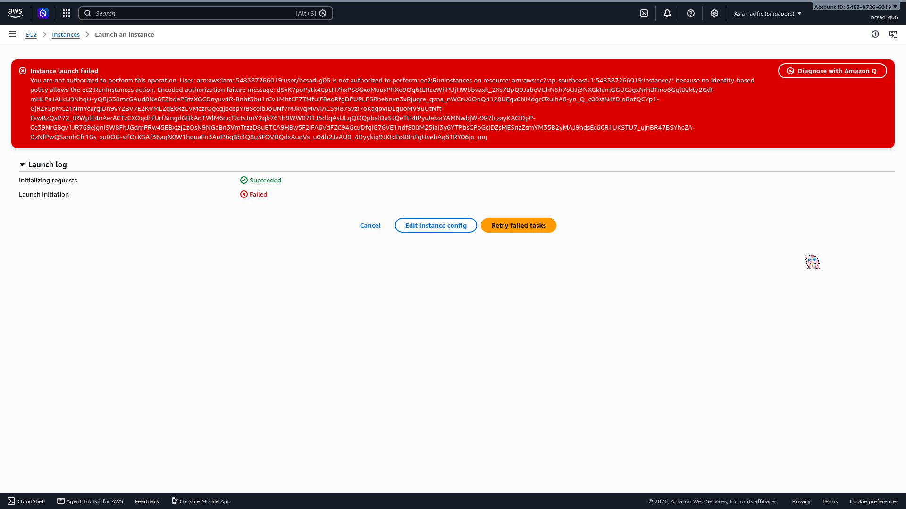
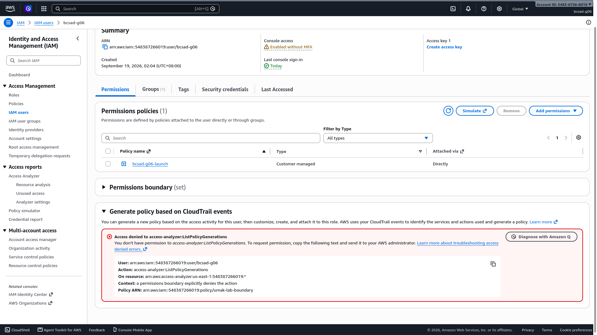
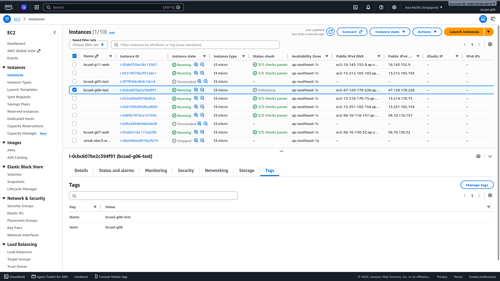
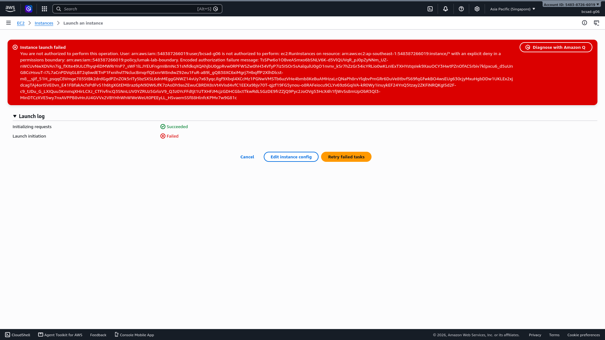
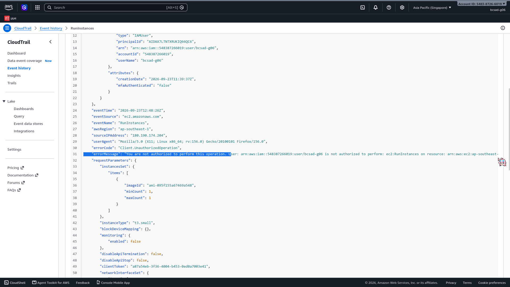

# Lab 1 Submission

## Part B
**Error Action Name:** Instance launch failed. You are not authorized to perform this operation. User: arn:aws:iam::548387266019:user/bcsad-g06 is not authorized to perform: **ec2:RunInstances** on resource: arn:aws:ec2:ap-southeast-1:548387266019:instance/* because no identity-based policy allows the ec2:RunInstances action. Encoded authorization failure message: dSxK7poPytk4CpcH7hxPS8GxoMuuxPRXo9Oq6tERceWhPUjHWbbvaxk_2Xs7BpQ9JabeVUhN5h7oUJj3NXGkIemGGUGJgxNrhBTmo6GglDzkty2GdI-mHLPaJALkU9NhqH-yQRj638mcGAud8Ne6EZbdePBtzXGCDnyuv4R-Bnht3bu1rCv1MhtCF7TMfuiFBeoRfgDPURLPSRhebnvn3xRjuqre_qcna_nWCrU6OoQ4128UEqx0NMdgrCRuihA8-yn_Q_c00stN4fDIoBofQCYp1-GjRZF5pMCZTNmYcurgjDn9vYZBV7E2KVML2qEkRzCVMczrOgegjbdspYIBScelbJoUNf7MJkvqMvVIAC59I87SvzI7oKagovIDLg0oMV9uUtNft-EswBzQaP72_tRWplE4nAerACTzCXOqdhfUrfSmgdGBkAqTWlM6nqTJctsJmY2qb761h9WW07FLI5rllqAsULqQOQpbslOaSJQeTH4IPyuIelzaYAMNwbjW-9R7lczayKACIDpP-Ce39NrG8gv1JR769ejgnISW8FhJGdmPRw45EBxlzj2zOsN9NGaBn3VmTrzzD8uBTCA9HBw5F2iFA6VdFZC94GcuDfqIG76VE1ndf800M25iaI3y6YTPbsCPoGciDZsMESnzZsmYM35B2yMAJ9ndsEc6CR1UKSTU7_ujnBR47BSYhcZA-DzNfPwQSamhCfr1Gs_su0OG-sifOcKSAf36aqN0W1hquaFn3AuF9iqBb3Q8u3FOVDQdxAuqVs_u04b2JvAU0_4Dyykig9JKtcEo88hFgHnehAg61RY06jo_mg

**Screenshot (Part B launch denial with username visible):**

## Part C
**Policy Statement Blanks:**
- `"Action"`: "ec2:RunInstances"
- `"Resource"`: "arn:aws:ec2:ap-southeast-1:548387266019:instance"
- `"ec2:InstanceType"`: "t3.micro"

## Part D
**Security Group Error Text:** You are not authorized to perform this operation. User: arn:aws:iam::548387266019:user/bcsad-g06 is not authorized to perform: ec2:CreateSecurityGroup on resource: arn:aws:ec2:ap-southeast-1:548387266019:security-group/* because no identity-based policy allows the ec2:CreateSecurityGroup action. Encoded authorization failure message: y-KwX6BBTXM_4zhr7FRqtEq76RWcAX-VrBJt_nQlTGzAcpJAfThATIh57Isom_aKjIULpkeeXHFQMZZvaEsBLxQh7c5e9OKpHZErYpdDRGzs9poKeSXPDpBvrS6hmiLpiK70XMWbbezKpG3xypMvP6yHYuGBHSHRzC6aNfccBmEJ7JNBMPcEK-2IgrUYNC-i5N_01gI6xbZIcc6_NZoZBxV5lx2AKJokRWRMv0fmKOIz9VBOnl2TQEBJ1hC-kfaXkKGKiGtYj81B7UX8kE0rchFEFaw0Q-G9QYMkvBbsqDXaLublRXf-zZvIvML8pGDk5a9ndf3dJwBIIW5bkioh-toQSJLxasDFFZGQoF0eQWSOPyaAMTB5TSsr33k6UIkdbPEtBr7tcipmDWc9QIG-EHZzA-l2iQuVd3WsF66qhsRoJJgwTtwIh9xVNYm8tQaelxx6FRPYD7q7-ty3GNKfqzuPUyIx5CulCdKa8Ym3Z9jzivGu48BzIPOhxaLngtxWRzfcmt0DUC8VCcusrTZMwH3x3wwhfF-pW-OFkTecDNg

**Running Instance Time:** 2026/09/23 20:55 GMT+8

**Screenshot 1 (Permissions tab listing <user>-launch):**

**Screenshot 2 (Instance in Running state):**

## Part E
**t3.small / Tokyo Denial Error:** Instance launch failed. You are not authorized to perform this operation. User: arn:aws:iam::548387266019:user/bcsad-g06 is not authorized to perform: ec2:RunInstances on resource: arn:aws:ec2:ap-southeast-1:548387266019:instance/* with an explicit deny in a permissions boundary: arn:aws:iam::548387266019:policy/umak-lab-boundary. Encoded authorization failure message: TsSPw6o1OBveASmxo6bSNLV6K-d5VlQUVqR_pJ0pZyNNm_UZ-nWCUvNwXDVAn7ig_fXIte49ULCfhyqHlDMWRrYnP7_sWF1lLJYEUFngmIBmNc31sNfdkqXQAhjbU0gpRvw0RPFWSZw0hH34VfyP7iz5ISOr5sAalqulU0gO1nvnv_kSr7hZzGr34icYRLio0wKLnIExTXHYstqsIek9XauOCY3HwtPZnOfACSrbiv7klpxcu6_d5uUnGBCcHsvuT-I7L7aCnPDVqGLBT2q6wdETnP1FxnihvlTNclucBmqrfQExnrW8ndwZ92eu1FuR-aB9l_gQB38XC6xiMgrj7HbqffP2XlhDlcst-m8__sjif_51H_psqqC8Vmge785StBk2drdGgdPZnZOk5rITy5bzSXSL6dnMEggGNWZ14vUy7x63yqcJlgf9Xbql4XCcMz1PGNwVMSTb6uzVHe4bmb8KeBuAMHzaLcQNaPh8rvYlqbvPmGRr6DuVe8tbvfS69fqGfwkBO4wsEUg630cjyMxuHgbDDw1UKLEx2xjdcagTAj4orISVE0vn_E41FBfakAcfxPdFvS1h6tgXGtEM8raz6pN9DW6JfK7zAoDh9asZEwuCBRDX8sVt4Visd4vfC1EEXa9bjv70T-qjzf19FG5ynou-o8RAFeiocu9CLYv69z6GqiVA-kR0Wy1inuykEF24YnQ5tzay2ZKFiNRQKgISd2F-c9_tJDu_G_LXIQuu3KmmqXHirLCXJ_CTFivfncQ3SNnLUV0YZRUz5GrloV9_Q3z0YcFFdtjt1UTXHFJMcjzGDHCGbctTkwRdLSGzDE9frZZjQ9Pyc2JoOVg53HcX4h1fjWvSs8mUpObR3Ql3-MinDTCzXVE5wy7nxAVPPB8vHnJU4GVVx2VBYHhWhWWeWeUt0PEEyLL_HSvaemSSf88HlnfcKPMv7w9G81c

**Screenshot 1 (t3.small or Tokyo denial):**

**Screenshot 2 (CloudTrail event showing errorMessage):**

## Part F Questions
1. Which action did the Part B error name?
   The action `ec2:RunInstances`
2. In your policy, which condition limits `ec2:RunInstances`?
   The `StringEquals` condition on `ec2:InstanceType` in the `RunOnlyT3MicroInstances` statement, which only allows launching instances whose type is exactly `t3.micro`.
3. After you attached `ec2:*` on `*`, why was `t3.small` still denied? Name the boundary statement.
   The `DenyAnyInstanceTypeButT3Micro` statement in `umak-lab-boundary` explicitly denies any instance type other than `t3.micro`. An explicit deny always overrides an allow, so `ec2:*` on `*` could not grant it.
4. Why is `ec2:*` on `*` a poor policy even with a boundary?
   It breaks least privilege. It grants every EC2 action on every resource, including deleting or modifying other teams' instances, security groups, etc., unless the boundary happens to block that exact case. The boundary is more like a safety net rather than a replacement for a scoped policy, and if it is ever changed or removed, the user instantly gets full EC2 access.
5. In two sentences: what does the boundary control that your policy cannot?
   The boundary sets the maximum permissions the user can ever have, such as only `t3.micro` and only the Singapore Region, no matter what identity policies are attached. The current policy can only grant permissions within that ceiling, and it cannot override the boundary's explicit denies.
