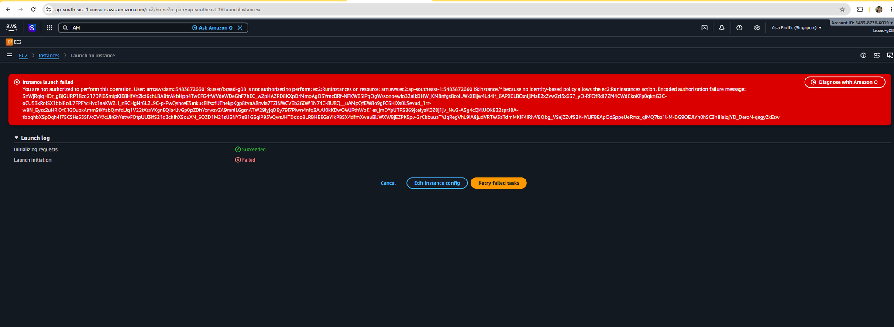
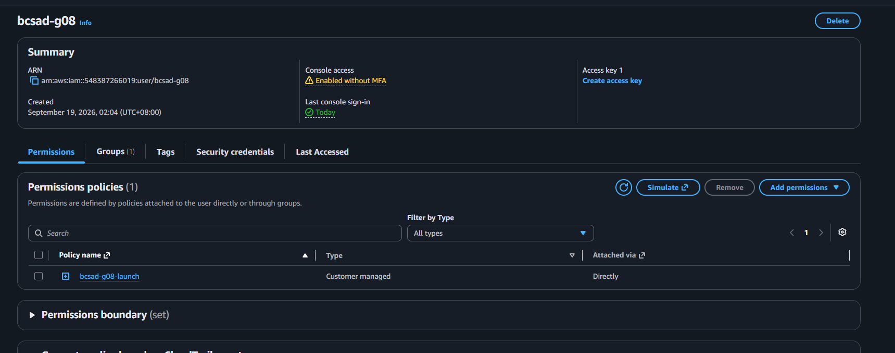
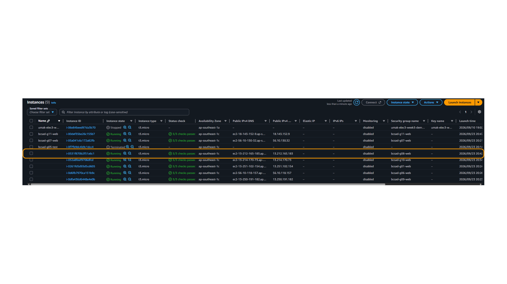
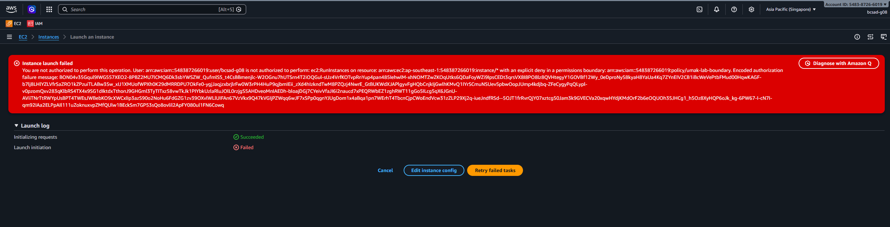
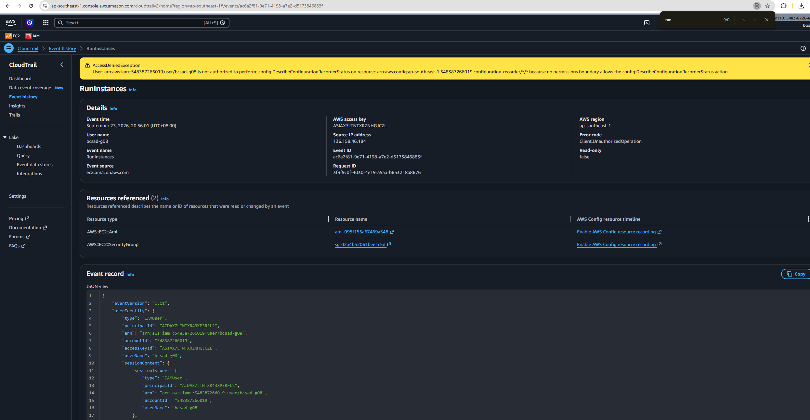

# Lab 1 Submission

## Part B
**Error Action Name:** Instance launch failed
You are not authorized to perform this operation. User: arn:aws:iam::548387266019:user/bcsad-g08 is not authorized to perform: ec2:RunInstances on resource: arn:aws:ec2:ap-southeast-1:548387266019:instance/* because no identity-based policy allows the ec2:RunInstances action. Encoded authorization failure message: 3nWjRqlqHOr_gBjGURP18zq2170PI6SmlpKiE8HfVn2kd6chLBABtrAkbHpp4TwCFG4fWVdeWDeGhF7hEC_w2pHAZRD8KXpDrMmpAgO3YmcDRf-NFKWE5IPqOgWssonoewIo32alkDHW_KM8nfgs8colLWxXEljw4Ld4If_6APXCLBCsnljlMaE2xZvwZcI5x637_yO-RFOfRdI7ZM4CWdCkoKFp0qknG3C-oCU53xRoISX1bbI8oiL7FPFYcHvx1aaKW2JI_nRCHgNr6L2L9C-p-PwQshceE5mkuc8IfsxfUThekpKgp8tvnA8nvia7TZiNWCVEb260W1N74C-8U8Q__uAMpQfEW8o9gFC6HIXs0LSevud_1rr-wBN_Eyzc2uHRI0rK1G0upxAmmStKfabQmfdUq1V22tXcxYKgnEQIa4JvGp0pZDhYxrwzvZA9mnIL6gsnATW29lyjqDBy79I7PIwn4nfq3AvU0kKDwOWJRthWpK1exjjmDYpUTPS869jcelyaK0Z8j1jv_Nw3-A5g4cQKlUOk822sprJ8A-tbbqhbXSpDqh4l75CSHs55SIVc0VKfcUir6hYetwFOtpUU3IfS21d2chIhX5ouXN_SOZD1M21sU6NY7e81GSqiP95VQwsJHTDddoBLRBHBEGaYIkPBSX4dfmXwuuBiJWXWBjEZPK5pv-2rCbbuuaTYJqRegVhL9lA8judVRTW3aTdmMKIF4IRivV8Obg_VSejZZvf53K-IYUFBEApOd5ppeUeRmz_qIMQ7bz1l-M-DG9OEJlYh0hSC3n8ialqjYD_DeroN-qegyZxEsw

**Screenshot (Part B launch denial with username visible):**

## Part C
**Policy Statement Blanks:**
- `"Action"`: ec2:RunInstances
- `"Resource"`: instance
- `"ec2:InstanceType"`: t3.micro

## Part D
**Security Group Error Text:** You are not authorized to perform this operation. User: arn:aws:iam::548387266019:user/bcsad-g08 is not authorized to perform: ec2:CreateSecurityGroup on resource: arn:aws:ec2:ap-southeast-1:548387266019:security-group/* because no identity-based policy allows the ec2:CreateSecurityGroup action. Encoded authorization failure message: B3C_p-EoLbhYMmENGitReteI3ecOYIR8FLNxrLbMJ8f9fWV12R1lm1Imm0DDURrzi4FPHZhZtCP9vaPUkv6pcbeiyJO2FfvYZWdzr1xfCFAN_b2gss3ugtBw-MdOjRm__COJ-zlvDWbqdfk4lzVAFGCl4tMwn4K4bUXzwQHmeUS925LUzMpO5P-Mu6S8x-dETxD-SXk1QuxTpDsIwDknGSauXcoWO5SbE62pL2SAt79LiwbbHxrEHAaueK6r1sGICeVMJBnCdyuyLk_MVGiyS5UX4xnjK8YGI3DKxqpjZ4uTHfpEIE9Y69_AncjITbewN2WlQUrwj3gkecDtF82nuIFR-vQPbUejMLOVSl4SxH6nD5OPfPZsARtIBMeEUFQzAcC2djGRVbjtVh7ovG7-h8J0rGEb-tkuzZ7AeDKcZPuRnSawpbAAoLZXe7uUcj-fdGtrFjGXfze8lx9Zow_AjGGaW74Q9S69edSXrXXy_2n9wKL8OVAstcpGZMFhnve7c8jQmsBp4mZNBRlbbvatI-4vU_uzknVm3QIaYUgUW9gq

**Running Instance Time:** 8:45 UTC

**Screenshot 1 (Permissions tab listing <user>-launch):**

**Screenshot 2 (Instance in Running state):**

## Part E
**t3.small / Tokyo Denial Error:** Instance launch failed
You are not authorized to perform this operation. User: arn:aws:iam::548387266019:user/bcsad-g08 is not authorized to perform: ec2:RunInstances on resource: arn:aws:ec2:ap-southeast-1:548387266019:instance/* with an explicit deny in a permissions boundary: arn:aws:iam::548387266019:policy/umak-lab-boundary. Encoded authorization failure message: BON04v35Gqul9IWG557XEO2-8PBZ2MU7lCMQ6Dk3sbYWSZW_QufmlSS_t4CsBBmenjlc-W2OGnu7hUTSrn4T2iOQGul-sUz4VrfKOTvpRnYup4pan485IehwlM-xhNOMTZwZKOqUtks6QDaFoyWZi9IpsCEDt3qrsVX8I8PO8lz8QVHtegyY1GOVBf12Wy_0eDproNy58kyaH8YaUa4Kq7ZYnEIV2CB1iBcWeVePtbFMud00HqwKAGF-b7lj8LHlYZLVfrSaZRO1kZPzuiTLABw3Sw_xIJ1XMUofWPXh0K29dMRRDPU7OkFe0-ygjJaqjzxbrjlrFw0W3rPH4HuP9qjbmIEii_zXd4hIzkndTwM8PZQzj4NwrE_GtBUKWdXJAPlgyvFgHQbCnjkIjGwlhKMvQ1IYrSCmuNSUev5pbwOopJUmp4kdjbq-ZFeCygyPqQLypl-v0pzomQxv283qKlbRS4TX4x9SG1dIktdxTthonJ9GHGml3TyTITxz58vwTkJk1PIYbkUzlaRluJOlL0rzjgS5AHDveoMnIAEDh-bloajDGj7CYeivVfaJI6i2naucd7xPEQRWbEZ1zghRWT11gGo5ILcg5qX6JGnU-AViiTNrTtRWYpUsBPT4TWEsJWBebKO9cXWCxlIp3azS90o2NoHu6FdGZG1zv39OXvlWLlUIFAn67VzVkx9Q47kVGIjPZWqq6wJF7xSPp0qgnYJUgDom1x4aBqa1pn7WErhT4TbcnCjpCWoEndVcw31zZLP29Xj2q-iueJndfRSd--5OJT1frRvrQjY07xztcg50Jam3k9GVECVa20xqwHYdjKMdOrF2b6eOQUOh35JHCg1_h5Oz8XyHQP6oJk_kg-6PW67-I-cN7I-qm92IAa2ELPpAIl111uZoknuxvpZMfQUlw1BEckSm7GP53sQo8ovlil2ApFY080ul1FN6Cowq

The AMI ID (ami-06380d26ad7176f2c) is not valid. The AMI might no longer exist or may be specific to another account or Region.

No VPCs found, either this account doesn’t have any VPCs in this region or an invalid search has been entered. Please refine the search query, create a new VPC or create a new default VPC

No subnets found, either this account has no subnets in this region or an invalid search has been entered. Please create a new subnet or refine the search query.

Auto assign public IP must be set. Select Enable or Disable.

**Screenshot 1 (t3.small or Tokyo denial):**

**Screenshot 2 (CloudTrail event showing errorMessage):**

## Part F Questions
1. Which action did the Part B error name?
    `ec2:RunInstances`
2. In your policy, which condition limits `ec2:RunInstances`?
   `ec2:InstanceType` with the value `t3.micro`
3. After you attached `ec2:*` on `*`, why was `t3.small` still denied? Name the boundary statement.
   It was still denied because the permissions boundary explicitly denies instance types other than `t3.micro`. The boundary statement is `DenyAnyInstanceTypeButT3Micro`.
4. Why is `ec2:*` on `*` a poor policy even with a boundary?
   It grants very broad EC2 permissions, which gives the user more access than necessary and increases the risk of unintended or unauthorized actions.
5. In two sentences: what does the boundary control that your policy cannot?
   The permissions boundary sets the maximum permissions that the user can have, even if an identity policy grants more permissions. It can restrict actions, resources, conditions, and regions that the identity policy alone would otherwise allow.
