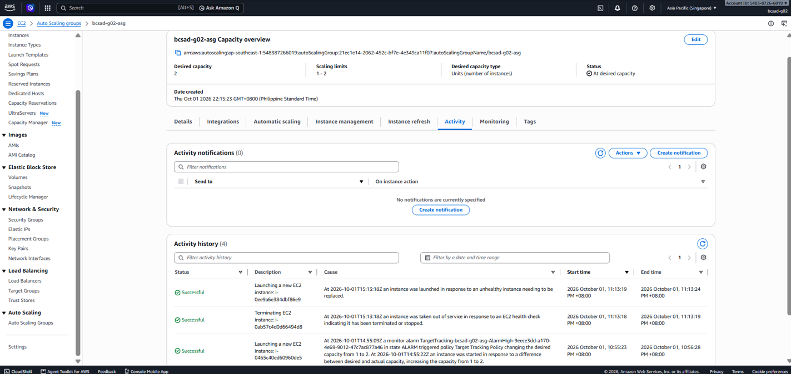
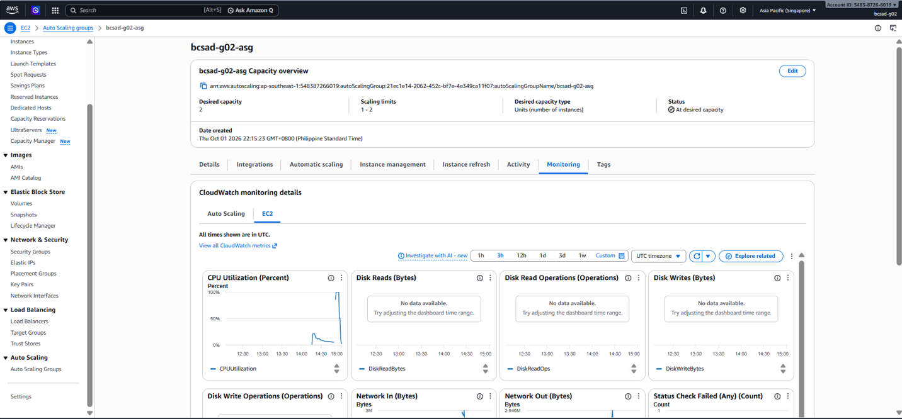

# Lab 2 Submission

## Instance Tracking
**First Instance**
- Instance ID: i-0ab57c4d0d66494d8
- Availability Zone: ap-southeast-1a

**Second Instance**
- Instance ID: i-0465c40ed60960de5
- Availability Zone: ap-southeast-1b

## Proof (Screenshots)
1. **Activity History:** Add a screenshot showing the Auto Scaling group's Activity history when the second instance launched.
   
   

2. **CloudWatch Alarm:** Add a screenshot of the target tracking alarm in the "In alarm" state.

   

## Questions
1. Why did the group stop at 2 instances?
   `Because the maximum capacity of the Auto Scaling Group was explicitly configured to 2.`
2. Why did terminating an instance by hand not remove the cost?
   `Because the Auto Scaling Group automatically launched a replacement instance to maintain the desired capacity (1 instance), meaning the total active instance count quickly returned to what it was before.`
3. Why is the target value set to your assigned value (e.g., 30-85 percent) instead of 99 percent?
   `Setting it to 99% leaves no safety buffer, meaning instances would become overwhelmed, unresponsive, or crash before the alarm could trigger a scale-out. A lower threshold scales out proactively while maintaining performance.`
4. What did the automatic cutoff protect us from?
   `It protected against runaway AWS charges caused by leaving resources running accidentally after the lab ended.`
5. What changes when a load balancer sits in front of the group?
   `Traffic is automatically distributed across all healthy instances, and users can access a single, stable entry point (DNS name) instead of having to manually connect to individual instance public IPs.`
