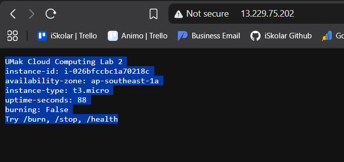
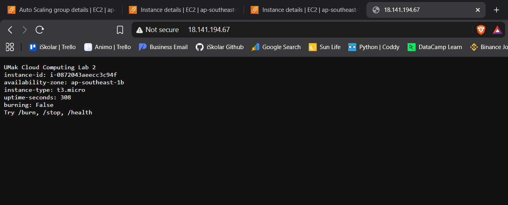
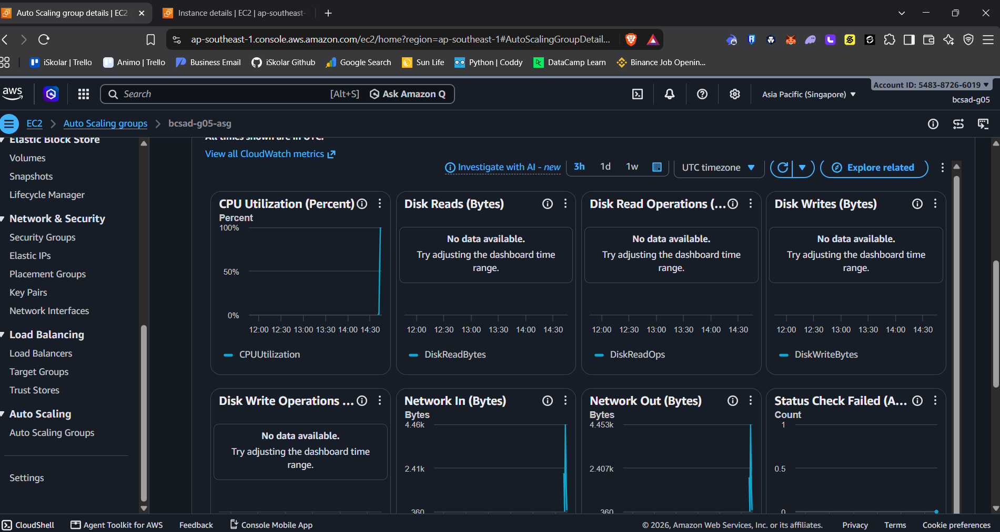
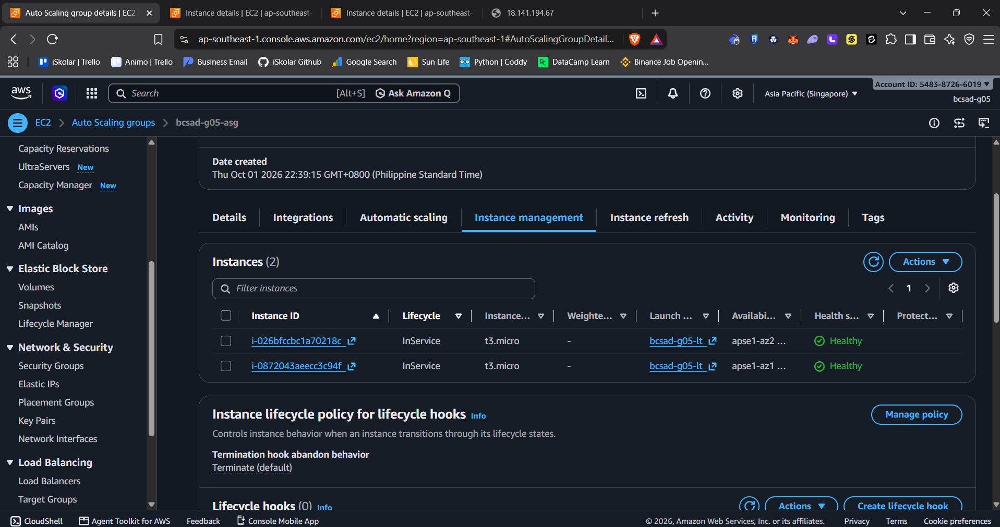
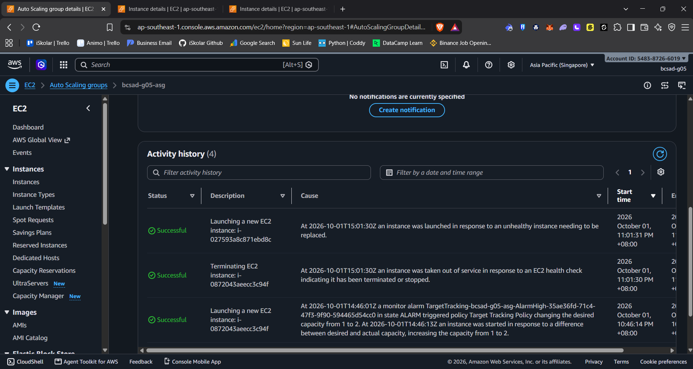
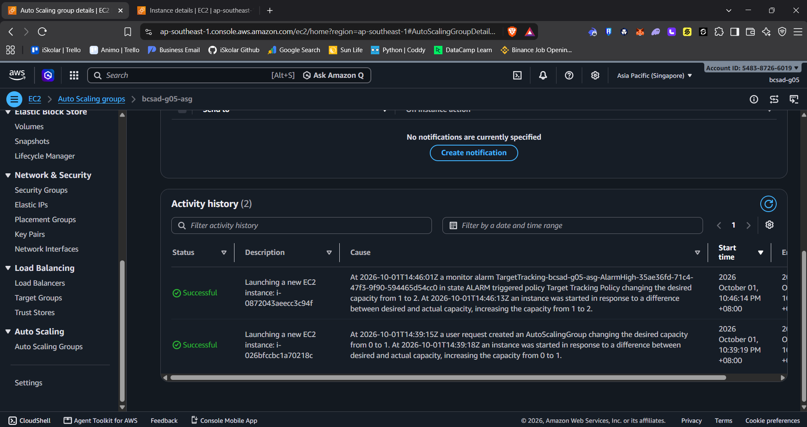
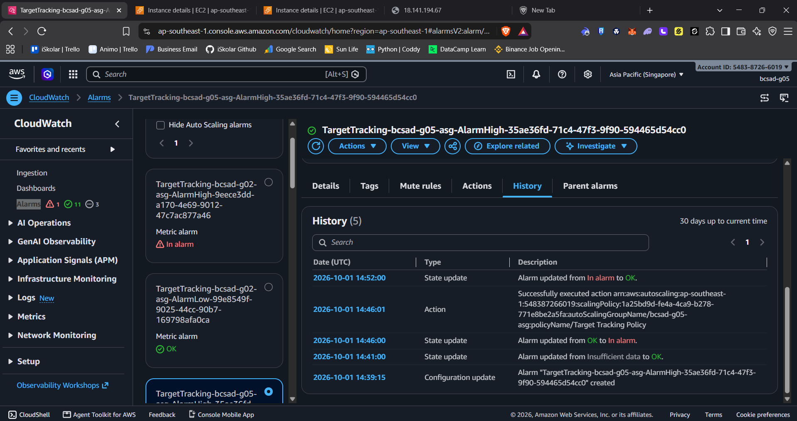

# Lab 2 Submission

## Instance Tracking
**First Instance**
- Instance ID: i-026bfccbc1a70218c
- Availability Zone: ap-southeast-1a

**Second Instance**
- Instance ID: i-0872043aeecc3c94f
- Availability Zone: ap-southeast-1b

**Replacement Instance**
- Terminated instance ID: i-0872043aeecc3c94f
- Replacement instance ID: i-027593a8c871ebd8c

## Proof (Screenshots)

1. **Activity History:** Add a screenshot showing the Auto Scaling group's Activity history when the second instance launched.
   
   

2. **CloudWatch Alarm:** Alarm history shows the target tracking alarm changed from OK to In alarm and triggered the scaling action.

   

## Questions
1. Why did the group stop at 2 instances?
   We set the Auto Scaling group's maximum capacity to 2, so it could not launch a third instance even while CPU usage was high.
2. Why did terminating an instance by hand not remove the cost?
   The group still needed its desired capacity. After an instance was terminated, it launched a replacement, which continued to incur EC2 charges until the group scaled in or we deleted it.
3. Why is the target value set to your assigned value (e.g., 30-85 percent) instead of 99 percent?
   Our assigned target was 50%. That leaves CPU capacity for new requests and gives the group time to add an instance before the first one is saturated. A 99% target would react too late.
4. What did the automatic cutoff protect us from?
   The eight-minute cutoff stopped the CPU stress test automatically, limiting unnecessary load and the time the group might need extra capacity if we forgot to use `/stop`.
5. What changes when a load balancer sits in front of the group?
   Clients would use one load balancer address instead of each instance's public IP. The load balancer would distribute requests among healthy instances, including newly launched replacements.

