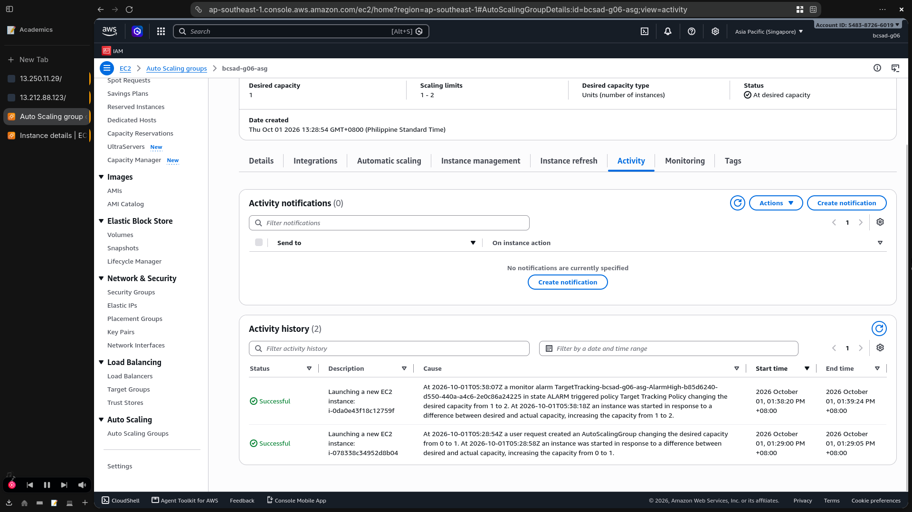
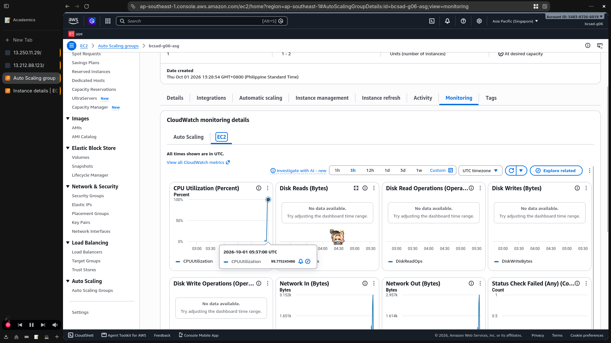

# Lab 2 Submission

## Instance Tracking
**First Instance**
- Instance ID: i-078338c34952d8b04
- Availability Zone: ap-southeast-1a

**Second Instance**
- Instance ID: i-0da0e43f18c12759f
- Availability Zone: ap-southeast-1b

## Proof (Screenshots)
1. **Activity History:** Add a screenshot showing the Auto Scaling group's Activity history when the second instance launched.
   

2. **CloudWatch Alarm:** Add a screenshot of the target tracking alarm in the "In alarm" state.

## Questions
1. Why did the group stop at 2 instances?
   The Auto Scaling group's maximum capacity was set to 2, so it could not launch more instances.
2. Why did terminating an instance by hand not remove the cost?
   The group maintained its desired capacity by launching a replacement instance. To reduce costs, lower the desired capacity or stop the group from replacing instances.
3. Why is the target value set to your assigned value (e.g., 30-85 percent) instead of 99 percent?
   The assigned target (in this case, 55%) leaves CPU headroom so the group can scale out before instances become overloaded. A 99% target waits until capacity is nearly exhausted.
4. What did the automatic cutoff protect us from?
   It limited runaway scaling and unexpected cloud charges by capping how many instances could launch.
5. What changes when a load balancer sits in front of the group?
   The load balancer distributes requests across healthy instances and registers or removes instances as the group scales. Users reach the shared endpoint instead of individual instances.
