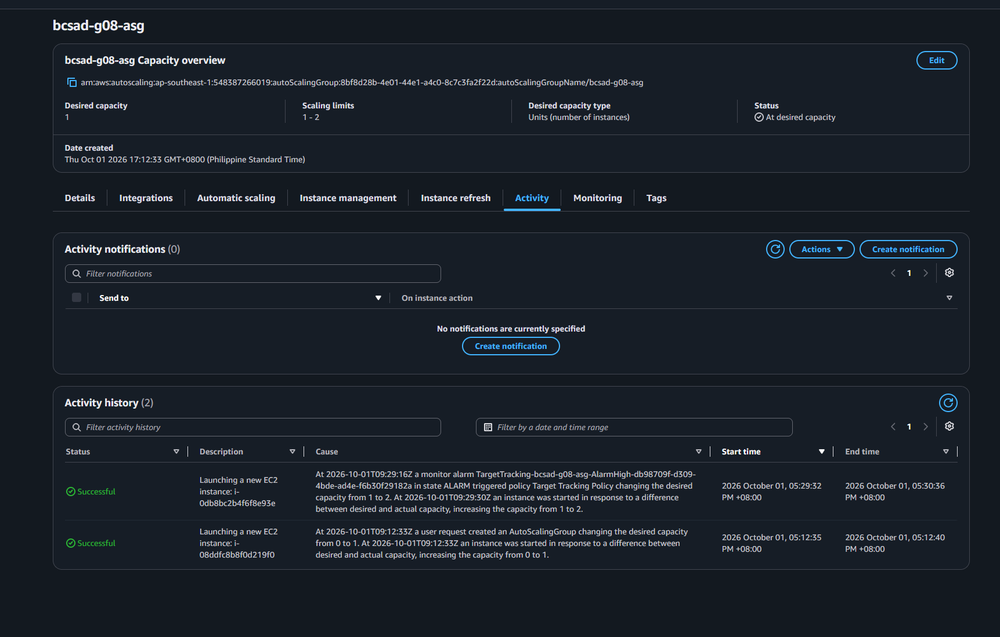
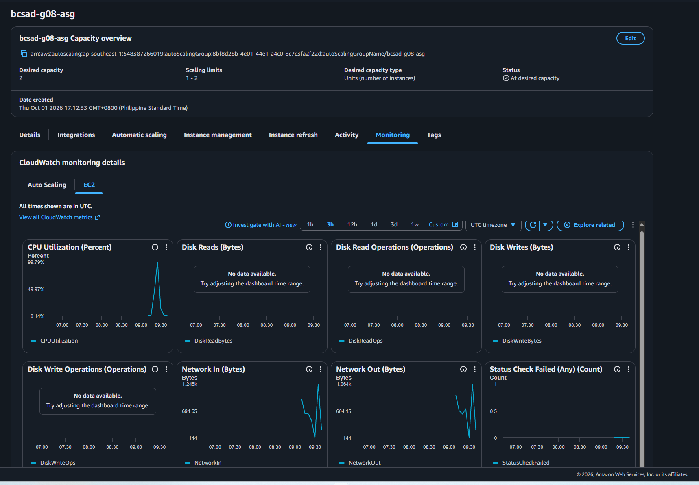

# Lab 2 Submission

## Instance Tracking
**First Instance**
- Instance ID: i-08ddfc8b8f0d219f0
- Availability Zone: ap-southeast-1b

**Second Instance**
- Instance ID: i-0db8bc2b4f6f8e93e
- Availability Zone: ap-southeast-1a

## Proof (Screenshots)
1. **Activity History:** Add a screenshot showing the Auto Scaling group's Activity history when the second instance launched.
   
   

2. **CloudWatch Alarm:** Add a screenshot of the target tracking alarm in the "In alarm" state.

   

## Questions
1. Why did the group stop at 2 instances?
   Because the Auto Scaling Group had a maximum capacity of 2 instances.
2. Why did terminating an instance by hand not remove the cost?
   Because Auto Scaling automatically launched a replacement instance to maintain the desired capacity.
3. Why is the target value set to your assigned value (e.g., 30-85 percent) instead of 99 percent?
   Because the assigned CPU target allows Auto Scaling to add an instance before the existing server becomes overloaded.
4. What did the automatic cutoff protect us from?
   It protected us from leaving the Auto Scaling Group running and continuously consuming AWS resources and increasing costs.
5. What changes when a load balancer sits in front of the group?
   The load balancer distributes incoming traffic across the healthy instances instead of users connecting directly to individual instance IPs.
